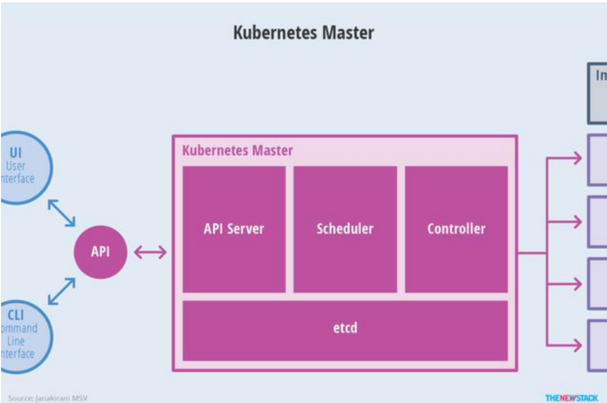
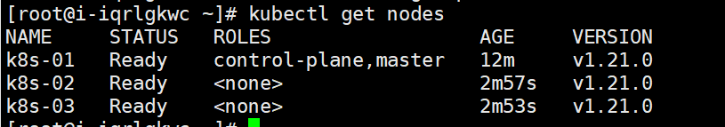

<center>
<h1>
    Kubernetes 基础入门
    </h1>    
</center>

# 一、Kubernetes简介

## 1、背景

# 1、部署方式的变迁


- **传统部署时代：**
  - 在物理服务器上运行应用程序
  - 无法为应用程序定义资源边界
  - 导致资源分配问题

 例如，如果在物理服务器上运行多个应用程序，则可能会出现一个应用程序占用大部分资源的情况， 结果可能导致其他应用程序的性能下降。 一种解决方案是在不同的物理服务器上运行每个应用程序，但是由于资源利用不足而无法扩展， 并且维护许多物理服务器的成本很高。

- **虚拟化部署时代：**
  - 作为解决方案，引入了虚拟化
  - 虚拟化技术允许你在单个物理服务器的 CPU 上运行多个虚拟机（VM）
  - 虚拟化允许应用程序在 VM 之间隔离，并提供一定程度的安全
  - 一个应用程序的信息 不能被另一应用程序随意访问。
  - 虚拟化技术能够更好地利用物理服务器上的资源
  - 因为可轻松地添加或更新应用程序 ，所以可以实现更好的可伸缩性，降低硬件成本等等。
  - 每个 VM 是一台完整的计算机，在虚拟化硬件之上运行所有组件，包括其自己的操作系统。

缺点：虚拟层冗余导致的资源浪费与性能下降

- **容器部署时代：**
  - 容器类似于 VM，但可以在应用程序之间共享操作系统（OS）。 
  - 容器被认为是轻量级的。
  - 容器与 VM 类似，具有自己的文件系统、CPU、内存、进程空间等。 
  - 由于它们与基础架构分离，因此可以跨云和 OS 发行版本进行移植。
  - *<u>**参照【Docker隔离原理- namespace 6项隔离（资源隔离）与 cgroups 8项资源限制（资源限制）】**</u>*


裸金属：真正的物理服务器


**容器优势：**

- **敏捷性：**敏捷应用程序的创建和部署：与使用 VM 镜像相比，提高了容器镜像创建的简便性和效率。
- **及时性：**持续开发、集成和部署：通过快速简单的回滚（由于镜像不可变性），支持可靠且频繁的 容器镜像构建和部署。
- **解耦性：**关注开发与运维的分离：在构建/发布时创建应用程序容器镜像，而不是在部署时。 从而将应用程序与基础架构分离。
- **可观测性：**可观察性不仅可以显示操作系统级别的信息和指标，还可以显示应用程序的运行状况和其他指标信号。
- **跨平台：**跨开发、测试和生产的环境一致性：在便携式计算机上与在云中相同地运行。
- **可移植：**跨云和操作系统发行版本的可移植性：可在 Ubuntu、RHEL、CoreOS、本地、 Google Kubernetes Engine 和其他任何地方运行。
- **简易性：**以应用程序为中心的管理：提高抽象级别，从在虚拟硬件上运行 OS 到使用逻辑资源在 OS 上运行应用程序。
- **大分布式：**松散耦合、分布式、弹性、解放的微服务：应用程序被分解成较小的独立部分， 并且可以动态部署和管理 - 而不是在一台大型单机上整体运行。
- **隔离性：**资源隔离：可预测的应用程序性能。
- **高效性：**资源利用：高效率和**高密度**


K8S之前：

10台服务器：25+15中间件

K8S之后：

10台服务器：上百个应用了。

k8s管理10几台服务器。资源规划。


### 2、容器化问题

- 弹性的容器化应用管理
- 强大的故障转移能力
- 高性能的负载均衡访问机制
- 便捷的扩展
- 自动化的资源监测
- ......


docker swarm：大规模进行容器编排

mesos：apache

Kubernetes : google；

竞品： Kubernetes 胜利


### 3、为什么用 Kubernetes 

容器是打包和运行应用程序的好方式。在生产环境中，你需要管理运行应用程序的容器，并确保不会停机。 例如，如果一个容器发生故障，则需要启动另一个容器。如果系统处理此行为，会不会更容易？

这就是 Kubernetes 来解决这些问题的方法！ Kubernetes 为你提供了一个可弹性运行分布式系统的框架。linux之上的一个服务编排框架；

 Kubernetes 会满足你的扩展要求、故障转移、部署模式等。 例如，Kubernetes 可以轻松管理系统的 Canary 部署。

Kubernetes 为你提供：

- **服务发现和负载均衡**

  Kubernetes 可以使用 DNS 名称或自己的 IP 地址公开容器，如果进入容器的流量很大， Kubernetes 可以负载均衡并分配网络流量，从而使部署稳定。

- **存储编排**

  Kubernetes 允许你自动挂载你选择的存储系统，例如本地存储、公共云提供商等。

- **自动部署和回滚**

  你可以使用 Kubernetes 描述已部署容器的所需状态，它可以以受控的速率将实际状态 更改为期望状态。例如，你可以自动化 Kubernetes 来为你的部署创建新容器， 删除现有容器并将它们的所有资源用于新容器。

- **自动完成装箱计算**

  Kubernetes 允许你指定每个容器所需 CPU 和内存（RAM）。 当容器指定了资源请求时，Kubernetes 可以做出更好的决策来管理容器的资源。

- **自我修复**

  Kubernetes 重新启动失败的容器、替换容器、杀死不响应用户定义的 运行状况检查的容器，并且在准备好服务之前不将其通告给客户端。

- **密钥与配置管理**

  Kubernetes 允许你存储和管理敏感信息，例如密码、OAuth 令牌和 ssh 密钥。 你可以在不重建容器镜像的情况下部署和更新密钥和应用程序配置，也无需在堆栈配置中暴露密钥
  
- .......

**为了生产环境的容器化大规模应用编排，必须有一个自动化的框架。系统**


### 4、市场份额

#### 1、容器化

docker swarm


#### 2、服务编排


google --- kubernetes --- 发起cncf --- 众多的项目辅佐 kubernetes ---- kubernetes +cncf其他软件 = 整个大型云平台


## 2、简介

Kubernetes 是一个可移植的、可扩展的**开源**平台，用于管理容器化的工作负载和服务，可促进声明式配置和自动化。 Kubernetes 拥有一个庞大且快速增长的生态系统。Kubernetes 的服务、支持和工具广泛可用。

名称 **Kubernetes** 源于希腊语，意为“舵手”或“飞行员”。Google 在 2014 年开源了 Kubernetes 项目。 Kubernetes 建立在 [Google 在大规模运行生产工作负载方面拥有十几年的经验](https://research.google/pubs/pub43438) 的基础上，结合了社区中最好的想法和实践。


### 1、Kubernetes不是什么

- Kubernetes 不是传统的、包罗万象的 PaaS（平台即服务）系统。 
- Kubernetes 在容器级别而不是在硬件级别运行
- 它提供了 PaaS 产品共有的一些普遍适用的功能， 例如部署、扩展、负载均衡、日志记录和监视。 
- 但是，Kubernetes 不是单体系统，默认解决方案都是可选和可插拔的。 Kubernetes 提供了构建开发人员平台的基础，但是在重要的地方保留了用户的选择和灵活性。

Kubernetes：

- **不限制支持的应用程序类型**。 Kubernetes 旨在支持极其多种多样的工作负载，包括无状态、有状态和数据处理工作负载。 如果应用程序可以在容器中运行，那么它应该可以在 Kubernetes 上很好地运行。
- **不部署源代码**，也不构建你的应用程序。 **持续集成(CI)、交付和部署（CI/CD）**工作流取决于组织的文化和偏好以及技术要求。
- **不提供应用程序级别的服务作为内置服务**，例如中间件（例如，消息中间件）、 数据处理框架（例如，Spark）、数据库（例如，mysql）、缓存、集群存储系统 （例如，Ceph）。这样的组件可以在 Kubernetes 上运行，并且/或者可以由运行在 Kubernetes 上的应用程序通过可移植机制（例如， [开放服务代理](https://openservicebrokerapi.org/)）来访问。

- **不要求日志记录、监视或警报解决方案**。 它提供了一些集成作为概念证明，并提供了收集和导出指标的机制。
- **不提供或不要求配置语言/系统**（例如 jsonnet），它提供了**声明性 API**， 该声明性 API 可以由任意形式的声明性规范所构成。RESTful；写yaml文件
- 不提供也不采用任何全面的机器配置、维护、管理或自我修复系统。
- 此外，Kubernetes 不仅仅是一个编排系统，实际上它消除了编排的需要。 编排的技术定义是执行已定义的工作流程：首先执行 A，然后执行 B，再执行 C。 相比之下，Kubernetes 包含一组独立的、可组合的控制过程， 这些过程连续地将当前状态驱动到所提供的所需状态。 如何从 A 到 C 的方式无关紧要，也不需要集中控制，这使得系统更易于使用 且功能更强大、系统更健壮、更为弹性和可扩展。


容器管家：

安装了很多应用。  	 -------------------------  qq电脑管家。（自动杀垃圾，自动卸载没用东西....）

机器上有很多容器。 --------------------------  kubernete容器的管家。（容器的启动停止、故障转义、负载均衡等）

# 二、Kubernetes安装

## 1、集群原理

集群：

主从：

- 主从同步/复制  ;mysql 主  -- mysql 从
- 主管理从   v

分片（数据集群）：

- 大家都一样
- 每个人存一部分东西


### 1、master-node 架构

11000台机器

地主+奴隶

地（机器）

奴隶（在机器上干活）


master：主节点（地主）。可能有很多（多人控股公司）

node：work节点（工作节点）。 很多。真正干应用的活


> master 和 worker怎么交互
>
> master决定worker里面都有什么
>
> worker只是和master （API） 通信；  每一个节点自己干自己的活

程序员使用UI或者CLI操作k8s集群的master，就可以知道整个集群的状况。


### 2、工作原理


> master节点（Control Plane【控制面板】）：master节点控制整个集群
>
> master节点上有一些核心组件：
>
> - Controller  Manager：控制管理器
> - etcd：键值数据库（redis）【记账本，记事本】
> - scheduler：调度器
> - api server：api网关（所有的控制都需要通过api-server）
>
> node节点（worker工作节点）：
>
> - kubelet（监工）：每一个node节点上必须安装的组件。
> - kube-proxy：代理。代理网络
>
> 部署一个应用？
>
> 程序员：调用CLI告诉master，我们现在要部署一个tomcat应用
>
> - 程序员的所有调用都先去master节点的网关api-server。这是matser的唯一入口（mvc模式中的c层）
> - 收到的请求先交给master的api-server。由api-server交给controller-mannager进行控制
> - controller-mannager 进行 应用部署
> - controller-mannager 会生成一次部署信息。 tomcat --image:tomcat6 --port 8080 ,真正不部署应用
> - 部署信息被记录在etcd中
> - scheduler调度器从etcd数据库中，拿到要部署的应用，开始调度。看哪个节点合适，
> - scheduler把算出来的调度信息再放到etcd中
> - 每一个node节点的监控kubelet，随时和master保持联系的（给api-server发送请求不断获取最新数据），所有节点的kubelet就会从master
> - 假设node2的kubelet最终收到了命令，要部署。
> - kubelet就自己run一个应用在当前机器上，随时给master汇报当前应用的状态信息，分配ip
> - node和master是通过master的api-server联系的
> - 每一个机器上的kube-proxy能知道集群的所有网络。只要node访问别人或者别人访问node，node上的kube-proxy网络代理自动计算进行流量转发


下图和上图一样的，再理解一下


无论访问哪个机器，都可以访问到真正应用（Service【服务】）

### 3、原理分解

#### 1、主节点（master）



> 快速介绍：
>
> - master也要装kubelet和kubeproxy
>
> - 前端访问（UI\CLI）：
> - kube-apiserver：
> - scheduler:
> - controller manager:
> - etcd
> - kubelet+kubeproxy每一个节点的必备+docker（容器运行时环境）


#### 2、工作节点（node）


> 快速介绍：
>
> - Pod：
>   - docker run 启动的是一个container（容器），**容器是docker的基本单位**，一个应用是一个容器
>   - kubelet run 启动的一个应用称为一个Pod；**Pod是k8s的基本单位。**
>     - Pod是容器的一个再封装
>     - atguigu(永远不变)    ==slf4j=    log4j(类)
>     - 应用 ===== ==Pod== ======= docker的容器
>     - 一个容器往往代表不了一个基本应用。博客（php+mysql合起来完成）
>     - 准备一个Pod 可以包含多个 container；一个Pod代表一个基本的应用。
>     - IPod（看电影、听音乐、玩游戏）【一个基本产品，原子】；
>     - Pod（music container、movie container）【一个基本产品，原子的】
> - Kubelet：监工，负责交互master的api-server以及当前机器的应用启停等，在master机器就是master的小助手。每一台机器真正干活的都是这个 Kubelet
> - Kube-proxy：
> - 其他：
>   - 

## 2、组件交互原理


> 想让k8s部署一个tomcat？
>
> 0、开机默认所有节点的kubelet、master节点的scheduler（调度器）、controller-manager（控制管理器）一直监听master的api-server发来的事件变化（for ::）
>
> 
>
> 1、程序员使用命令行工具： kubectl ； kubectl create deploy tomcat --image=tomcat8（告诉master让集群使用tomcat8镜像，部署一个tomcat应用）
>
> 2、kubectl命令行内容发给api-server，api-server保存此次创建信息到etcd
>
> 3、etcd给api-server上报事件，说刚才有人给我里面保存一个信息。（部署Tomcat[deploy]）
>
> 4、controller-manager监听到api-server的事件，是 （部署Tomcat[deploy]）
>
> 5、controller-manager 处理这个 （部署Tomcat[deploy]）的事件。controller-manager会生成Pod的部署信息【pod信息】
>
> 6、controller-manager 把Pod的信息交给api-server，再保存到etcd
>
> 7、etcd上报事件【pod信息】给api-server。
>
> 8、scheduler专门监听 【pod信息】 ，拿到 【pod信息】的内容，计算，看哪个节点合适部署这个Pod【pod调度过后的信息（node: node-02）】，
>
> 9、scheduler把 【pod调度过后的信息（node: node-02）】交给api-server保存给etcd
>
> 10、etcd上报事件【pod调度过后的信息（node: node-02）】，给api-server
>
> 11、其他节点的kubelet专门监听 【pod调度过后的信息（node: node-02）】 事件，集群所有节点kubelet从api-server就拿到了 【pod调度过后的信息（node: node-02）】 事件
>
> 12、每个节点的kubelet判断是否属于自己的事情；node-02的kubelet发现是他的事情
>
> 13、node-02的kubelet启动这个pod。汇报给master当前启动好的所有信息


## 3、安装

### 1、理解

安装方式

- 二进制方式（建议生产环境使用）
- MiniKube.....
- kubeadm引导方式（官方推荐）
  - GA


大致流程

- 准备N台服务器，**内网互通**，
- 安装Docker容器化环境【k8s放弃dockershim】
- 安装Kubernetes
  - 三台机器安装核心组件（**kubeadm(创建集群的引导工具)**,  ***kubelet***，**kubectl（程序员用的命令行）**  ）
  - kubelet可以直接通过容器化的方式创建出之前的核心组件（api-server）【官方把核心组件做成镜像】
  - 由kubeadm引导创建集群


### 2、执行

#### 1、准备机器

- 开通三台机器，内网互通，配置公网ip。centos7.8/7.9，基础实验2c4g三台也可以
- 每台机器的hostname不要用localhost，可用k8s-01，k8s-02，k8s-03之类的【不包含下划线、小数点、大写字母】（这个后续步骤也可以做）

#### 2、安装前置环境（都执行）

##### 1、基础环境

```sh
#########################################################################
#关闭防火墙： 如果是云服务器，需要设置安全组策略放行端口
# https://kubernetes.io/zh/docs/setup/production-environment/tools/kubeadm/install-kubeadm/#check-required-ports
systemctl stop firewalld
systemctl disable firewalld

# 修改 hostname
hostnamectl set-hostname k8s-01
# 查看修改结果
hostnamectl status
# 设置 hostname 解析
echo "127.0.0.1   $(hostname)" >> /etc/hosts

#关闭 selinux： 
sed -i 's/enforcing/disabled/' /etc/selinux/config
setenforce 0

#关闭 swap：
swapoff -a  
sed -ri 's/.*swap.*/#&/' /etc/fstab 

#允许 iptables 检查桥接流量
#https://kubernetes.io/zh/docs/setup/production-environment/tools/kubeadm/install-kubeadm/#%E5%85%81%E8%AE%B8-iptables-%E6%A3%80%E6%9F%A5%E6%A1%A5%E6%8E%A5%E6%B5%81%E9%87%8F
## 开启br_netfilter
## sudo modprobe br_netfilter
## 确认下
## lsmod | grep br_netfilter

## 修改配置


#####这里用这个，不要用课堂上的配置。。。。。。。。。
#将桥接的 IPv4 流量传递到 iptables 的链：
# 修改 /etc/sysctl.conf
# 如果有配置，则修改
sed -i "s#^net.ipv4.ip_forward.*#net.ipv4.ip_forward=1#g"  /etc/sysctl.conf
sed -i "s#^net.bridge.bridge-nf-call-ip6tables.*#net.bridge.bridge-nf-call-ip6tables=1#g"  /etc/sysctl.conf
sed -i "s#^net.bridge.bridge-nf-call-iptables.*#net.bridge.bridge-nf-call-iptables=1#g"  /etc/sysctl.conf
sed -i "s#^net.ipv6.conf.all.disable_ipv6.*#net.ipv6.conf.all.disable_ipv6=1#g"  /etc/sysctl.conf
sed -i "s#^net.ipv6.conf.default.disable_ipv6.*#net.ipv6.conf.default.disable_ipv6=1#g"  /etc/sysctl.conf
sed -i "s#^net.ipv6.conf.lo.disable_ipv6.*#net.ipv6.conf.lo.disable_ipv6=1#g"  /etc/sysctl.conf
sed -i "s#^net.ipv6.conf.all.forwarding.*#net.ipv6.conf.all.forwarding=1#g"  /etc/sysctl.conf
# 可能没有，追加
echo "net.ipv4.ip_forward = 1" >> /etc/sysctl.conf
echo "net.bridge.bridge-nf-call-ip6tables = 1" >> /etc/sysctl.conf
echo "net.bridge.bridge-nf-call-iptables = 1" >> /etc/sysctl.conf
echo "net.ipv6.conf.all.disable_ipv6 = 1" >> /etc/sysctl.conf
echo "net.ipv6.conf.default.disable_ipv6 = 1" >> /etc/sysctl.conf
echo "net.ipv6.conf.lo.disable_ipv6 = 1" >> /etc/sysctl.conf
echo "net.ipv6.conf.all.forwarding = 1"  >> /etc/sysctl.conf
# 执行命令以应用
sysctl -p


#################################################################

```

##### 2、docker环境

```sh
sudo yum remove docker*
sudo yum install -y yum-utils
#配置docker yum 源
sudo yum-config-manager --add-repo http://mirrors.aliyun.com/docker-ce/linux/centos/docker-ce.repo
#安装docker 19.03.9
yum install -y docker-ce-3:19.03.9-3.el7.x86_64  docker-ce-cli-3:19.03.9-3.el7.x86_64 containerd.io

#安装docker 19.03.9   docker-ce  19.03.9
yum install -y docker-ce-19.03.9-3  docker-ce-cli-19.03.9 containerd.io

#启动服务
systemctl start docker
systemctl enable docker

#配置加速
sudo mkdir -p /etc/docker
sudo tee /etc/docker/daemon.json <<-'EOF'
{
  "registry-mirrors": ["https://82m9ar63.mirror.aliyuncs.com"]
}
EOF
sudo systemctl daemon-reload
sudo systemctl restart docker
```


#### 3、安装k8s核心（都执行）

```sh
# 配置K8S的yum源
cat <<EOF > /etc/yum.repos.d/kubernetes.repo
[kubernetes]
name=Kubernetes
baseurl=http://mirrors.aliyun.com/kubernetes/yum/repos/kubernetes-el7-x86_64
enabled=1
gpgcheck=0
repo_gpgcheck=0
gpgkey=http://mirrors.aliyun.com/kubernetes/yum/doc/yum-key.gpg
       http://mirrors.aliyun.com/kubernetes/yum/doc/rpm-package-key.gpg
EOF

# 卸载旧版本
yum remove -y kubelet kubeadm kubectl

# 查看可以安装的版本
yum list kubelet --showduplicates | sort -r

# 安装kubelet、kubeadm、kubectl 指定版本
yum install -y kubelet-1.21.0 kubeadm-1.21.0 kubectl-1.21.0

# 开机启动kubelet
systemctl enable kubelet && systemctl start kubelet
```


#### 4、初始化master节点（master执行）

```sh
############下载核心镜像 kubeadm config images list：查看需要哪些镜像###########

####封装成images.sh文件
#!/bin/bash
images=(
  kube-apiserver:v1.21.0
  kube-proxy:v1.21.0
  kube-controller-manager:v1.21.0
  kube-scheduler:v1.21.0
  coredns:v1.8.0
  etcd:3.4.13-0
  pause:3.4.1
)
for imageName in ${images[@]} ; do
    docker pull registry.cn-hangzhou.aliyuncs.com/lfy_k8s_images/$imageName
done
#####封装结束

chmod +x images.sh && ./images.sh


# registry.cn-hangzhou.aliyuncs.com/lfy_k8s_images/coredns:v1.8.0

##注意1.21.0版本的k8s coredns镜像比较特殊，结合阿里云需要特殊处理，重新打标签
docker tag registry.cn-hangzhou.aliyuncs.com/lfy_k8s_images/coredns:v1.8.0 registry.cn-hangzhou.aliyuncs.com/lfy_k8s_images/coredns/coredns:v1.8.0

########kubeadm init 一个master########################
########kubeadm join 其他worker########################
kubeadm init \
--apiserver-advertise-address=10.170.11.8 \
--image-repository registry.cn-hangzhou.aliyuncs.com/lfy_k8s_images \
--kubernetes-version v1.21.0 \
--service-cidr=10.96.0.0/16 \
--pod-network-cidr=192.168.0.0/16
## 注意：pod-cidr与service-cidr
# cidr 无类别域间路由（Classless Inter-Domain Routing、CIDR）
# 指定一个网络可达范围  pod的子网范围+service负载均衡网络的子网范围+本机ip的子网范围不能有重复域


######按照提示继续######
## init完成后第一步：复制相关文件夹
To start using your cluster, you need to run the following as a regular user:

  mkdir -p $HOME/.kube
  sudo cp -i /etc/kubernetes/admin.conf $HOME/.kube/config
  sudo chown $(id -u):$(id -g) $HOME/.kube/config

## 导出环境变量
Alternatively, if you are the root user, you can run:

  export KUBECONFIG=/etc/kubernetes/admin.conf


### 部署一个pod网络
You should now deploy a pod network to the cluster.
Run "kubectl apply -f [podnetwork].yaml" with one of the options listed at:
  https://kubernetes.io/docs/concepts/cluster-administration/addons/
  ##############如下：安装calico#####################
kubectl apply -f https://docs.projectcalico.org/manifests/calico.yaml


### 命令检查
kubectl get pod -A  ##获取集群中所有部署好的应用Pod
kubectl get nodes  ##查看集群所有机器的状态
 

Then you can join any number of worker nodes by running the following on each as root:

kubeadm join 172.24.80.222:6443 --token nz9azl.9bl27pyr4exy2wz4 \
	--discovery-token-ca-cert-hash sha256:4bdc81a83b80f6bdd30bb56225f9013006a45ed423f131ac256ffe16bae73a20 
```

#### 5、初始化worker节点（worker执行）

```sh
## 用master生成的命令即可

kubeadm join 172.24.80.222:6443 --token nz9azl.9bl27pyr4exy2wz4 \
	--discovery-token-ca-cert-hash sha256:4bdc81a83b80f6bdd30bb56225f9013006a45ed423f131ac256ffe16bae73a20 
	
	

##过期怎么办
kubeadm token create --print-join-command
kubeadm token create --ttl 0 --print-join-command
kubeadm join --token y1eyw5.ylg568kvohfdsfco --discovery-token-ca-cert-hash sha256: 6c35e4f73f72afd89bf1c8c303ee55677d2cdb1342d67bb23c852aba2efc7c73
```




#### 6、验证集群

```sh
#获取所有节点
kubectl get nodes

#给节点打标签
## k8s中万物皆对象。node:机器  Pod：应用容器
###加标签  《h1》
kubectl label node k8s-02 node-role.kubernetes.io/worker=''
###去标签
kubectl label node k8s-02 node-role.kubernetes.io/worker-


## k8s集群，机器重启了会自动再加入集群，master重启了会自动再加入集群控制中心
```


#### 7、设置ipvs模式

k8s整个集群为了访问通；默认是用iptables,性能下（kube-proxy在集群之间同步iptables的内容）


```sh
#1、查看默认kube-proxy 使用的模式
kubectl logs -n kube-system kube-proxy-28xv4
#2、需要修改 kube-proxy 的配置文件,修改mode 为ipvs。默认iptables，但是集群大了以后就很慢
kubectl edit cm kube-proxy -n kube-system
修改如下
   ipvs:
      excludeCIDRs: null
      minSyncPeriod: 0s
      scheduler: ""
      strictARP: false
      syncPeriod: 30s
    kind: KubeProxyConfiguration
    metricsBindAddress: 127.0.0.1:10249
    mode: "ipvs"
 ###修改了kube-proxy的配置，为了让重新生效，需要杀掉以前的Kube-proxy
 kubectl get pod -A|grep kube-proxy
 kubectl delete pod kube-proxy-pqgnt -n kube-system
### 修改完成后可以重启kube-proxy以生效
```


# 三、Kubernetes基础入门

以下的所有都先进行基本理解，我们后来会一一详细讲解


## 0、基础知识


以上展示了一个master（主节点）和6个worker（工作节点）的k8s集群


docker是每一个worker节点的运行时环境

kubelet负责控制所有容器的启动停止，保证节点工作正常，已经帮助节点交互master


## 1、部署一个应用

```sh
# kubectl create 帮我们创建k8s集群中的一些对象
kubectl create --help

#Create a deployment named  my-nginx that runs the nginx image
kubectl create deployment my-nginx --image=nginx

# Create a deployment with command
kubectl create deployment my-nginx --image=nginx -- date

# Create a deployment named my-nginx that runs the nginx image with 3 replicas.
kubectl create deployment my-nginx --image=nginx --replicas=3

# Create a deployment named my-nginx that runs the nginx image and expose port 80.
kubectl create deployment my-nginx --image=nginx --port=80

```

>  **Deployment（部署）**
>
> - 在k8s中，通过发布 Deployment，可以创建应用程序 (docker image) 的实例 (docker container)，这个实例会被包含在称为 **Pod** 的概念中，**Pod** 是 k8s 中最小可管理单元。
> - 在 k8s 集群中发布 Deployment 后，Deployment 将指示 k8s 如何创建和更新应用程序的实例，master 节点将应用程序实例调度到集群中的具体的节点上。
> - 创建应用程序实例后，Kubernetes Deployment Controller 会持续监控这些实例。如果运行实例的 worker 节点关机或被删除，则 Kubernetes Deployment Controller 将在群集中资源最优的另一个 worker 节点上重新创建一个新的实例。**这提供了一种自我修复机制来解决机器故障或维护问题。**
> - 在容器编排之前的时代，各种安装脚本通常用于启动应用程序，但是不能够使应用程序从机器故障中恢复。通过创建应用程序实例并确保它们在集群节点中的运行实例个数，Kubernetes Deployment 提供了一种完全不同的方式来管理应用程序。
> - Deployment 处于 master 节点上，通过发布 Deployment，master 节点会选择合适的 worker 节点创建 Container（即图中的正方体），Container 会被包含在 Pod （即蓝色圆圈）里。


## 2、应用程序探索

- 了解Kubernetes Pods（容器组）
- 了解Kubernetes Nodes（节点）
- 排查故障

创建 Deployment 后，k8s创建了一个 **Pod（容器组）** 来放置应用程序实例（container 容器）。


### 1、了解Pod

**Pod （容器组）** 是一个k8s中一个抽象的概念，用于存放一组 container（可包含一个或多个 container 容器，即图上正方体)，以及这些 container （容器）的一些共享资源。这些资源包括：

- 共享存储，称为卷(Volumes)，即图上紫色圆柱
- 网络，每个 Pod（容器组）在集群中有个唯一的 IP，pod（容器组）中的 container（容器）共享该IP地址
- container（容器）的基本信息，例如容器的镜像版本，对外暴露的端口等


**Pod（容器组）是 k8s 集群上的最基本的单元**。当我们在 k8s 上创建 Deployment 时，会在**集群上创建包含容器的 Pod (而不是直接创建容器)**。每个Pod都与运行它的 worker 节点（Node）绑定，并保持在那里直到终止或被删除。如果节点（Node）发生故障，则会在群集中的其他可用节点（Node）上运行相同的 Pod（从同样的镜像创建 Container，使用同样的配置，IP 地址不同，Pod 名字不同）。


> TIP
>
> 重要：
>
> - Pod 是一组容器（可包含一个或多个应用程序容器），以及共享存储（卷 Volumes）、IP 地址和有关如何运行容器的信息。
> - 如果多个容器紧密耦合并且需要共享磁盘等资源，则他们应该被部署在同一个Pod（容器组）中。


### 2、了解Node

Pod（容器组）总是在 **Node（节点）** 上运行。Node（节点）是 kubernetes 集群中的计算机，可以是虚拟机或物理机。每个 Node（节点）都由 master 管理。一个 Node（节点）可以有多个Pod（容器组），kubernetes master 会根据每个 Node（节点）上可用资源的情况，自动调度 Pod（容器组）到最佳的 Node（节点）上。

每个 Kubernetes Node（节点）至少运行：

- Kubelet，负责 master 节点和 worker 节点之间通信的进程；管理 Pod（容器组）和 Pod（容器组）内运行的 Container（容器）。
- kube-proxy，负责进行流量转发
- 容器运行环境（如Docker）负责下载镜像、创建和运行容器等。


### 3、故障排除

- **kubectl get** - 显示资源列表

  - ```sh
    # kubectl get 资源类型
    
    #获取类型为Deployment的资源列表
    kubectl get deployments
    
    #获取类型为Pod的资源列表
    kubectl get pods
    
    #获取类型为Node的资源列表
    kubectl get nodes
    ```

  - ```sh
    # 查看所有名称空间的 Deployment
    kubectl get deployments -A
    kubectl get deployments --all-namespaces
    # 查看 kube-system 名称空间的 Deployment
    kubectl get deployments -n kube-system
    ```

  - ```sh
    #####并不是所有的对象都在名称空间中
    
    # 在名称空间里
    kubectl api-resources --namespaced=true
    
    # 不在名称空间里
    kubectl api-resources --namespaced=false
    ```

- **kubectl describe** - 显示有关资源的详细信息

  - ```sh
    # kubectl describe 资源类型 资源名称
    
    #查看名称为nginx-XXXXXX的Pod的信息
    kubectl describe pod nginx-XXXXXX	
    
    #查看名称为nginx的Deployment的信息
    kubectl describe deployment my-nginx	
    ```

    

- **kubectl logs** - 查看pod中的容器的打印日志（和命令docker logs 类似）

  - ```sh
    # kubectl logs Pod名称
    
    #查看名称为nginx-pod-XXXXXXX的Pod内的容器打印的日志
    #本案例中的 nginx-pod 没有输出日志，所以您看到的结果是空的
    kubectl logs -f nginx-pod-XXXXXXX
    ```

- **kubectl exec** - 在pod中的容器环境内执行命令(和命令docker exec 类似)

  - ```sh
    # kubectl exec Pod名称 操作命令
    
    # 在名称为nginx-pod-xxxxxx的Pod中运行bash
    kubectl exec -it nginx-pod-xxxxxx /bin/bash
    
    ### 注意：新版1.21.0 提示这个命令会过期
    ```


### 4、kubectl run

也可以独立跑一个Pod

```sh
## kubectl run --help
kubectl run nginx --image=nginx
```


## 3、应用外部可见

### 1、目标

- 了解 Kubernetes 中的 Service
- 了解 标签(Label) 和 标签选择器(Label Selector) 对象如何与 Service 关联
- 在 Kubernetes 集群外用 Service 暴露应用

### 2、Kubernetes Service 总览

- Kubernetes [Pod](https://kubernetes.io/zh/docs/concepts/workloads/pods/) 是转瞬即逝的。
- Pod 实际上拥有 [生命周期](https://kubernetes.io/zh/docs/concepts/workloads/pods/pod-lifecycle/)。 当一个工作 Node 挂掉后, 在 Node 上运行的 Pod 也会消亡。
- [ReplicaSet](https://kubernetes.io/zh/docs/concepts/workloads/controllers/replicaset/) 会自动地通过创建新的 Pod 驱动集群回到目标状态，以保证应用程序正常运行。
- *Kubernetes 的 Service 是一个抽象层，它定义了一组 Pod 的逻辑集，并为这些 Pod 支持外部流量暴露、负载平衡和服务发现。*
  - Service 使从属 Pod 之间的松耦合成为可能。 和其他 Kubernetes 对象一样, Service 用 YAML [(更推荐)](https://kubernetes.io/zh/docs/concepts/configuration/overview/#general-configuration-tips) 或者 JSON 来定义. Service 下的一组 Pod 通常由 *LabelSelector* (请参阅下面的说明为什么您可能想要一个 spec 中不包含`selector`的服务)来标记。
  - 尽管每个 Pod 都有一个唯一的 IP 地址，但是如果没有 Service ，这些 IP 不会暴露在群集外部。Service 允许您的应用程序接收流量。Service 也可以用在 ServiceSpec 标记`type`的方式暴露
    - *ClusterIP* (默认) - 在集群的内部 IP 上公开 Service 。这种类型使得 Service 只能从集群内访问。
    - *NodePort* - 使用 NAT 在集群中每个选定 Node 的相同端口上公开 Service 。使用`<NodeIP>:<NodePort>` 从集群外部访问 Service。是 ClusterIP 的超集。
    - *LoadBalancer* - 在当前云中创建一个外部负载均衡器(如果支持的话)，并为 Service 分配一个固定的外部IP。是 NodePort 的超集。
    - *ExternalName* - 通过返回带有该名称的 CNAME 记录，使用任意名称(由 spec 中的`externalName`指定)公开 Service。不使用代理。这种类型需要`kube-dns`的v1.7或更高版本。


### 3、Service 和 Label


Service 通过一组 Pod 路由通信。Service 是一种抽象，它允许 Pod 死亡并在 Kubernetes 中复制，而不会影响应用程序。在依赖的 Pod (如应用程序中的前端和后端组件)之间进行发现和路由是由Kubernetes Service 处理的。

Service 匹配一组 Pod 是使用 [标签(Label)和选择器(Selector)](https://kubernetes.io/zh/docs/concepts/overview/working-with-objects/labels), 它们是允许对 Kubernetes 中的对象进行逻辑操作的一种分组原语。标签(Label)是附加在对象上的键/值对，可以以多种方式使用:

- 指定用于开发，测试和生产的对象
- 嵌入版本标签
- 使用 Label 将对象进行分类


### 4、kubectl expose

```sh
 kubectl expose deployment tomcat6 --port=8912 --target-port=8080 --type=NodePort
 
 ## --port：集群内访问service的端口 8912
 ## --target-port： pod容器的端口 8080
 ## --nodePort： 每个机器开发的端口 30403
 
 
 ## 进行验证
 kubectl get svc 
 curl ip:port
 
 ## kubectl exec 进去pod修改，并测试负载均衡
```


## 4、伸缩应用程序-扩缩容

**目标**

- 用 kubectl 扩缩应用程序
- 扩缩一个 Deployment

我们创建了一个 [Deployment ](https://kubernetes.io/docs/concepts/workloads/controllers/deployment/)，然后通过 [服务](https://kubernetes.io/docs/concepts/services-networking/service/)提供访问 Pod 的方式。我们发布的 Deployment 只创建了一个 Pod 来运行我们的应用程序。当流量增加时，我们需要对应用程序进行伸缩操作以满足系统性能需求。


```sh
## 扩展
kubectl scale --replicas=3  deployment tomcat6

#持续观测效果
watch kubectl get pods -o wide
```


## 5、执行滚动升级

**目标**

- 使用 kubectl 执行滚动更新

> *滚动更新允许通过使用新的实例逐步更新 Pod 实例从而实现 Deployments 更新，停机时间为零。*

与应用程序扩展类似，如果暴露了 Deployment，服务（Service）将在更新期间仅对可用的 pod 进行负载均衡。可用 Pod 是应用程序用户可用的实例。

滚动更新允许以下操作：

- 将应用程序从一个环境提升到另一个环境（通过容器镜像更新）
- 回滚到以前的版本
- 持续集成和持续交付应用程序，无需停机


```sh
#应用升级: tomcat:alpine、tomcat:jre8-alpine
kubectl set image deployment.apps/tomcat6 tomcat=tomcat:jre8-alpine #可以携带--record参数，记录变更


##回滚升级
### 查看历史记录
kubectl rollout history deployment.apps/tomcat6
kubectl rollout history deploy tomcat6

### 回滚到指定版本
kubectl rollout undo deployment.apps/tomcat6 --to-revision=1
kubectl rollout undo deploy tomcat6 --to-revision=1
```


## 6、以上用配置文件方式

### 1、部署一个应用

```yaml
apiVersion: apps/v1	#与k8s集群版本有关，使用 kubectl api-versions 即可查看当前集群支持的版本
kind: Deployment	#该配置的类型，我们使用的是 Deployment
metadata:	        #译名为元数据，即 Deployment 的一些基本属性和信息
  name: nginx-deployment	#Deployment 的名称
  labels:	    #标签，可以灵活定位一个或多个资源，其中key和value均可自定义，可以定义多组，目前不需要理解
    app: nginx	#为该Deployment设置key为app，value为nginx的标签
spec:	        #这是关于该Deployment的描述，可以理解为你期待该Deployment在k8s中如何使用
  replicas: 1	#使用该Deployment创建一个应用程序实例
  selector:	    #标签选择器，与上面的标签共同作用，目前不需要理解
    matchLabels: #选择包含标签app:nginx的资源
      app: nginx
  template:	    #这是选择或创建的Pod的模板
    metadata:	#Pod的元数据
      labels:	#Pod的标签，上面的selector即选择包含标签app:nginx的Pod
        app: nginx
    spec:	    #期望Pod实现的功能（即在pod中部署）
      containers:	#生成container，与docker中的container是同一种
      - name: nginx	#container的名称
        image: nginx:1.7.9	#使用镜像nginx:1.7.9创建container，该container默认80端口可访问

```

> kubectl apply -f xxx.yaml


### 2、暴露应用

```yaml
apiVersion: v1
kind: Service
metadata:
  name: nginx-service	#Service 的名称
  labels:     	#Service 自己的标签
    app: nginx	#为该 Service 设置 key 为 app，value 为 nginx 的标签
spec:	    #这是关于该 Service 的定义，描述了 Service 如何选择 Pod，如何被访问
  selector:	    #标签选择器
    app: nginx	#选择包含标签 app:nginx 的 Pod
  ports:
  - name: nginx-port	#端口的名字
    protocol: TCP	    #协议类型 TCP/UDP
    port: 80	        #集群内的其他容器组可通过 80 端口访问 Service
    nodePort: 32600   #通过任意节点的 32600 端口访问 Service
    targetPort: 80	#将请求转发到匹配 Pod 的 80 端口
  type: NodePort	#Serive的类型，ClusterIP/NodePort/LoaderBalancer

```


### 3、扩缩容

修改deployment.yaml 中的 replicas 属性即可


完成后运行  kubectl apply -f xxx.yaml

### 4、滚动升级

修改deployment.yaml 中的 imageName 属性等


完成后运行  kubectl apply -f xxx.yaml


> 以上都可以直接 kubectl edit deploy/service 等，修改完成后自动生效

# 四、其他

## 1、查看Kubernetes适配的docker版本

https://github.com/kubernetes/kubernetes/releases   查看他的changelog，搜索适配的docker版本即可。


## 2、弃用dockershim的问题

https://kubernetes.io/zh/blog/2020/12/02/dockershim-faq/

- 使用containerd： https://kubernetes.io/zh/docs/setup/production-environment/container-runtimes/#containerd
- 配置docker：https://kubernetes.io/zh/docs/setup/production-environment/container-runtimes/#docker

## 3、部署dashboard

https://github.com/kubernetes/dashboard

type: NodePort

```sh
#访问测试
每次访问都需要令牌
kubectl -n kubernetes-dashboard describe secret $(kubectl -n kubernetes-dashboard get secret | grep admin-user | awk '{print $1}')
```


## 4、master初始化的日志

```sh
[root@i-iqrlgkwc ~]# kubeadm init \
> --apiserver-advertise-address=10.170.11.8 \
> --image-repository registry.cn-hangzhou.aliyuncs.com/lfy_k8s_images \
> --kubernetes-version v1.21.0 \
> --service-cidr=10.96.0.0/16 \
> --pod-network-cidr=192.168.0.0/16
[init] Using Kubernetes version: v1.21.0
[preflight] Running pre-flight checks
	[WARNING IsDockerSystemdCheck]: detected "cgroupfs" as the Docker cgroup driver. The recommended driver is "systemd". Please follow the guide at https://kubernetes.io/docs/setup/cri/
[preflight] Pulling images required for setting up a Kubernetes cluster
[preflight] This might take a minute or two, depending on the speed of your internet connection
[preflight] You can also perform this action in beforehand using 'kubeadm config images pull'
[certs] Using certificateDir folder "/etc/kubernetes/pki"
[certs] Generating "ca" certificate and key
[certs] Generating "apiserver" certificate and key
[certs] apiserver serving cert is signed for DNS names [k8s-01 kubernetes kubernetes.default kubernetes.default.svc kubernetes.default.svc.cluster.local] and IPs [10.96.0.1 10.170.11.8]
[certs] Generating "apiserver-kubelet-client" certificate and key
[certs] Generating "front-proxy-ca" certificate and key
[certs] Generating "front-proxy-client" certificate and key
[certs] Generating "etcd/ca" certificate and key
[certs] Generating "etcd/server" certificate and key
[certs] etcd/server serving cert is signed for DNS names [k8s-01 localhost] and IPs [10.170.11.8 127.0.0.1 ::1]
[certs] Generating "etcd/peer" certificate and key
[certs] etcd/peer serving cert is signed for DNS names [k8s-01 localhost] and IPs [10.170.11.8 127.0.0.1 ::1]
[certs] Generating "etcd/healthcheck-client" certificate and key
[certs] Generating "apiserver-etcd-client" certificate and key
[certs] Generating "sa" key and public key
[kubeconfig] Using kubeconfig folder "/etc/kubernetes"
[kubeconfig] Writing "admin.conf" kubeconfig file
[kubeconfig] Writing "kubelet.conf" kubeconfig file
[kubeconfig] Writing "controller-manager.conf" kubeconfig file
[kubeconfig] Writing "scheduler.conf" kubeconfig file
[kubelet-start] Writing kubelet environment file with flags to file "/var/lib/kubelet/kubeadm-flags.env"
[kubelet-start] Writing kubelet configuration to file "/var/lib/kubelet/config.yaml"
[kubelet-start] Starting the kubelet
[control-plane] Using manifest folder "/etc/kubernetes/manifests"
[control-plane] Creating static Pod manifest for "kube-apiserver"
[control-plane] Creating static Pod manifest for "kube-controller-manager"
[control-plane] Creating static Pod manifest for "kube-scheduler"
[etcd] Creating static Pod manifest for local etcd in "/etc/kubernetes/manifests"
[wait-control-plane] Waiting for the kubelet to boot up the control plane as static Pods from directory "/etc/kubernetes/manifests". This can take up to 4m0s
[kubelet-check] Initial timeout of 40s passed.
[apiclient] All control plane components are healthy after 66.504822 seconds
[upload-config] Storing the configuration used in ConfigMap "kubeadm-config" in the "kube-system" Namespace
[kubelet] Creating a ConfigMap "kubelet-config-1.21" in namespace kube-system with the configuration for the kubelets in the cluster
[upload-certs] Skipping phase. Please see --upload-certs
[mark-control-plane] Marking the node k8s-01 as control-plane by adding the labels: [node-role.kubernetes.io/master(deprecated) node-role.kubernetes.io/control-plane node.kubernetes.io/exclude-from-external-load-balancers]
[mark-control-plane] Marking the node k8s-01 as control-plane by adding the taints [node-role.kubernetes.io/master:NoSchedule]
[bootstrap-token] Using token: os234q.tqr5fxmvapgu0b71
[bootstrap-token] Configuring bootstrap tokens, cluster-info ConfigMap, RBAC Roles
[bootstrap-token] configured RBAC rules to allow Node Bootstrap tokens to get nodes
[bootstrap-token] configured RBAC rules to allow Node Bootstrap tokens to post CSRs in order for nodes to get long term certificate credentials
[bootstrap-token] configured RBAC rules to allow the csrapprover controller automatically approve CSRs from a Node Bootstrap Token
[bootstrap-token] configured RBAC rules to allow certificate rotation for all node client certificates in the cluster
[bootstrap-token] Creating the "cluster-info" ConfigMap in the "kube-public" namespace
[kubelet-finalize] Updating "/etc/kubernetes/kubelet.conf" to point to a rotatable kubelet client certificate and key
[addons] Applied essential addon: CoreDNS
[addons] Applied essential addon: kube-proxy

Your Kubernetes control-plane has initialized successfully!

To start using your cluster, you need to run the following as a regular user:

  mkdir -p $HOME/.kube
  sudo cp -i /etc/kubernetes/admin.conf $HOME/.kube/config
  sudo chown $(id -u):$(id -g) $HOME/.kube/config

Alternatively, if you are the root user, you can run:

  export KUBECONFIG=/etc/kubernetes/admin.conf

You should now deploy a pod network to the cluster.
Run "kubectl apply -f [podnetwork].yaml" with one of the options listed at:
  https://kubernetes.io/docs/concepts/cluster-administration/addons/

Then you can join any number of worker nodes by running the following on each as root:

kubeadm join 10.170.11.8:6443 --token os234q.tqr5fxmvapgu0b71 \
	--discovery-token-ca-cert-hash sha256:68251032e1f77a7356e784bdeb8e1f7f728cb0fb31c258dc7b44befc9f516f85 

```

