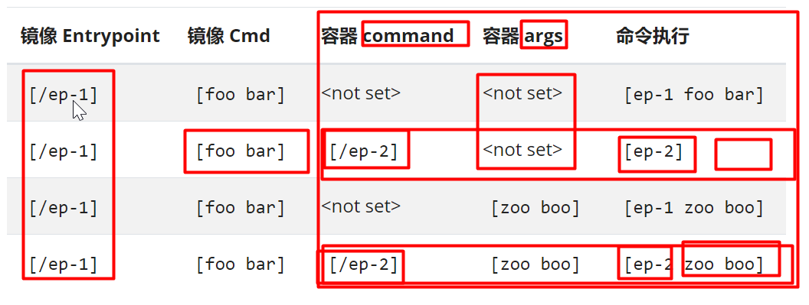

<center>
<h1>
    Kubernetes 概念
    </h1>    
</center>


# 一、基础概念理解

- 集群
  - master
  - worker
    - Node
- Pod
  - 应用最终以Pod为一个基本单位部署
- Label
  - 很多资源都可以打标签
- Deployment
  - 应用部署用它，deployment最终会产生Pod
- Service
  - 负载均衡机制


# 二、kubernetes Objects（k8s对象）

## 1、什么是k8s对象

 https://kubernetes.io/zh/docs/concepts/overview/working-with-objects/kubernetes-objects/ 

- **k8s里面操作的资源实体，就是k8s的对象，可以使用yaml来声明对象。然后让k8s根据yaml的声明创建出这个对象；**kubectl create/run /expose.....

- 操作 Kubernetes 对象 —— 无论是创建、修改，或者删除 —— 需要使用 [Kubernetes API](https://git.k8s.io/community/contributors/devel/sig-architecture/api-conventions.md)。比如，当使用 `kubectl` 命令行接口时，CLI 会执行必要的 Kubernetes API 调用 

- Kubernetes对象指的是Kubernetes系统的持久化实体，所有这些对象合起来，代表了你集群的实际情况。常规的应用里，我们把应用程序的数据存储在数据库中，**Kubernetes将其数据以Kubernetes对象的形式通过 api server存储在 etcd 中**。具体来说，这些数据（Kubernetes对象）描述了：
  - 集群中运行了哪些容器化应用程序（以及在哪个节点上运行）
  - 集群中对应用程序可用的资源（网络，存储等）
  - 应用程序相关的策略定义，例如，重启策略、升级策略、容错策略
  - 其他Kubernetes管理应用程序时所需要的信息
    scheduler先计算应该去哪个节点部署

> 对象的spec和status
>
> 每一个 Kubernetes 对象都包含了两个重要的字段：
>
> - `spec` 必须由您来提供，描述了您对该对象所期望的 **目标状态**
> - `status` 只能由 Kubernetes 系统来修改，描述了该对象在 Kubernetes 系统中的 **实际状态**
>
> Kubernetes通过对应的 **控制器**，**不断地使实际状态趋向于您期望的目标状态** 

```yaml
###  kubectl create deployment my-nginx --image=nginx
apiVersion: apps/v1
kind: Deployment
metadata:
  annotations:
    deployment.kubernetes.io/revision: "1"
  creationTimestamp: "2021-04-27T11:37:59Z"
  generation: 1
  labels:
    app: my-nginx
  name: my-nginx
  namespace: default
  resourceVersion: "376418"
  uid: 5a47e879-e2e9-40d1-8b02-180031903e8a
spec:  ###期望状态
  progressDeadlineSeconds: 600
  replicas: 1  ### 副本数量
  revisionHistoryLimit: 10
  selector:
    matchLabels:
      app: my-nginx
  strategy:
    rollingUpdate:
      maxSurge: 25%
      maxUnavailable: 25%
    type: RollingUpdate
  template:
    metadata:
      creationTimestamp: null
      labels:
        app: my-nginx
    spec:
      containers: 
      - image: nginx   ###使用这个镜像创建容器
        imagePullPolicy: Always
        name: nginx
        resources: {}
        terminationMessagePath: /dev/termination-log
        terminationMessagePolicy: File
      dnsPolicy: ClusterFirst
      restartPolicy: Always
      schedulerName: default-scheduler
      securityContext: {}
      terminationGracePeriodSeconds: 30
status:  ###当前状态
  availableReplicas: 1  ## 当前集群可用的
  conditions:
  - lastTransitionTime: "2021-04-27T11:38:17Z"
    lastUpdateTime: "2021-04-27T11:38:17Z"
    message: Deployment has minimum availability.
    reason: MinimumReplicasAvailable
    status: "True"
    type: Available
  - lastTransitionTime: "2021-04-27T11:37:59Z"
    lastUpdateTime: "2021-04-27T11:38:17Z"
    message: ReplicaSet "my-nginx-6b74b79f57" has successfully progressed.
    reason: NewReplicaSetAvailable
    status: "True"
    type: Progressing
  observedGeneration: 1
  readyReplicas: 1
  replicas: 1
  updatedReplicas: 1
  
  
  
  ### 最终一致。
  ## etcd保存的创建资源期望的状态和最终这个资源的状态要是一致的；spec和status要最终一致
  ## 1、kubectl create deployment my-nginx --image=nginx
  ## 2、api-server保存etcd，controller-manager最终解析数据，知道集群要my-nginx一份，保存到etcd
  ## 3、kubelet就做一件事情，spec状态和最终状态一致
  while(true){
    if(my-nginx.replicas != spec.replicas)
   	{
   	   kubelet.startPod();
   	}
  }
## 
```


## 2、**描述k8s对象**

```yaml
##自己编写任意资源的yaml都可以创建出他


###如何会写任意资源的yaml，比如Pod

#################编写yaml的黑科技#########################
##  kubectl run my-nginx666 --image=nginx  #启动一个Pod
## 1、kubectl get pod my-nginx666 -oyaml 集群中挑一个同类资源，获取出他的yaml。
## 2、kubectl run my-tomcat --image=tomcat --dry-run -oyaml  干跑一遍

```

```yaml
kind: Pod          #资源类型  kubectl api-resources:可以获取到所有资源
apiVersion: v1     #同一个资源有可能有多个版本。看 kubectl api-resources提示的。
metadata:          #每一个资源定义一些元数据信息
  labels:
    run: my-tomcat
  name: my-tomcat
spec:			   #资源的规格（镜像名、镜像的环境变量信息等等）
  containers:
  - image: tomcat
    name: my-tomcat
    resources: {}
  dnsPolicy: ClusterFirst
  restartPolicy: Always
```


当您在 Kubernetes 中创建一个对象时，您必须提供

- 该对象的 spec 字段，通过该字段描述您期望的 **目标状态**
- 该对象的一些基本信息，例如名字

可以使用 kubectl 命令行创建对象，业可以编写 `.yaml` 格式的文件进行创建

```yaml
apiVersion: apps/v1
kind: Deployment                      
metadata:
  name: nginx-deployment
spec:
  selector:
    matchLabels:
      app: nginx
  replicas: 2 # 运行 2 个容器化应用程序副本
  template:
    metadata:
      labels:
        app: nginx
    spec:
      containers:
      - name: nginx
        image: nginx:1.7.9
        ports:
        - containerPort: 80
```


```sh
#1、部署
kubectl apply -f deployment.yaml

#2、移除
kubectl delete -f deployment.yaml
```


集群中所有的资源，都在那里？

k8s只依赖一个存储就是etcd。

## 3、k8s对象yaml的结构


**必填字段**

在上述的 `.yaml` 文件中，如下字段是必须填写的：

- **apiVersion** 用来创建对象时所使用的Kubernetes API版本
- **kind** 被创建对象的类型
- **metadata** 用于唯一确定该对象的元数据：包括 `name` 和 `namespace`，如果 `namespace` 为空，则默认值为 `default`
- **spec** 描述您对该对象的期望状态

> 不同类型的 Kubernetes，其 `spec` 对象的格式不同（含有不同的内嵌字段），通过 [API 手册](https://kubernetes.io/docs/reference/#api-reference) 可以查看 Kubernetes 对象的字段和描述。例如，假设您想了解 Pod 的 `spec` 定义，可以在 [这里](https://kubernetes.io/docs/reference/generated/kubernetes-api/v1.16/#podspec-v1-core)找到，Deployment 的 `spec` 定义可以在 [这里](https://kubernetes.io/docs/reference/generated/kubernetes-api/v1.16/#deploymentspec-v1-apps) 找到 

 https://kubernetes.io/docs/reference/generated/kubernetes-api/v1.21/  这就是我们以后要完全参照的文档。

## 4、管理k8s对象

| 管理方式         | 操作对象                                | 推荐的环境 | 参与编辑的人数 | 学习曲线 |
| ---------------- | --------------------------------------- | ---------- | -------------- | -------- |
| 指令性的命令行   | Kubernetes对象;kubectl xxxxx。 cka      | 开发环境   | 1+             | 最低     |
| 指令性的对象配置 | 单个 yaml 文件                          | 生产环境   | 1              | 适中     |
| 声明式的对象配置 | 包含多个 yaml 文件的多个目录。kustomize | 生产环境   | 1+             | 最高     |

> 同一个Kubernetes对象应该只使用一种方式管理，否则可能会出现不可预期的结果 

```sh
#1、命令式
kubectl run nginx --image nginx

kubectl create deployment nginx --image nginx

apply -f ： 没有就创建，有就修改
#2、指令性
- 使用指令性的对象配置（imperative object configuration）时，需要向 kubectl 命令指定具体的操作（create,replace,apply,delete等），可选参数以及至少一个配置文件的名字。配置文件中必须包括一个完整的对象的定义，可以是 yaml 格式，也可以是 json 格式。

#创建对象
kubectl create -f nginx.yaml
#删除对象
kubectl delete -f nginx.yaml -f redis.yaml
#替换对象
kubectl replace -f nginx.yaml


#3、声明式
#处理 configs 目录中所有配置文件中的Kubernetes对象，根据情况创建对象、或更新Kubernetes中已经存在的对象。可以先执行 diff 指令查看具体的变更，然后执行 apply 指令执行变更；
kubectl diff -f configs/
kubectl apply -f configs/


#递归处理目录中的内容：
kubectl diff -R -f configs/
kubectl apply -R -f configs/

#移除
kubectl delete -f configs/
```


## 5、对象名称

 Kubernetes REST API 中，所有的对象都是通过 `name` 和 `UID` 唯一性确定 

可以通过 `namespace` + `name` 唯一性地确定一个 RESTFUL 对象，例如：

```http
/api/v1/namespaces/{namespace}/pods/{name}
```

> **Names**

同一个名称空间下，同一个类型的对象，可以通过 `name` 唯一性确定。如果删除该对象之后，可以再重新创建一个同名对象。

依据命名规则，Kubernetes对象的名字应该：

- 最长不超过 253个字符
- 必须由小写字母、数字、减号 `-`、小数点 `.` 组成
- 某些资源类型有更具体的要求

例如，下面的配置文件定义了一个 name 为 `nginx-demo` 的 Pod，该 Pod 包含一个 name 为 `nginx` 的容器：

```yaml
apiVersion: v1
kind: Pod
metadata:
  name: nginx-demo  ##pod的名字
spec:
  containers:
  - name: nginx     ##容器的名字
    image: nginx:1.7.9
    ports:
    - containerPort: 80 UIDs
```


> **UID**

UID 是由 Kubernetes 系统生成的，唯一标识某个 Kubernetes 对象的字符串。

Kubernetes集群中，每创建一个对象，都有一个唯一的 UID。用于区分多次创建的同名对象（如前所述，按照名字删除对象后，重新再创建同名对象时，两次创建的对象 name 相同，但是 UID 不同。）


## 6、名称空间

```sh
kubectl get namespaces

kubectl describe namespaces <name>

#隔离 mysql mapper.xml--》dao.

```

Kubernetes 安装成功后，默认有初始化了三个名称空间：

- **default** 默认名称空间，如果 Kubernetes 对象中不定义 `metadata.namespace` 字段，该对象将放在此名称空间下
- **kube-system** Kubernetes系统创建的对象放在此名称空间下
- **kube-public** 此名称空间自动在安装集群是自动创建，并且所有用户都是可以读取的（即使是那些未登录的用户）。主要是为集群预留的，例如，某些情况下，某些Kubernetes对象应该被所有集群用户看到。


> 名称空间未来如何隔离
>
> 1）、基于环境隔离（prod,test）
>
> ​		prod：部署的所有应用
>
> ​	   test：部署的所有应用
>
> ​        
>
> 2）、基于产品线的名称空间（商城，android，ios，backend）；
>
> 3）、基于团队隔离
>
> 


> 访问其他名称空间的东西？(名称空间资源隔离，网络不隔离)
>
> 1）、配置直接拿来用。不行
>
> 2）、网络访问，可以。
>
> Pod-Pod；
>
> serviceName来访问，找本名称空间的Service负载均衡
>
> **serviceName.名称空间**，可以访问别的名称空间的


> 创建名称空间
>
> ```yaml
> apiVersion: v1
> kind: Namespace
> metadata:
> name: <名称空间的名字>
> 
> apiVersion: v1
> kind: Namespace
> metadata:
> creationTimestamp: null
> name: k8s-03
> spec: {}
> status: {}
> 
> ```
>
> ```sh
> kubectl create -f ./my-namespace.yaml
> ```
>
> ```sh
> #直接用命令
> kubectl create namespace <名称空间的名字>
> 
> #删除
> kubectl delete namespaces <名称空间的名字>
> ```

名称空间的名字必须与 DNS 兼容：

- 不能带小数点 `.`
- 不能带下划线 `_`
- 使用数字、小写字母和减号 `-` 组成的字符串

 默认情况下，安装Kubernetes集群时，会初始化一个 `default` 名称空间，用来将承载那些未指定名称空间的 Pod、Service、Deployment等对象 


> 为请求设置命名空间
>
> ```sh
> #要为当前请求设置命名空间，请使用 --namespace 参数。
> 
> kubectl run nginx --image=nginx --namespace=<insert-namespace-name-here>
> kubectl get pods --namespace=<insert-namespace-name-here>
> ```
>
> ```yaml
> #在对象yaml中使用命名空间
> apiVersion: v1
> kind: Pod
> metadata:
>    name: nginx-demo  ##pod的名字
>    namespace: default #不写就是default
> spec:
>    containers:
>      - name: nginx     ##容器的名字
>      image: nginx:1.7.9
>      ports:
>        - containerPort: 80
> ```
>
> 当您创建一个 [Service](https://kubernetes.io/docs/user-guide/services) 时，Kubernetes 会创建一个相应的 [DNS 条目](https://kubernetes.io/docs/concepts/services-networking/dns-pod-service/)。
>
> 该条目的形式是 <service-name>.<namespace-name>.svc.cluster.local ，这意味着如果容器只使用 ``，它将被解析到本地命名空间的服务。这对于跨多个命名空间（如开发、分级和生产）使用相同的配置非常有用。如果您希望跨命名空间访问，则需要使用完全限定域名（FQDN）。

```yaml
# 创建Pod  kind:Pod
k8s底层最小的部署单元是Pod。Service，Deploy，ReplicaSet
# Deploy:直接指定Pod模板（） kind: Deploy
```


**并非所有对象都在命名空间中**

大多数 kubernetes 资源（例如 Pod、Service、副本控制器等）都位于某些命名空间中。但是命名空间资源本身并不在命名空间中。而且底层资源，例如 [nodes](https://kubernetes.io/docs/admin/node) 和持久化卷不属于任何命名空间。

查看哪些 Kubernetes 资源在命名空间中，哪些不在命名空间中：

```sh
# In a namespace
kubectl api-resources --namespaced=true

# Not in a namespace
kubectl api-resources --namespaced=false
```


## 7 、标签和选择器

 标签（Label）是附加在Kubernetes对象上的一组名值对，其意图是按照对用户有意义的方式来标识Kubernetes对象，同时，又不对Kubernetes的核心逻辑产生影响。标签可以用来组织和选择一组Kubernetes对象。您可以在创建Kubernetes对象时为其添加标签，也可以在创建以后再为其添加标签。每个Kubernetes对象可以有多个标签，同一个对象的标签的 Key 必须唯一，例如： 

```yaml
metadata:
  labels:
    key1: value1
    key2: value2
```

 使用标签（Label）可以高效地查询和监听Kubernetes对象，在Kubernetes界面工具（如 Kubenetes Dashboard 或 Kuboard）和 kubectl 中，标签的使用非常普遍。那些非标识性的信息应该记录在 **注解（annotation）**


> 为什么要使用标签

使用标签，用户可以按照自己期望的形式组织 Kubernetes 对象之间的结构，而无需对 Kubernetes 有任何修改。

应用程序的部署或者批处理程序的部署通常都是多维度的（例如，多个高可用分区、多个程序版本、多个微服务分层）。管理这些对象时，很多时候要针对某一个维度的条件做整体操作，例如，将某个版本的程序整体删除，这种情况下，如果用户能够事先规划好标签的使用，再通过标签进行选择，就会非常地便捷。

标签的例子有：

- `release: stable`、`release: canary`
- `environment: dev`、`environment: qa`、`environment: production`
- `tier: frontend`、`tier: backend`、`tier: cache`
- `partition: customerA`、`partition: customerB`
- `track: daily`、`track: weekly`

上面只是一些使用比较普遍的标签，您可以根据您自己的情况建立合适的使用标签的约定。

> 句法和字符集

标签是一组名值对（key/value pair）。标签的 key 可以有两个部分：可选的前缀和标签名，通过 `/` 分隔。

- 标签名：
  - 标签名部分是必须的
  - 不能多于 63 个字符
  - 必须由字母、数字开始和结尾
  - 可以包含字母、数字、减号`-`、下划线`_`、小数点`.`
- 标签前缀：
  - 标签前缀部分是可选的
  - 如果指定，必须是一个DNS的子域名，例如：k8s.eip.work
  - 不能多于 253 个字符
  - 使用 `/` 和标签名分隔

如果省略标签前缀，则标签的 key 将被认为是专属于用户的。Kubernetes的系统组件（例如，kube-scheduler、kube-controller-manager、kube-apiserver、kubectl 或其他第三方组件）向用户的Kubernetes对象添加标签时，必须指定一个前缀。`kubernetes.io/` 和 `k8s.io/` 这两个前缀是 Kubernetes 核心组件预留的。

标签的 value 必须：

- 不能多于 63 个字符
- 可以为空字符串
- 如果不为空，则
  - 必须由字母、数字开始和结尾
  - 可以包含字母、数字、减号`-`、下划线`_`、小数点`.`

```yaml
apiVersion: v1
kind: Pod
metadata:
  name: label-demo
  labels:
    environment: production
    app: nginx
spec:
  containers:
  - name: nginx
    image: nginx:1.7.9
    ports:
    - containerPort: 80
```


**标签选择器**

通常来讲，会有多个Kubernetes对象包含相同的标签。通过使用标签选择器（label selector），用户/客户端可以选择一组对象。标签选择器（label selector）是 Kubernetes 中最主要的分类和筛选手段。

Kubernetes api server支持两种形式的标签选择器，`equality-based 基于等式的` 和 `set-based 基于集合的`。标签选择器可以包含多个条件，并使用逗号分隔，此时只有满足所有条件的 Kubernetes 对象才会被选中

> 使用基于等式的选择方式,可以使用三种操作符 =、==、!=。前两个操作符含义是一样的，都代表相等，后一个操作符代表不相等

```shell
#
kubectl get pods -l environment=production,tier=frontend
# 选择了标签名为 `environment` 且 标签值为 `production` 的Kubernetes对象
environment = production
# 选择了标签名为 `tier` 且标签值不等于 `frontend` 的对象，以及不包含标签 `tier` 的对象
tier != frontend
```

> 使用基于集合的选择方式
>
> ```sh
> Set-based 标签选择器可以根据标签名的一组值进行筛选。支持的操作符有三种：in、notin、exists。例如
> # 选择所有的包含 `environment` 标签且值为 `production` 或 `qa` 的对象
> environment in (production, qa)
> # 选择所有的 `tier` 标签不为 `frontend` 和 `backend`的对象，或不含 `tier` 标签的对象
> tier notin (frontend, backend)
> # 选择所有包含 `partition` 标签的对象
> partition
> # 选择所有不包含 `partition` 标签的对象
> !partition
> 
> # 选择包含 `partition` 标签（不检查标签值）且 `environment` 不是 `qa` 的对象
> partition,environment notin (qa)
> 
> 
> kubectl get pods -l 'environment in (production),tier in (frontend)'
> ```

```yaml
#Job、Deployment、ReplicaSet 和 DaemonSet 同时支持基于等式的选择方式和基于集合的选择方式。例如：
selector:
  matchLabels:
    component: redis
  matchExpressions:
    - {key: tier, operator: In, values: [cache]}
    - {key: environment, operator: NotIn, values: [dev]}

# matchLabels 是一个 {key,value} 组成的 map。map 中的一个 {key,value} 条目相当于 matchExpressions 中的一个元素，其 key 为 map 的 key，operator 为 In， values 数组则只包含 value 一个元素。matchExpression 等价于基于集合的选择方式，支持的 operator 有 In、NotIn、Exists 和 DoesNotExist。当 operator 为 In 或 NotIn 时，values 数组不能为空。所有的选择条件都以 AND 的形式合并计算，即所有的条件都满足才可以算是匹配
```

```shell
#添加或者修改标签
kubectl label --help
# Update pod 'foo' with the label 'unhealthy' and the value 'true'.
kubectl label pods foo unhealthy=true

# Update pod 'foo' with the label 'status' and the value 'unhealthy', overwriting any existing value.
kubectl label --overwrite pods foo status=unhealthy

# Update all pods in the namespace
kubectl label pods --all status=unhealthy

# Update a pod identified by the type and name in "pod.json"
kubectl label -f pod.json status=unhealthy

# Update pod 'foo' only if the resource is unchanged from version 1.
kubectl label pods foo status=unhealthy --resource-version=1

# Update pod 'foo' by removing a label named 'bar' if it exists.
# Does not require the --overwrite flag.
kubectl label pods foo bar-

```


## 8、注解annotation

 注解（annotation）可以用来向 Kubernetes 对象的 `metadata.annotations` 字段添加任意的信息。Kubernetes 的客户端或者自动化工具可以存取这些信息以实现其自定义的逻辑。 

```yaml
metadata:
  annotations:
    key1: value1
    key2: value2
```


## 9、字段选择器

*字段选择器*（*Field selectors*）允许您根据一个或多个资源字段的值[筛选 Kubernetes 资源](https://kubernetes.io/docs/concepts/overview/working-with-objects/kubernetes-objects)。 下面是一些使用字段选择器查询的例子：

- `metadata.name=my-service`
- `metadata.namespace!=default`
- `status.phase=Pending`


```sh
kubectl get pods --field-selector status.phase=Running
```


> 三个命令玩转所有的yaml写法‘
>
> - kubectl get  xxx   -oyaml
>
> - kubectl create deploy xxxxx  --dry-run-client -oyaml
>
> - kubectl explain pod.spec.xx

写完yaml  kubectl apply -f 即可


## 10、给vscode安装插件

搜索kubernetes ，`安装 yaml`和`kubernetes template`插件即可


idea也有kubernetes插件


## 11、认识kubectl和kubelet

- kubeadm安装的集群。二进制后来就是  yum install etcd  api-server
  - 认识核心文件夹  /etc/kubernetes .   以Pod方式安装的核心组件。
    - etcd，api-server，scheduler。（安装k8s的时候，yum kubeadm **kubelet** kubectl）
  - 回顾集群安装的时候，[为什么只有master节点的kubectl可以操作集群](https://kubernetes.io/zh/docs/reference/kubectl/overview/)
  - kubelet额外参数配置  **/etc/sysconfig/kubelet**；kubelet配置位置 /var/lib/kubelet/config.yaml


kubectl的所有命令参考：

命令参考：https://kubernetes.io/docs/reference/generated/kubectl/kubectl-commands

pdf命令实战：https://github.com/dennyzhang/cheatsheet-kubernetes-A4/blob/master/cheatsheet-kubernetes-A4.pdf

```sh
Basic Commands (Beginner): 初学者掌握的命令
  create        Create a resource from a file or from stdin.
  expose        Take a replication controller, service, deployment or pod and expose it as a new
Kubernetes Service
  run           Run a particular image on the cluster
  set           Set specific features on objects

Basic Commands (Intermediate): 基础命令
  explain       Documentation of resources
  get           Display one or many resources
  edit          Edit a resource on the server
  delete        Delete resources by filenames, stdin, resources and names, or by resources and label
selector

Deploy Commands:   #部署用的命令
  rollout       Manage the rollout of a resource
  scale         Set a new size for a Deployment, ReplicaSet or Replication Controller
  autoscale     Auto-scale a Deployment, ReplicaSet, StatefulSet, or ReplicationController

Cluster Management Commands:  #集群管理的命令
  certificate   Modify certificate resources.
  cluster-info  Display cluster info
  top           Display Resource (CPU/Memory) usage.
  cordon        Mark node as unschedulable
  uncordon      Mark node as schedulable
  drain         Drain node in preparation for maintenance
  taint         Update the taints on one or more nodes

Troubleshooting and Debugging Commands:  # debug的命令
  describe      Show details of a specific resource or group of resources
  logs          Print the logs for a container in a pod
  attach        Attach to a running container
  exec          Execute a command in a container
  port-forward  Forward one or more local ports to a pod
  proxy         Run a proxy to the Kubernetes API server
  cp            Copy files and directories to and from containers.
  auth          Inspect authorization
  debug         Create debugging sessions for troubleshooting workloads and nodes

Advanced Commands:  # 高阶命令
  diff          Diff live version against would-be applied version
  apply         Apply a configuration to a resource by filename or stdin
  patch         Update field(s) of a resource
  replace       Replace a resource by filename or stdin
  wait          Experimental: Wait for a specific condition on one or many resources.
  kustomize     Build a kustomization target from a directory or URL.

Settings Commands:  # 设置
  label         Update the labels on a resource
  annotate      Update the annotations on a resource
  completion    Output shell completion code for the specified shell (bash or zsh) #

Other Commands:  #其他
  api-resources Print the supported API resources on the server
  api-versions  Print the supported API versions on the server, in the form of "group/version"
  config        Modify kubeconfig files
  plugin        Provides utilities for interacting with plugins.
  version       Print the client and server version information

```


## 12、自动补全

https://kubernetes.io/zh/docs/tasks/tools/included/optional-kubectl-configs-bash-linux/

```sh
# 安装
yum install bash-completion


# 自动补全
echo 'source <(kubectl completion bash)' >>~/.bashrc
kubectl completion bash >/etc/bash_completion.d/kubectl
source /usr/share/bash-completion/bash_completion

```


# 三、万物基础-容器

> 思考：我们在k8s里面的容器和docker的容器有什么异同？

k8s的**Pod**是最小单位，Pod中容器的配置需要注意以下常用的

Pod里面的容器内容可以写的东西

```yaml
   args	<[]string>


   command	<[]string>
     Entrypoint array. Not executed within a shell. The docker image's
     ENTRYPOINT is used if this is not provided. Variable references $(VAR_NAME)
     are expanded using the container's environment. If a variable cannot be
     resolved, the reference in the input string will be unchanged. The
     $(VAR_NAME) syntax can be escaped with a double $$, ie: $$(VAR_NAME).
     Escaped references will never be expanded, regardless of whether the
     variable exists or not. Cannot be updated. More info:
     https://kubernetes.io/docs/tasks/inject-data-application/define-command-argument-container/#running-a-command-in-a-shell

   env	<[]Object>
     容器要用的环境变量

   envFrom	<[]Object>
     List of sources to populate environment variables in the container. The
     keys defined within a source must be a C_IDENTIFIER. All invalid keys will
     be reported as an event when the container is starting. When a key exists
     in multiple sources, the value associated with the last source will take
     precedence. Values defined by an Env with a duplicate key will take
     precedence. Cannot be updated.

   image	<string>
    	写镜像的名字

   imagePullPolicy	<string>
        下载策略： 
        Always：总是去下载： 【默认】  
            先看网上有没有，有了就下载，（本机也有，docker就相当于不用下载了）
        Never：总不去下载，一定保证当前Pod所在的机器有这个镜像 ；直接看本机
        IfNotPresent：如果本机没有就去下载；先看本机，再看远程

   lifecycle	<Object>
      生命周期钩子

   livenessProbe	<Object>
     Periodic probe of container liveness. Container will be restarted if the
     probe fails. Cannot be updated. More info:
     https://kubernetes.io/docs/concepts/workloads/pods/pod-lifecycle#container-probes

   name	<string> -required-
   		容器的名字

   ports	<[]Object>
      端口：

   readinessProbe	<Object>
     Periodic probe of container service readiness. Container will be removed
     from service endpoints if the probe fails. Cannot be updated. More info:
     https://kubernetes.io/docs/concepts/workloads/pods/pod-lifecycle#container-probes

   resources	<Object>
     Compute Resources required by this container. Cannot be updated. More info:
     https://kubernetes.io/docs/concepts/configuration/manage-resources-containers/

   securityContext	<Object>
     Security options the pod should run with. More info:
     https://kubernetes.io/docs/concepts/policy/security-context/ More info:
     https://kubernetes.io/docs/tasks/configure-pod-container/security-context/

   startupProbe	<Object>
     StartupProbe indicates that the Pod has successfully initialized. If
     specified, no other probes are executed until this completes successfully.
     If this probe fails, the Pod will be restarted, just as if the
     livenessProbe failed. This can be used to provide different probe
     parameters at the beginning of a Pod's lifecycle, when it might take a long
     time to load data or warm a cache, than during steady-state operation. This
     cannot be updated. More info:
     https://kubernetes.io/docs/concepts/workloads/pods/pod-lifecycle#container-probes

   stdin	<boolean>
     Whether this container should allocate a buffer for stdin in the container
     runtime. If this is not set, reads from stdin in the container will always
     result in EOF. Default is false.

   stdinOnce	<boolean>
     Whether the container runtime should close the stdin channel after it has
     been opened by a single attach. When stdin is true the stdin stream will
     remain open across multiple attach sessions. If stdinOnce is set to true,
     stdin is opened on container start, is empty until the first client
     attaches to stdin, and then remains open and accepts data until the client
     disconnects, at which time stdin is closed and remains closed until the
     container is restarted. If this flag is false, a container processes that
     reads from stdin will never receive an EOF. Default is false

   terminationMessagePath	<string>
     Optional: Path at which the file to which the container's termination
     message will be written is mounted into the container's filesystem. Message
     written is intended to be brief final status, such as an assertion failure
     message. Will be truncated by the node if greater than 4096 bytes. The
     total message length across all containers will be limited to 12kb.
     Defaults to /dev/termination-log. Cannot be updated.

   terminationMessagePolicy	<string>
     Indicate how the termination message should be populated. File will use the
     contents of terminationMessagePath to populate the container status message
     on both success and failure. FallbackToLogsOnError will use the last chunk
     of container log output if the termination message file is empty and the
     container exited with an error. The log output is limited to 2048 bytes or
     80 lines, whichever is smaller. Defaults to File. Cannot be updated.

   tty	<boolean>
     Whether this container should allocate a TTY for itself, also requires
     'stdin' to be true. Default is false.

   volumeDevices	<[]Object>
     volumeDevices is the list of block devices to be used by the container.

   volumeMounts	<[]Object>
     Pod volumes to mount into the container's filesystem. Cannot be updated.

   workingDir	<string>
    	指定进容器的工作目录

```


## 1、镜像

 在 Kubernetes 的 Pod 中使用容器镜像之前，我们必须将其推送到一个镜像仓库（或者使用仓库中已经有的容器镜像）。在 Kubernetes 的 Pod 定义中定义容器时，必须指定容器所使用的镜像，容器中的 `image` 字段支持与 `docker` 命令一样的语法，包括私有镜像仓库和标签。 


 如果使用 `hub.dokcer.com` Registry 中的镜像，可以省略 registry 地址和 registry 端口。例如：`nginx:latest` 

 Kubernetes中，默认的镜像抓取策略是 `IfNotPresent`，使用此策略，kubelet在发现本机有镜像的情况下，不会向镜像仓库抓取镜像。如果您期望每次启动 Pod 时，都强制从镜像仓库抓取镜像，可以尝试如下方式： 

- 设置 container 中的 `imagePullPolicy` 为 `Always`
- 省略 `imagePullPolicy` 字段，并使用 `:latest` tag 的镜像
- 省略 `imagePullPolicy` 字段和镜像的 tag
- 激活 [AlwaysPullImages](https://kubernetes.io/docs/reference/access-authn-authz/admission-controllers/#alwayspullimages) 管理控制器


docker pull redis    

docker.io/library/redis:latest


**下载私有仓库镜像**

```sh

#这个秘钥默认在default名称空间，不能被hello名称空间共享
kubectl create secret -n hello docker-registry my-aliyun \
  --docker-server=registry.cn-hangzhou.aliyuncs.com \
  --docker-username=forsumlove \
  --docker-password=lfy11223344
  
  # 那个镜像对应哪个仓库没有任何问题
  
```

```yaml
apiVersion: v1
kind: Pod
metadata:
  name: foo
spec:
  containers:
    - name: foo
      image: registry.cn-zhangjiakou.aliyuncs.com/atguigudocker/atguigu-java-img:v1.0
  imagePullSecrets:
    - name: mydocker
```


## 2、启动命令



## 3、环境变量

 env指定即可

## 4、生命周期容器钩子

Kubernetes中为容器提供了两个 hook（钩子函数）：

- `PostStart`

  此钩子函数在容器创建后将立刻执行。但是，并不能保证该钩子函数在容器的 `ENTRYPOINT` 之前执行。该钩子函数没有输入参数。

- `PreStop`

  此钩子函数在容器被 terminate（终止）之前执行，例如：

  - 通过接口调用删除容器所在 Pod
  - 某些管理事件的发生：健康检查失败、资源紧缺等

  如果容器已经被关闭或者进入了 `completed` 状态，preStop 钩子函数的调用将失败。该函数的执行是同步的，即，kubernetes 将在该函数完成执行之后才删除容器。该钩子函数没有输入参数。

```yaml
apiVersion: v1
kind: Pod
metadata:
  name: lifecycle-demo
spec:
  containers:
  - name: lifecycle-demo-container
    image: alpine
    command: ["/bin/sh", "-c", "echo hello; "]
    volumeMounts:
       - name: mount1
       	 mountPath: /app
    lifecycle:
      postStart:
        exec:
          command: ["/bin/sh", "-c", "echo world;"]
      preStop:
        exec:
          command: ["/bin/sh","-c","echo 66666;"]
```

- Kubernetes 在容器启动后立刻发送 postStart 事件，但是并不能确保 postStart 事件处理程序在容器的 EntryPoint 之前执行。postStart 事件处理程序相对于容器中的进程来说是异步的（同时执行），然而，Kubernetes 在管理容器时，将一直等到 postStart 事件处理程序结束之后，才会将容器的状态标记为 Running。
- Kubernetes 在决定关闭容器时，立刻发送 preStop 事件，并且，将一直等到 preStop 事件处理程序结束或者 Pod 的 `--grace-period` 超时，才删除容器


## 3、资源限制

```yaml
pods/qos/qos-pod.yaml 

apiVersion: v1
kind: Pod
metadata:
  name: qos-demo
  namespace: qos-example
spec:
  containers:
  - name: qos-demo-ctr
    image: nginx
    resources:
    # 
      limits:  # 限制最大大小   -Xmx
        memory: "200Mi"
        cpu: "700m" 
        # 启动默认给分配的大小   -Xms
      requests:
        memory: "200Mi"
        cpu: "700m"
```

## 4、其他

kubectl explain  解析一个资源Pod改怎么编写yaml


kubectl describe 用来排错的，看资源的状态

官方文档

= 专家


