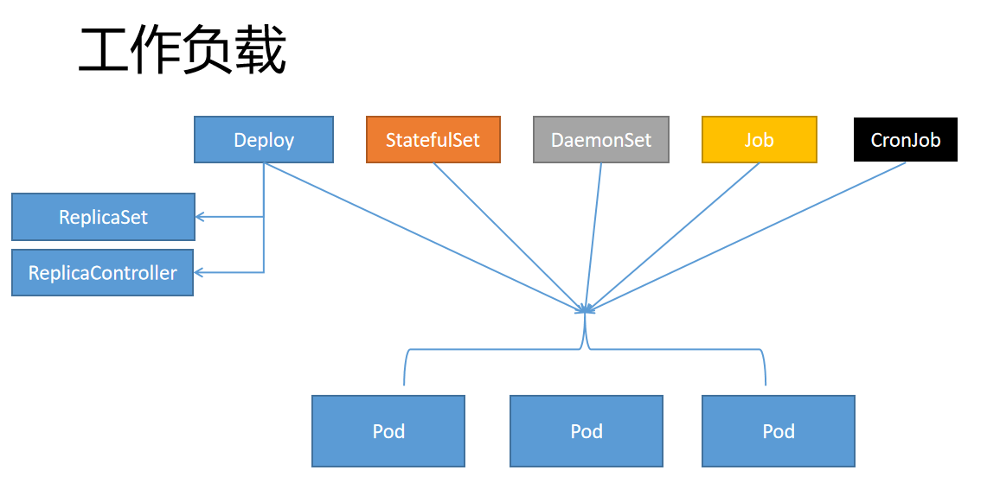
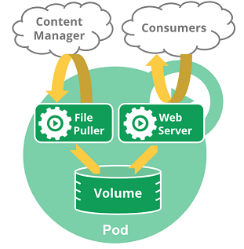
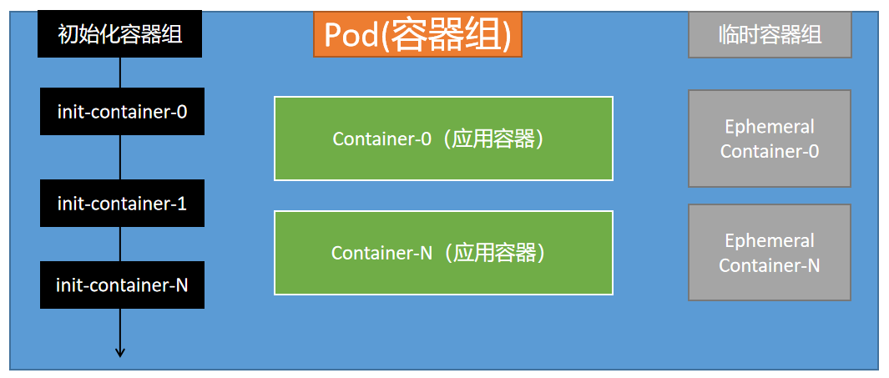
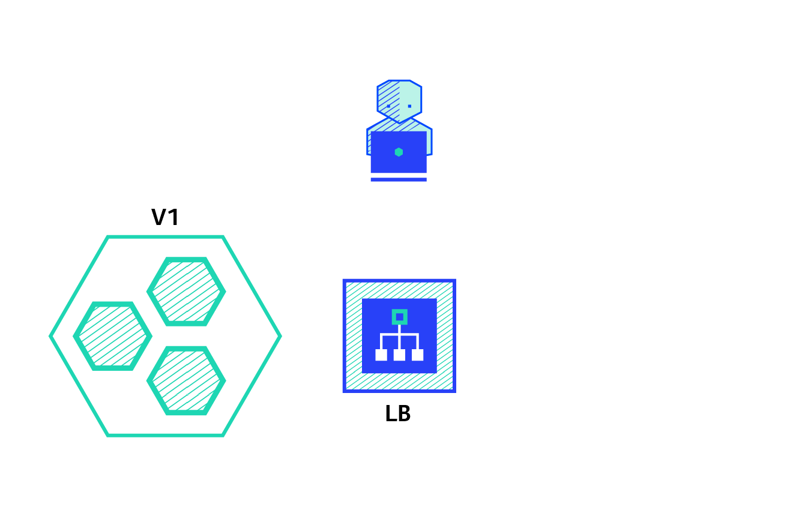

<center>
<h1>
    Kubernetes 工作负载
    </h1>    
</center>

# 总：Workloads

```sh
#获取控制台访问令牌
kubectl -n kubernetes-dashboard describe secret $(kubectl -n kubernetes-dashboard get secret | grep admin-user | awk '{print $1}')
```

> 什么是工作负载（Workloads）
>
> - 工作负载是运行在 Kubernetes 上的一个应用程序。
> - 一个应用很复杂，可能由单个组件或者多个组件共同完成。无论怎样我们可以用一组Pod来表示一个应用，也就是一个工作负载
> - Pod又是一组容器（Containers）
> - 所以关系又像是这样
>   - 工作负载（Workloads）控制一组Pod
>   - Pod控制一组容器（Containers）
>     - 比如Deploy（工作负载） 3个副本的nginx（3个Pod），每个nginx里面是真正的nginx容器（container）




工作负载能让Pod能拥有自恢复能力。

会写Pod。研究不同的工作负载怎么控制Pod的行为


# 一、Pod

## 1、什么是Pod

- *Pod*是一组（一个或多个） [容器（docker容器）](https://kubernetes.io/zh/docs/concepts/overview/what-is-kubernetes/#why-containers)的集合 （就像在豌豆荚中）；这些容器共享存储、网络、以及怎样运行这些容器的声明。
- 
- 我们一般不直接创建Pod，而是创建一些工作负载由他们来创建Pod
- Pod的形式
  - Pod对容器有自恢复能力（Pod自动重启失败的容器）
  - Pod自己不能恢复自己，Pod被删除就真的没了（100，MySQL、Redis、Order）还是希望k8s集群能自己在其他地方再启动这个Pod
  - 单容器Pod
  - 多容器协同Pod。我们可以把另外的容器称为**`SideCar（为应用赋能）`**
  - Pod 天生地为其成员容器提供了两种共享资源：[网络](https://kubernetes.io/zh/docs/concepts/workloads/pods/#pod-networking)和 [存储](https://kubernetes.io/zh/docs/concepts/workloads/pods/#pod-storage)。
- 一个Pod由一个**Pause容器**设置好整个Pod里面所有容器的网络、名称空间等信息
- systemctl status可以观测到。Pod和容器进程关系
  - kubelet启动一个Pod，准备两个容器，一个是Pod声明的应用容器（nginx），另外一个是Pause。Pause给当前应用容器设置好网络空间各种的。
  - 



> 编写yaml测试：多容器协同


## 2、Pod使用

- 可以编写deploy等各种工作负载的yaml文件，最终创建出pod，也可以直接创建

- Pod的模板如下

- ```yaml
      # 这里是 Pod 模版
      apiVersion: v1
      kind: Pod
      metadata:
        name: my-pod
      spec:
        containers:
        - name: hello
          image: busybox
          command: ['sh', '-c', 'echo "Hello, Kubernetes!" && sleep 3600']
        restartPolicy: OnFailure
      # 以上为 Pod 模版
  ```


## 3、Pod生命周期



- Pod启动，会先**依次**执行所有初始化容器，有一个失败，则Pod不能启动
- 接下来**启动所有的应用容器**（每一个应用容器都必须能一直运行起来），Pod开始正式工作，一个启动失败就会**尝试重启Pod内的这个容器**，Pod只要是NotReady，Pod就不对外提供服务了

>  编写yaml测试生命周期
>
> - 应用容器生命周期钩子
>
> - 初始化容器（也可以有钩子）


临时容器：线上排错。

有些容器基础镜像。线上没法排错。使用临时容器进入这个Pod。临时容器共享了Pod的所有。临时容器有Debug的一些命令，拍错完成以后，只要exit退出容器，临时容器自动删除


Java：dump，  jre 50mb。jdk 150mb

jre 50mb。: jdk作为临时容器


>  临时容器需要开启特性门控  --feature-gates="EphemeralContainers=true"
>
> 在所有组件，api-server、kubelet、scheduler、controller-manager都得配置

1.21.0： 生产环境  .5

使用临时容器的步骤：

1、声明一个临时容器。准备好json文件

```json
{
    "apiVersion": "v1",
    "kind": "EphemeralContainers",
    "metadata": {
            "name": "my-nginx666" //指定Pod的名字
    },
    "ephemeralContainers": [{
        "command": [
            "sh"
        ],
        "image": "busybox",  //jre的需要jdk来调试
        "imagePullPolicy": "IfNotPresent",
        "name": "debugger",
        "stdin": true,
        "tty": true,
        "terminationMessagePolicy": "File"
    }]
}
```

2、使用临时容器，应用一下即可

```shell
kubectl replace --raw /api/v1/namespaces/default/pods/my-nginx666【pod名】/ephemeralcontainers  -f ec.json
```


## 4、静态Pod

在  **/etc/kubernetes/manifests** 位置放的所有Pod.yaml文件，机器启动kubelet自己就把他启动起来。

静态Pod一直守护在他的这个机器上


## 5、Probe 探针机制（健康检查机制）

- 每个容器三种探针（Probe）
  - **启动探针****（后来才加的）**  **一次性成功探针。**  只要启动成功了
    
    - kubelet 使用启动探针，来检测应用是否已经启动。如果启动就可以进行后续的探测检查。慢容器一定指定启动探针。一直在等待启动
    - **启动探针 成功以后就不用了，剩下存活探针和就绪探针持续运行**
    
  - 存活探针
    
    - kubelet 使用存活探针，来检测容器是否正常存活。（有些容器可能产生死锁【应用程序在运行，但是无法继续执行后面的步骤】），`如果检测失败就会**重新启动这个容器`**
    - initialDelaySeconds：  3600（长了导致可能应用一段时间不可用）    5（短了陷入无限启动循环）
    
  - 就绪探针
    
    - kubelet 使用就绪探针，来检测容器是否准备**好了可以接收流量**。当一个 Pod 内的所有容器都准备好了，才能把这个 Pod 看作就绪了。用途就是：Service后端负载均衡多个Pod，如果某个Pod还没就绪，就会从service负载均衡里面剔除
    
  - 谁利用这些探针探测
  
    - kubelet会主动按照配置给Pod里面的所有容器发送响应的探测请求
  
    

-------------

- [Probe](https://kubernetes.io/docs/reference/generated/kubernetes-api/v1.21/#probe-v1-core)配置项
  - `initialDelaySeconds`：容器启动后要等待多少秒后存活和就绪探测器才被初始化，默认是 0 秒，最小值是 0。这是针对以前没有
  - `periodSeconds`：执行探测的时间间隔（单位是秒）。默认是 10 秒。**最小值是 1**。
  - `successThreshold`：探测器在失败后，被视为成功的最小连续成功数。**默认值是 1**。 
    - 存活和启动探针的这个值必须是 1。最小值是 1。
  - `failureThreshold`：当探测失败时，Kubernetes 的重试次数。 存活探测情况下的放弃就意味着重新启动容器。 就绪探测情况下的放弃 Pod 会被打上未就绪的标签。**默认值是 3**。最小值是 1。
  - `timeoutSeconds`：探测的超时后等待多少秒。**默认值是 1 秒**。最小值是 1。 

https://kubernetes.io/zh/docs/tasks/configure-pod-container/configure-liveness-readiness-startup-probes/#configure-probes

```yaml
   exec、httpGet、tcpSocket 【那种方式探测】
   
   
   

   failureThreshold

   

   initialDelaySeconds

   periodSeconds

   successThreshold

   

   terminationGracePeriodSeconds

   timeoutSeconds	<integer>

```


> 编写yaml测试探针机制

```yaml
apiVersion: v1
kind: Pod
metadata:
  name: "nginx-start-probe02"
  namespace: default
  labels:
    app: "nginx-start-probe02"
spec:
  volumes:
  - name: nginx-vol
    hostPath: 
      path: /app
  - name: nginx-html
    hostPath: 
      path: /html
  containers:
  - name: nginx
    image: "nginx"
    ports:
    - containerPort: 80
    startupProbe:
      exec:
        command:  ["/bin/sh","-c","cat /app/abc"]  ## 返回不是0，那就是探测失败
      # initialDelaySeconds: 20 ## 指定的这个秒以后才执行探测
      periodSeconds: 5  ## 每隔几秒来运行这个
      timeoutSeconds: 5  ##探测超时，到了超时时间探测还没返回结果说明失败
      successThreshold: 1 ## 成功阈值，连续几次成才算成功
      failureThreshold: 3 ## 失败阈值，连续几次失败才算真失败
    volumeMounts:
    - name: nginx-vol
      mountPath: /app
    - name: nginx-html
      mountPath: /usr/share/nginx/html
    livenessProbe:   ## nginx容器有没有 /abc.html，就绪探针
      # httpGet:
      #   host: 127.0.0.1
      #   path: /abc.html
      #   port: 80
      #   scheme: HTTP
      # periodSeconds: 5  ## 每隔几秒来运行这个
      # successThreshold: 1 ## 成功阈值，连续几次成才算成功
      # failureThreshold: 5 ## 失败阈值，连续几次失败才算真失败
      exec:
        command:  ["/bin/sh","-c","cat /usr/share/nginx/html/abc.html"]  ## 返回不是0，那就是探测失败
      # initialDelaySeconds: 20 ## 指定的这个秒以后才执行探测
      periodSeconds: 5  ## 每隔几秒来运行这个
      timeoutSeconds: 5  ##探测超时，到了超时时间探测还没返回结果说明失败
      successThreshold: 1 ## 成功阈值，连续几次成才算成功
      failureThreshold: 3 ## 失败阈值，连续几次失败才算真失败
    readinessProbe: ##就绪检测，都是http
      httpGet:  
        # host: 127.0.0.1  ###不行
        path: /abc.html  ## 给容器发请求
        port: 80
        scheme: HTTP ## 返回不是0，那就是探测失败
      initialDelaySeconds: 2 ## 指定的这个秒以后才执行探测
      periodSeconds: 5  ## 每隔几秒来运行这个
      timeoutSeconds: 5  ##探测超时，到了超时时间探测还没返回结果说明失败
      successThreshold: 3 ## 成功阈值，连续几次成才算成功
      failureThreshold: 5 ## 失败阈值，连续几次失败才算真失败
        
    # livenessProbe:
    #   exec: ["/bin/sh","-c","sleep 30;abc "]  ## 返回不是0，那就是探测失败
    #   initialDelaySeconds: 20 ## 指定的这个秒以后才执行探测
    #   periodSeconds: 5  ## 每隔几秒来运行这个
    #   timeoutSeconds: 5  ##探测超时，到了超时时间探测还没返回结果说明失败
    #   successThreshold: 5 ## 成功阈值，连续几次成才算成功
    #   failureThreshold: 5 ## 失败阈值，连续几次失败才算真失败
```


微服务。   /health

K8S检查当前应用的状态；connection refuse；

SpringBoot 优雅停机：gracefulShowdown: true

pod.spec.**terminationGracePeriodSeconds** = 30s  优雅停机；给一个缓冲时间


健康检查+优雅停机 = 0宕机

start完成以后，liveness和readness并存。   liveness失败导致重启。readness失败导致不给Service负载均衡网络中加，不接受流量。  kubectl exec -it 就进不去。Kubectl describe 看看咋了。


# 二、Deployment

## 1、什么是Deployment

- 一个 *Deployment* 为 [Pods](https://kubernetes.io/docs/concepts/workloads/pods/pod-overview/) 和 [ReplicaSets](https://kubernetes.io/zh/docs/concepts/workloads/controllers/replicaset/) 提供声明式的更新能力。 
- 你负责描述 Deployment 中的 *目标状态*，而 Deployment [控制器（Controller）](https://kubernetes.io/zh/docs/concepts/architecture/controller/) 以受控速率更改**实际状态**， 使其变为**期望状态**；控制循环。 for(){ xxx  controller.spec()}
- 不要管理 Deployment 所拥有的 ReplicaSet 
- 我们部署一个应用一般不直接写Pod，而是部署一个Deployment
- Deploy编写规约 https://kubernetes.io/zh/docs/concepts/workloads/controllers/deployment/#writing-a-deployment-spec


## 2、Deployment创建

- 基本格式
  - `.metadata.name`指定deploy名字
  - `replicas` 指定副本数量
  - `selector` 指定匹配的Pod模板。
  - `template` 声明一个Pod模板

> 编写一个Deployment的yaml
>
> 赋予Pod自愈和故障转移能力。


- 在检查集群中的 Deployment 时，所显示的字段有：
  - `NAME` 列出了集群中 Deployment 的名称。
  - `READY` 显示应用程序的可用的 *副本* 数。显示的模式是“就绪个数/期望个数”。
  - `UP-TO-DATE` 显示为了达到期望状态已经更新的副本数。
  - `AVAILABLE` 显示应用可供用户使用的副本数。
  - `AGE` 显示应用程序运行的时间。

- ReplicaSet 输出中包含以下字段：
  - `NAME` 列出名字空间中 ReplicaSet 的名称；
  - `DESIRED` 显示应用的期望副本个数，即在创建 Deployment 时所定义的值。 此为期望状态；
  - `CURRENT` 显示当前运行状态中的副本个数；
  - `READY` 显示应用中有多少副本可以为用户提供服务；
  - `AGE` 显示应用已经运行的时间长度。
  - 注意：ReplicaSet 的名称始终被格式化为`[Deployment名称]-[随机字符串]`。 其中的随机字符串是使用 pod-template-hash 作为种子随机生成的。

>  一个Deploy产生三个
>
> - Deployment资源
> - replicaset资源
> - Pod资源
>
> Deployment控制RS，RS控制Pod的副本数
>
> ReplicaSet： 只提供了副本数量的控制功能
>
> Deployment：   每部署一个新版本就会创建一个新的副本集，利用他记录状态，回滚也是直接让指定的rs生效
>
>    ---   rs1： 4       abc    
>
>    ---    rs2:  4        def
>
>    ---    rsN:  4     eee
>
> nginx=111   nginx:v1=2222  nginx:v2=3333


## 3、Deployment 更新机制

- 仅当 Deployment Pod 模板（即 `.spec.template`）发生改变时，例如**模板的标签或容器镜像被更新， 才会触发 Deployment 上线**。 **其他更新（如对 Deployment 执行扩缩容的操作）不会触发上线动作。**
- **上线动作 原理： 创建新的rs，准备就绪后，替换旧的rs（此时不会删除，因为`revisionHistoryLimit` 指定了保留几个版本）**

- 常用的kubectl 命令

```sh
################更新#################################
#kubectl  set image  deployment资源名  容器名=镜像名
kubectl set image deployment.apps/nginx-deployment php-redis=tomcat:8 --record
## yaml提取可更新的关键所有字段计算的hash。
web---- /hello
postman   aservice- /hello

#或者直接修改定义也行
kubectl edit deployment.v1.apps/nginx-deployment
#查看状态
kubectl rollout status deployment.v1.apps/nginx-deployment

################查看历史并回滚####################################
#查看更新历史-看看我们设置的历史总记录数是否生效了
kubectl rollout history deployment.v1.apps/nginx-deployment
#回滚
kubectl rollout undo deployment.v1.apps/nginx-deployment --to-revision=2

###############累计更新##############
#暂停记录版本
kubectl rollout pause deployment.v1.apps/nginx-deployment
#多次更新操作。
##比如更新了资源限制
kubectl set resources deployment.v1.apps/nginx-deployment -c=nginx --limits=cpu=200m,memory=512Mi
##比如更新了镜像版本
kubectl set image deployment.apps/nginx-deployment php-redis=tomcat:8
##在继续操作多次
##看看历史版本有没有记录变化
kubectl rollout history deployment.v1.apps/nginx-deployment
#让多次累计生效
kubectl rollout resume deployment.v1.apps/nginx-deployment
```


### 1、*比例缩放（Proportional Scaling）*

maxSurge（最大增量）：除当前数量外还要添加多少个实例。

maxUnavailable（最大不可用量）：滚动更新过程中的不可用实例数。


### 2、*HPA（动态扩缩容）*


概念：https://kubernetes.io/zh/docs/tasks/run-application/horizontal-pod-autoscale/#scaling-policies

实战：https://kubernetes.io/zh/docs/tasks/run-application/horizontal-pod-autoscale-walkthrough/


- 需要先安装metrics-server

https://github.com/kubernetes-sigs/metrics-server

- 安装步骤

  - ```yaml
    apiVersion: v1
    kind: ServiceAccount
    metadata:
      labels:
        k8s-app: metrics-server
      name: metrics-server
      namespace: kube-system
    ---
    apiVersion: rbac.authorization.k8s.io/v1
    kind: ClusterRole
    metadata:
      labels:
        k8s-app: metrics-server
        rbac.authorization.k8s.io/aggregate-to-admin: "true"
        rbac.authorization.k8s.io/aggregate-to-edit: "true"
        rbac.authorization.k8s.io/aggregate-to-view: "true"
      name: system:aggregated-metrics-reader
    rules:
    - apiGroups:
      - metrics.k8s.io
      resources:
      - pods
      - nodes
      verbs:
      - get
      - list
      - watch
    ---
    apiVersion: rbac.authorization.k8s.io/v1
    kind: ClusterRole
    metadata:
      labels:
        k8s-app: metrics-server
      name: system:metrics-server
    rules:
    - apiGroups:
      - ""
      resources:
      - pods
      - nodes
      - nodes/stats
      - namespaces
      - configmaps
      verbs:
      - get
      - list
      - watch
    ---
    apiVersion: rbac.authorization.k8s.io/v1
    kind: RoleBinding
    metadata:
      labels:
        k8s-app: metrics-server
      name: metrics-server-auth-reader
      namespace: kube-system
    roleRef:
      apiGroup: rbac.authorization.k8s.io
      kind: Role
      name: extension-apiserver-authentication-reader
    subjects:
    - kind: ServiceAccount
      name: metrics-server
      namespace: kube-system
    ---
    apiVersion: rbac.authorization.k8s.io/v1
    kind: ClusterRoleBinding
    metadata:
      labels:
        k8s-app: metrics-server
      name: metrics-server:system:auth-delegator
    roleRef:
      apiGroup: rbac.authorization.k8s.io
      kind: ClusterRole
      name: system:auth-delegator
    subjects:
    - kind: ServiceAccount
      name: metrics-server
      namespace: kube-system
    ---
    apiVersion: rbac.authorization.k8s.io/v1
    kind: ClusterRoleBinding
    metadata:
      labels:
        k8s-app: metrics-server
      name: system:metrics-server
    roleRef:
      apiGroup: rbac.authorization.k8s.io
      kind: ClusterRole
      name: system:metrics-server
    subjects:
    - kind: ServiceAccount
      name: metrics-server
      namespace: kube-system
    ---
    apiVersion: v1
    kind: Service
    metadata:
      labels:
        k8s-app: metrics-server
      name: metrics-server
      namespace: kube-system
    spec:
      ports:
      - name: https
        port: 443
        protocol: TCP
        targetPort: https
      selector:
        k8s-app: metrics-server
    ---
    apiVersion: apps/v1
    kind: Deployment
    metadata:
      labels:
        k8s-app: metrics-server
      name: metrics-server
      namespace: kube-system
    spec:
      selector:
        matchLabels:
          k8s-app: metrics-server
      strategy:
        rollingUpdate:
          maxUnavailable: 0
      template:
        metadata:
          labels:
            k8s-app: metrics-server
        spec:
          containers:
          - args:
            - --cert-dir=/tmp
            - --kubelet-insecure-tls
            - --secure-port=4443
            - --kubelet-preferred-address-types=InternalIP,ExternalIP,Hostname
            - --kubelet-use-node-status-port
            image: registry.cn-hangzhou.aliyuncs.com/lfy_k8s_images/metrics-server:v0.4.3
            imagePullPolicy: IfNotPresent
            livenessProbe:
              failureThreshold: 3
              httpGet:
                path: /livez
                port: https
                scheme: HTTPS
              periodSeconds: 10
            name: metrics-server
            ports:
            - containerPort: 4443
              name: https
              protocol: TCP
            readinessProbe:
              failureThreshold: 3
              httpGet:
                path: /readyz
                port: https
                scheme: HTTPS
              periodSeconds: 10
            securityContext:
              readOnlyRootFilesystem: true
              runAsNonRoot: true
              runAsUser: 1000
            volumeMounts:
            - mountPath: /tmp
              name: tmp-dir
          nodeSelector:
            kubernetes.io/os: linux
          priorityClassName: system-cluster-critical
          serviceAccountName: metrics-server
          volumes:
          - emptyDir: {}
            name: tmp-dir
    ---
    apiVersion: apiregistration.k8s.io/v1
    kind: APIService
    metadata:
      labels:
        k8s-app: metrics-server
      name: v1beta1.metrics.k8s.io
    spec:
      group: metrics.k8s.io
      groupPriorityMinimum: 100
      insecureSkipTLSVerify: true
      service:
        name: metrics-server
        namespace: kube-system
      version: v1beta1
      versionPriority: 100
    
    ```

  - kubectl apply 即可、

  - 全部runnning 用 

    - kubectl top nodes --use-protocol-buffers
    - kubectl top pods --use-protocol-buffers

- 配置hpa测试

```yaml
### 测试镜像 registry.cn-hangzhou.aliyuncs.com/lfy_k8s_images/php-hpa:latest

##应用的yaml已经做好
apiVersion: v1
kind: Service
metadata:
  name: php-apache
spec:
  ports:
  - port: 80
    protocol: TCP
    targetPort: 80
  selector:
    run: php-apache
---
apiVersion: apps/v1
kind: Deployment
metadata:
  labels:
    run: php-apache
  name: php-apache
spec:
  replicas: 1
  selector:
    matchLabels:
      run: php-apache
  template:
    metadata:
      creationTimestamp: null
      labels:
        run: php-apache
    spec:
      containers:
      - image: registry.cn-hangzhou.aliyuncs.com/lfy_k8s_images/php-hpa:latest
        name: php-apache
        ports:
        - containerPort: 80
        resources:
          requests:
            cpu: 200m

##hpa配置 hpa.yaml
apiVersion: autoscaling/v1
kind: HorizontalPodAutoscaler
metadata:
  name: php-apache
spec:
  maxReplicas: 10
  minReplicas: 1
  scaleTargetRef:
    apiVersion: apps/v1
    kind: Deployment
    name: php-apache
  targetCPUUtilizationPercentage: 50
  
#3、进行压力测试
kubectl run -i --tty load-generator --image=busybox /bin/sh

#回车然后敲下面的命令
 kubectl run -i --tty load-generator --rm --image=busybox --restart=Never -- /bin/sh -c "while sleep 0.01; do wget -q -O- http://php-apache; done"
```


### 3、*Canary（金丝雀部署）*

#### 1、蓝绿部署VS金丝雀部署

> 蓝绿部署


> 金丝雀部署
>
>    矿场。




#### 2、金丝雀的简单测试

```yaml
#### 使用这个镜像测试registry.cn-hangzhou.aliyuncs.com/lfy_k8s_images/nginx-test
#### 这个镜像docker run 的时候 -e msg=aaaa，访问这个nginx页面就是看到aaaa
```

步骤原理

- 准备一个Service，负载均衡Pod
- 准备版本v1的deploy，准备版本v2的deploy


滚动发布的缺点？（同时存在两个版本都能接受流量）

- 没法控制流量 ；    6   4，   8  2  ，3  7

-  滚动发布短时间就直接结束，不能直接控制新老版本的存活时间。


用两个镜像：

- registry.cn-hangzhou.aliyuncs.com/lfy_k8s_images/nginx-test:env-msg   默认输出11111
- nginx： 默认输出  默认页；


## 4、Deployment状态与排错

https://kubernetes.io/zh/docs/concepts/workloads/controllers/deployment/#deployment-status


# 三、RC、RS


# 四、DaemonSet

DaemonSet 控制器确保所有（或一部分）的节点都运行了一个指定的 Pod 副本。

- 每当向集群中添加一个节点时，指定的 Pod 副本也将添加到该节点上
- 当节点从集群中移除时，Pod 也就被垃圾回收了
- 删除一个 DaemonSet 可以清理所有由其创建的 Pod

DaemonSet 的典型使用场景有：

- 在每个节点上运行集群的存储守护进程，例如 glusterd、ceph
- 在每个节点上运行日志收集守护进程，例如 fluentd、logstash
- 在每个节点上运行监控守护进程，例如 [Prometheus Node Exporter](https://github.com/prometheus/node_exporter)、[Sysdig Agent](https://sysdigdocs.atlassian.net/wiki/spaces/Platform)、collectd、[Dynatrace OneAgent](https://www.dynatrace.com/technologies/kubernetes-monitoring/)、[APPDynamics Agent](https://docs.appdynamics.com/display/CLOUD/Container+Visibility+with+Kubernetes)、[Datadog agent](https://docs.datadoghq.com/agent/kubernetes/daemonset_setup/)、[New Relic agent](https://docs.newrelic.com/docs/integrations/kubernetes-integration/installation/kubernetes-installation-configuration)、Ganglia gmond、[Instana Agent](https://www.instana.com/supported-integrations/kubernetes-monitoring/) 等

```yaml
apiVersion: apps/v1
kind: DaemonSet
metadata:
  name: logging
  labels:
    app: logging
spec:
  selector:
    matchLabels:
      name: logging
  template:
    metadata:
      labels:
        name: logging
    spec:
      containers:
      - name: logging
        image: nginx
        resources:
          limits:
            memory: 200Mi
          requests:
            cpu: 100m
            memory: 200Mi
      tolerations:  #设置容忍master的污点
      - key: node-role.kubernetes.io/master
        effect: NoSchedule
#查看效果
kubectl get pod -l name=logging -o wide
```


# 五、StatefulSet

有状态副本集；Deployment等属于无状态的应用部署（stateless）

- **StatefulSet** 使用场景；对于有如下要求的应用程序，StatefulSet 非常适用：
  - **稳定、唯一的网络标识（dnsname）**
    - StatefulSet**通过与其相关的无头服务为每个pod提供DNS解析条目**。假如无头服务的DNS条目为:
      "$(service name).$(namespace).svc.cluster.local"，
      那么pod的解析条目就是"$(pod name).$(service name).$(namespace).svc.cluster.local"，每个pod name也是唯一的。
  - **稳定的、持久的存储；【每个Pod始终对应各自的存储路径（PersistantVolumeClaimTemplate）】**
  - **有序的、优雅的部署和缩放。【按顺序地增加副本、减少副本，并在减少副本时执行清理】**
  - **有序的、自动的滚动更新。【按顺序自动地执行滚动更新】**

- 限制
  - 给定 Pod 的存储必须由 [PersistentVolume 驱动](https://github.com/kubernetes/examples/tree/master/staging/persistent-volume-provisioning/README.md) 基于所请求的 `storage class` 来提供，或者由管理员预先提供。
  - 删除或者收缩 StatefulSet 并*不会*删除它关联的存储卷。 这样做是为了保证数据安全，它通常比自动清除 StatefulSet 所有相关的资源更有价值。
  - StatefulSet 当前需要[无头服务](https://kubernetes.io/zh/docs/concepts/services-networking/service/#headless-services) 来负责 Pod 的网络标识。你需要负责创建此服务。
  - 当删除 StatefulSets 时，StatefulSet 不提供任何终止 Pod 的保证。 为了实现 StatefulSet 中的 Pod 可以有序地且体面地终止，可以在删除之前将 StatefulSet 缩放为 0。
  - 在默认 [Pod 管理策略](https://kubernetes.io/zh/docs/concepts/workloads/controllers/statefulset/#pod-management-policies)(`OrderedReady`) 时使用 [滚动更新](https://kubernetes.io/zh/docs/concepts/workloads/controllers/statefulset/#rolling-updates)，可能进入需要[人工干预](https://kubernetes.io/zh/docs/concepts/workloads/controllers/statefulset/#forced-rollback) 才能修复的损坏状态。

如果一个应用程序不需要稳定的网络标识，或者不需要按顺序部署、删除、增加副本，**就应该考虑使用 Deployment 这类无状态（stateless）的控制器**

```yaml
apiVersion: v1
kind: Service   #定义一个负载均衡网络
metadata:
  name: stateful-tomcat
  labels:
    app: stateful-tomcat
spec:
  ports:
  - port: 8123
    name: web
    targetPort: 8080
  clusterIP: None   #NodePort：任意机器+NodePort都能访问，ClusterIP：集群内能用这个ip、service域名能访问，clusterIP: None；不要分配集群ip。headless；无头服务。稳定的域名
  selector:
    app: stateful-tomcat
---
apiVersion: apps/v1
kind: StatefulSet  #控制器。
metadata:
  name: stateful-tomcat
spec:
  selector:
    matchLabels:
      app: stateful-tomcat # has to match .spec.template.metadata.labels
  serviceName: "stateful-tomcat" #这里一定注意，必须提前有个service名字叫这个的
  replicas: 3 # by default is 1
  template:
    metadata:
      labels:
        app: stateful-tomcat # has to match .spec.selector.matchLabels
    spec:
      terminationGracePeriodSeconds: 10
      containers:
      - name: tomcat
        image: tomcat:7
        ports:
        - containerPort: 8080
          name: web

#观察效果。
删除一个，重启后名字，ip等都是一样的。保证了状态


#细节
kubectl explain StatefulSet.spec
podManagementPolicy：
  OrderedReady（按序）、Parallel（并发）
  
serviceName -required-
  设置服务名，就可以用域名访问pod了。
  pod-specific-string.serviceName.default.svc.cluster.local


#测试
kubectl run -i --tty --image busybox dns-test --restart=Never --rm /bin/sh
ping stateful-tomcat-0.stateful-tomcat

#我们在这里没有加存储卷。如果有的话  kubectl get pvc -l app=stateful-tomcat 我们就能看到即使Pod删了再拉起，卷还是同样的。
```


# 六、Job、CronJob

## 1、Job

Kubernetes中的 Job 对象将创建一个或多个 Pod，并确保指定数量的 Pod 可以成功执行到进程正常结束：

- 当 Job 创建的 Pod 执行成功并正常结束时，Job 将记录成功结束的 Pod 数量
- 当成功结束的 Pod 达到指定的数量时，Job 将完成执行
- 删除 Job 对象时，将清理掉由 Job 创建的 Pod
- 

```yaml
apiVersion: batch/v1
kind: Job
metadata:
  name: pi
spec:
  template:
    spec:
      containers:
      - name: pi
        image: perl
        command: ["perl",  "-Mbignum=bpi", "-wle", "print bpi(2000)"]
      restartPolicy: Never #Job情况下，不支持Always
  backoffLimit: 4 #任务4次都没成，认为失败
  activeDeadlineSeconds: 10
  
  
 
#默认这个任务需要成功执行一次。

#查看job情况
kubectl get job

#修改下面参数设置再试试
#千万不要用阻塞容器。nginx。job由于Pod一直running状态。下一个永远得不到执行，而且超时了，当前running的Pod还会删掉
 
 kubectl api-resources
```

```sh
#参数说明
kubectl explain job.spec
	activeDeadlineSeconds：10 总共维持10s
		#该字段限定了 Job 对象在集群中的存活时长，一旦达到 .spec.activeDeadlineSeconds 指定的时长，该 Job 创建的所有的 Pod 都将被终止。但是Job不会删除，Job需要手动删除，或者使用ttl进行清理
	backoffLimit：
		#设定 Job 最大的重试次数。该字段的默认值为 6；一旦重试次数达到了 backoffLimit 中的值，Job 将被标记为失败，且尤其创建的所有 Pod 将被终止；
	completions： #Job结束需要成功运行的Pods。默认为1
	manualSelector：
	parallelism： #并行运行的Pod个数，默认为1
	ttlSecondsAfterFinished：
		ttlSecondsAfterFinished: 0 #在job执行完时马上删除
 		ttlSecondsAfterFinished: 100 #在job执行完后，等待100s再删除
 		#除了 CronJob 之外，TTL 机制是另外一种自动清理已结束Job（Completed 或 Finished）的方式：
 		#TTL 机制由 TTL 控制器 提供，ttlSecondsAfterFinished 字段可激活该特性
 		#当 TTL 控制器清理 Job 时，TTL 控制器将删除 Job 对象，以及由该 Job 创建的所有 Pod 对象。
 		
# job超时以后 已经完成的不删，正在运行的Pod就删除
#单个Pod时，Pod成功运行，Job就结束了
#如果Job中定义了多个容器，则Job的状态将根据所有容器的执行状态来变化。
#Job任务不建议去运行nginx，tomcat，mysql等阻塞式的，否则这些任务永远完不了。
##如果Job定义的容器中存在http server、mysql等长期的容器和一些批处理容器，则Job状态不会发生变化（因为长期运行的容器不会主动结束）。此时可以通过Pod的.status.containerStatuses获取指定容器的运行状态。
```

- manualSelector：

  - job同样可以指定selector来关联pod。需要注意的是job目前可以使用两个API组来操作，batch/v1和extensions/v1beta1。当用户需要自定义selector时，使用两种API组时定义的参数有所差异。
  - 使用batch/v1时，用户需要将jod的spec.manualSelector设置为true，才可以定制selector。默认为false。
  - 使用extensions/v1beta1时，用户不需要额外的操作。因为extensions/v1beta1的spec.autoSelector默认为false，该项与batch/v1的spec.manualSelector含义正好相反。换句话说，使用extensions/v1beta1时，用户不想定制selector时，需要手动将spec.autoSelector设置为true。

  

## 2、CronJob

CronJob 按照预定的时间计划（schedule）创建 Job（注意：启动的是Job不是Deploy，rs）。一个 CronJob 对象类似于 crontab (cron table) 文件中的一行记录。该对象根据 [Cron](https://en.wikipedia.org/wiki/Cron) 格式定义的时间计划，周期性地创建 Job 对象。

> Schedule
>
> 所有 CronJob 的 `schedule` 中所定义的时间，都是基于 master 所在时区来进行计算的。

一个 CronJob 在时间计划中的每次执行时刻，都创建 **大约** 一个 Job 对象。这里用到了 **大约** ，是因为在少数情况下会创建两个 Job 对象，或者不创建 Job 对象。尽管 K8S 尽最大的可能性避免这种情况的出现，但是并不能完全杜绝此现象的发生。因此，Job 程序必须是 [幂等的](https://www.kuboard.cn/glossary/idempotent.html)。

当以下两个条件都满足时，Job 将至少运行一次：

- `startingDeadlineSeconds` 被设置为一个较大的值，或者不设置该值（默认值将被采纳）
- `concurrencyPolicy` 被设置为 `Allow`

```sh
# kubectl explain cronjob.spec

   concurrencyPolicy：并发策略
     "Allow" (允许，default): 
     "Forbid"(禁止): forbids；前个任务没执行完，要并发下一个的话，下一个会被跳过
     "Replace"(替换): 新任务，替换当前运行的任务

   failedJobsHistoryLimit：记录失败数的上限，Defaults to 1.
   successfulJobsHistoryLimit： 记录成功任务的上限。 Defaults to 3.
   #指定了 CronJob 应该保留多少个 completed 和 failed 的 Job 记录。将其设置为 0，则 CronJob 不会保留已经结束的 Job 的记录。

   jobTemplate： job怎么定义（与前面我们说的job一样定义法）

   schedule： cron 表达式；

   startingDeadlineSeconds： 表示如果Job因为某种原因无法按调度准时启动，在spec.startingDeadlineSeconds时间段之内，CronJob仍然试图重新启动Job，如果在.spec.startingDeadlineSeconds时间之内没有启动成功，则不再试图重新启动。如果spec.startingDeadlineSeconds的值没有设置，则没有按时启动的任务不会被尝试重新启动。

   

   suspend	暂停定时任务，对已经执行了的任务，不会生效； Defaults to false.
```


```yaml
apiVersion: batch/v1beta1
kind: CronJob
metadata:
  name: hello
spec:
  schedule: "*/1 * * * *"    #分、时、日、月、周
  jobTemplate:
    spec:
      template:
        spec:
          containers:
          - name: hello
            image: busybox
            args:
            - /bin/sh
            - -c
            - date; echo Hello from the Kubernetes cluster
          restartPolicy: OnFailure
```


# 七、GC

 https://kubernetes.io/zh/docs/concepts/workloads/controllers/ttlafterfinished/ 

这是alpha版本

这个特性现在在v1.12版本是alpha阶段，而且默认关闭的，需要手动开启。

- 需要修改的组件包括apiserver、controller还要scheduler。
- apiserver、controller还要scheduler都是以pod的形式运行的，所以直接修改/etc/kubernetes/manifests下面对应的三个.yaml静态文件，加入  `- --feature-gates=TTLAfterFinished=true `  命令，然后重启对应的pod即可。

例如修改后的kube-scheduler.yaml的spec部分如下，kube-apiserver.yaml和kube-controller-manager.yaml也在spec部分加入- --feature-gates=TTLAfterFinished=true即可。


## 什么是垃圾回收

 Kubernetes garbage collector（垃圾回收器）的作用是删除那些曾经有 owner，后来又不再有 owner 的对象。描述

**垃圾收集器如何删除从属对象**

当删除某个对象时，可以指定该对象的从属对象是否同时被自动删除，这种操作叫做级联删除（cascading deletion）。级联删除有两种模式：后台（background）和前台（foreground）

如果删除对象时不删除自动删除其从属对象，此时，从属对象被认为是孤儿（或孤立的 orphaned）

 

通过参数 `--cascade`，kubectl delete 命令也可以选择不同的级联删除策略：

- --cascade=true 级联删除
- --cascade=false 不级联删除 orphan


```sh
#删除rs，但不删除级联Pod
kubectl delete replicaset my-repset --cascade=false
```

