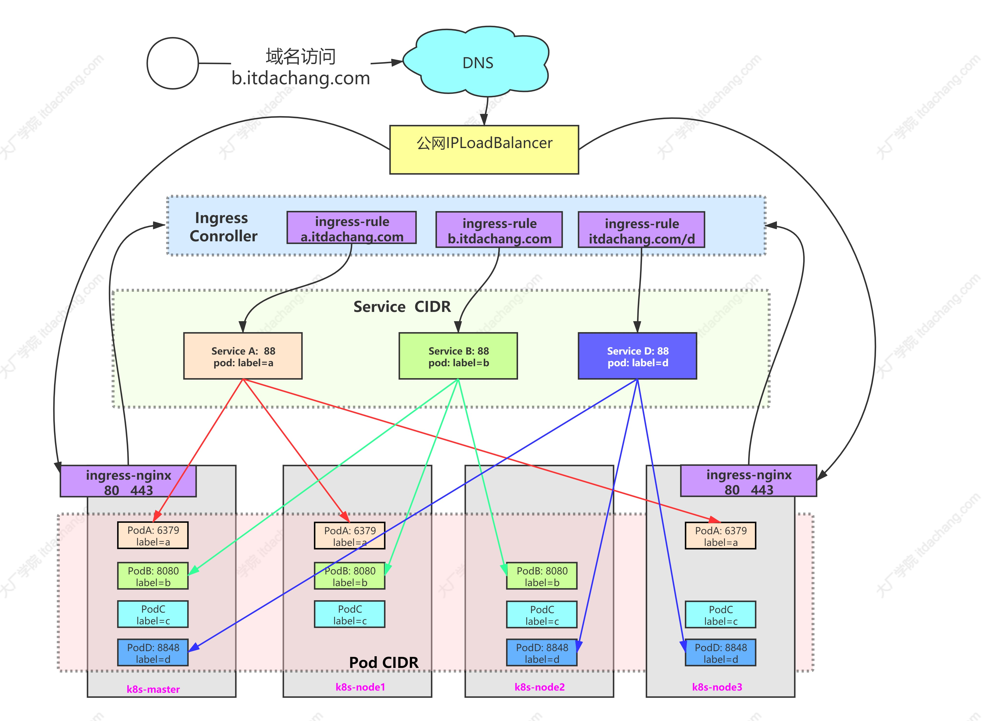
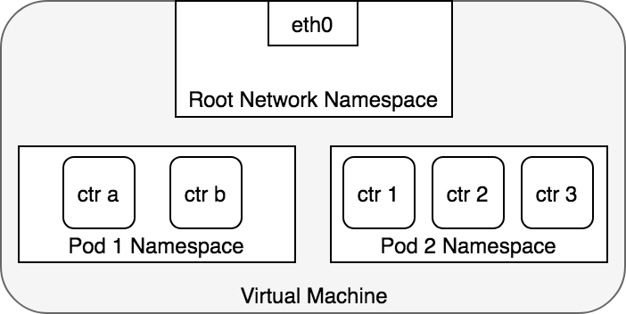
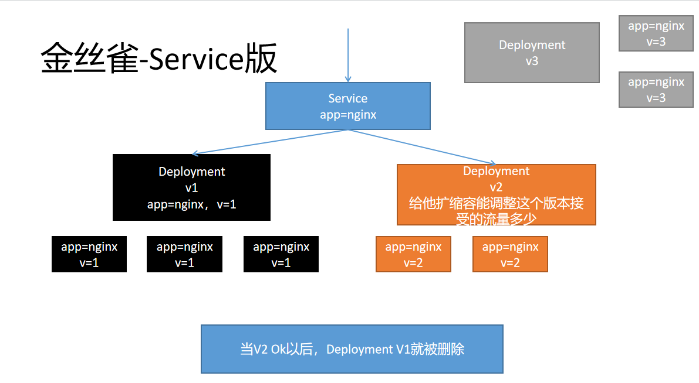
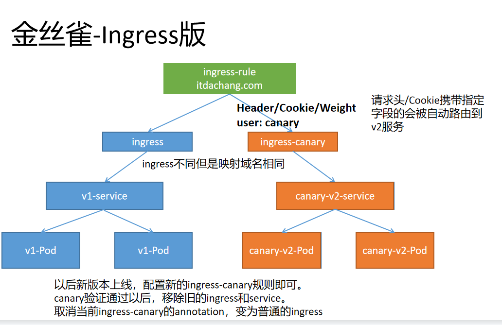
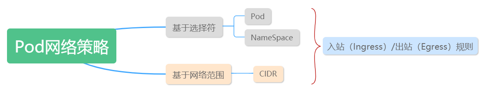

<center>
<h1>
    Kubernetes 网络和负载均衡
    </h1>    
</center>

# 一、Kubernetes网络

Kubernetes 网络解决四方面的问题：

- 一个 Pod 中的容器之间通过**本地回路（loopback）通信。**
- 集群网络在不同 pod 之间提供通信。Pod和Pod之间互通
- Service 资源允许你对外暴露 Pods 中运行的应用程序，以支持来自于集群外部的访问。Service和Pod要通
- 可以使用 Services 来发布仅供集群内部使用的服务。

## 1、k8s网络架构图

### 1、架构图




### 2、访问流程

门面。所有的零散层上再抽取一个聚合层。


## 2、网络连通原理

### 1、Container To Container



```sh
ip netns add ns1  #添加网络名称空间
ls /var/run/netns #查看所有网络名词空间
ip netns 		  #查看所有网络名词空间
# Linux 将所有的进程都分配到 root network namespace，以使得进程可以访问外部网络
# Kubernetes 为每一个 Pod 都创建了一个 network namespace
```

### 2、Pod To Pod

#### 1、同节点


#### 2、跨节点


### 3、Pod-To-Service

#### 1、Pod To Service


#### 2、Service-To-Pod


### 4、Internet-To-Service

#### 1、Pod-To-Internet


#### 2、Internet-To-Pod（LoadBalancer -- Layer4）


#### 3、Internet-To-Pod（Ingress-- Layer7）


# 二、Service

负载均衡服务。让一组Pod可以被别人进行服务发现。

Service   --- >>  选择一组Pod

别人只需要访问这个Service。Service还会基于Pod的探针机制（ReadinessProbe：就绪探针）完成Pod的自动剔除和上线工作。

- Service即使无头服务。别人（Pod）不能用ip访问，但是可以用service名当成域名访问。

- **Service的名字还能当成域名被Pod解析**


## 1、基础概念

将运行在一组 [Pods](https://kubernetes.io/docs/concepts/workloads/pods/pod-overview/) 上的应用程序公开为网络服务的抽象方法。

> **云原生服务发现**
>
> service中的type可选值如下，代表四种不同的服务发现类型
>
> - ExternalName
> - ClusterIP: 为当前Service分配或者不分配集群IP。负载均衡一组Pod
> - NodePort：  外界也可以使用机器ip+暴露的NodePort端口 访问。
>   - nodePort端口由kube-proxy开在机器上
>   - 机器ip+暴露的NodePort 流量先来到  kube-proxy 
> - LoadBalancer.

- **`ClusterIP`** ：通过集群的内部 IP 暴露服务，选择该值时服务只能够在集群内部访问。 这也是默认的 `ServiceType`。
- [`NodePort`](https://kubernetes.io/zh/docs/concepts/services-networking/service/#nodeport)：通过每个节点上的 IP 和静态端口（`NodePort`）暴露服务。 `NodePort` 服务会路由到自动创建的 `ClusterIP` 服务。 通过请求 `<节点 IP>:<节点端口>`，你可以从集群的外部访问一个 `NodePort` 服务。
- [`LoadBalancer`](https://kubernetes.io/zh/docs/concepts/services-networking/service/#loadbalancer)：使用云提供商的负载均衡器向外部暴露服务。 外部负载均衡器可以将流量路由到自动创建的 `NodePort` 服务和 `ClusterIP` 服务上。
- [`ExternalName`](https://kubernetes.io/zh/docs/concepts/services-networking/service/#externalname)：通过返回 `CNAME` 和对应值，可以将服务映射到 `externalName` 字段的内容（例如，`foo.bar.example.com`）。 无需创建任何类型代理。

### 1、创建简单Service 

```yaml
apiVersion: v1
kind: Service
metadata:
  name: my-service
spec:
  selector:
    app: MyApp   ## 使用选择器选择所有Pod
 # type: ClusterIP  ##type很重要，不写默认是ClusterIP
  ports:
    - protocol: TCP
      port: 80
      targetPort: 9376
```

- Service 创建完成后，会对应一组EndPoint。可以kubectl get ep 进行查看
- type有四种，每种对应不同服务发现机制
- Servvice可以利用Pod的就绪探针机制，只负载就绪了的Pod。自动剔除没有就绪的Pod


### 2、创建无Selector的Service

- 我们可以创建Service不指定Selector
- 然后手动创建EndPoint，指定一组Pod地址。
- 此场景用于我们负载均衡其他中间件场景。

```yaml
# 无selector的svc
apiVersion: v1
kind: Service
metadata:
  name: my-service-no-selector
spec:
  ports:
  - protocol: TCP
    name: http  ###一定注意，name可以不写，
    ###但是这里如果写了name，那么endpoint里面的ports必须有同名name才能绑定
    port: 80  # service 80
    targetPort: 80  #目标80
---    
apiVersion: v1
kind: Endpoints
metadata:
  name: my-service-no-selector  ### ep和svc的绑定规则是：和svc同名同名称空间，port同名或同端口
  namespace: default
subsets:
- addresses:
  - ip: 220.181.38.148
  - ip: 39.156.69.79
  - ip: 192.168.169.165
  ports:
  - port: 80
    name: http  ## svc有name这里一定要有
    protocol: TCP
```


原理：kube-proxy 在负责这个事情

https://kubernetes.io/zh/docs/concepts/services-networking/service/#virtual-ips-and-service-proxies

```yaml
## 实验
apiVersion: v1
kind: Service
metadata:
  name: cluster-service-no-selector
  namespace: default
spec:
  ## 不选中Pod而在下面手动定义可以访问的EndPoint
  type: ClusterIP 
  ports:
  - name: abc
    port: 80  ## 访问当前service 的 80
    targetPort: 80  ## 派发到Pod的 80
---
apiVersion: v1
kind: Endpoints
metadata:
  name: cluster-service-no-selector  ## 和service同名
  namespace: default
subsets:
- addresses:
  - ip: 192.168.169.184
  - ip: 192.168.169.165
  - ip: 39.156.69.79
  ports:
  - name: abc  ## ep和service要是一样的
    port: 80
    protocol: TCP
```

> ### 场景：Pod要访问 MySQL。 MySQL单独部署到很多机器，每次记ip麻烦
>
> ### 集群内创建一个Service，实时的可以剔除EP信息。反向代理集群外的东西。

## 2、ClusterIP

```yaml
type: ClusterIP
ClusterIP: 手动指定/None/""
```

- 手动指定的ClusterIP必须在合法范围内
- None会创建出没有ClusterIP的**headless service（无头服务）**，Pod需要用服务的域名访问


## 3、NodePort

```yaml
apiVersion: v1
kind: Service
metadata:
  name: my-service
  namespace: default
type: NodePort
ports:
  - protocol: TCP
    port: 80  # service 80
    targetPort: 80  #目标80
    nodePort: 32123  #自定义
```


- 如果将 `type` 字段设置为 `NodePort`，则 Kubernetes 将在 `--service-node-port-range` 标志指定的范围内分配端口（默认值：30000-32767）
- k8s集群的所有机器都将打开监听这个端口的数据，访问任何一个机器，都可以访问这个service对应的Pod
- 使用 nodePort 自定义端口

## 4、ExternalName

```yaml
apiVersion: v1
kind: Service
metadata:
  name: my-service-05
  namespace: default
spec:
  type: ExternalName
  externalName: baidu.com
```

- 其他的Pod可以通过访问这个service而访问其他的域名服务
- 但是需要注意目标服务的跨域问题


## 5、LoadBalancer

```yaml
apiVersion: v1
kind: Service
metadata:
  creationTimestamp: null
  labels:
    app.kubernetes.io/name: load-balancer-example
  name: my-service
spec:
  ports:
  - port: 80
    protocol: TCP
    targetPort: 80
  selector:
    app.kubernetes.io/name: load-balancer-example
  type: LoadBalancer
```


## 6、扩展 - externalIP

在 Service 的定义中， `externalIPs` 可以和任何类型的 `.spec.type` 一通使用。在下面的例子中，客户端可通过 `80.11.12.10:80` （externalIP:port） 访问`my-service`

```yaml
apiVersion: v1
kind: Service
metadata:
  name: my-service-externalip
spec:
  selector:
    app: canary-nginx
  ports:
    - name: http
      protocol: TCP
      port: 80
      targetPort: 80
  externalIPs: ### 定义只有externalIPs指定的地址才可以访问这个service
    - 10.170.0.111  ### 集群内的ip都不行？
 ####    - 其他机器的ip
```

黑名单？？？？


## 7、扩展 - Pod的DNS

```yaml
apiVersion: v1
kind: Service
metadata:
  name: default-subdomain
spec:
  selector:
    name: busybox
  clusterIP: None
  ports:
  - name: foo # 实际上不需要指定端口号
    port: 1234
    targetPort: 1234
---
apiVersion: v1
kind: Pod
metadata:
  name: busybox1
  labels:
    name: busybox
spec:
  hostname: busybox-1
  subdomain: default-subdomain  
  ## 指定必须和svc名称一样，才可以 podName.subdomain.名称空间.svc.cluster.local访问。否则访问不同指定Pod
  containers:
  - image: busybox:1.28
    command:
      - sleep
      - "3600"
    name: busybox
---
apiVersion: v1
kind: Pod
metadata:
  name: busybox2
  labels:
    name: busybox
spec:
  hostname: busybox-2  ### 每个Pod指定主机名 
  subdomain: default-subdomain  ## subdomain等于sevrice的名
  containers:
  - image: busybox:1.28
    command:
      - sleep
      - "3600"
    name: busybox
```

- 访问   <u>busybox-1</u>.*default-subdomain*.**default**.`svc.cluster.local`  可以访问到busybox-1。
- 访问Service
  - 同名称空间
    - ping service-name 即可
  - 不同名称空间
    - ping service-name.namespace 即可
- 访问Pod
  - 同名称空间
    - ping pod-host-name.service-name 即可
  - 不同名称空间
    - ping pod-host-name.service-name.namespace 即可


busybox-1.***default-subdomain*.default****

Pod的hostName.service的名.名称空间的名

想要使用域名访问的模式，必须加Service网络的名字


# 三、Ingress

为什么需要Ingress？

- Service可以使用NodePort暴露集群外访问端口，但是性能低下不安全
- 缺少**Layer7**的统一访问入口，可以负载均衡、限流等
- [Ingress](https://kubernetes.io/docs/reference/generated/kubernetes-api/v1.21/#ingress-v1beta1-networking-k8s-io) 公开了从集群外部到集群内[服务](https://kubernetes.io/zh/docs/concepts/services-networking/service/)的 HTTP 和 HTTPS 路由。 流量路由由 Ingress 资源上定义的规则控制。
- 我们使用Ingress作为整个集群统一的入口，配置Ingress规则转到对应的Service


## 1、Ingress nginx和nginx ingress

### 1、nginx ingress

这是nginx官方做的，适配k8s的，分为**开源版**和**nginx plus版（收费）**。[文档地址](https://docs.nginx.com/nginx-ingress-controller/overview/)

https://www.nginx.com/products/nginx-ingress-controller


### 2、ingress nginx

[https://kubernetes.io/zh/docs/concepts/services-networking/ingress/#ingress-%E6%98%AF%E4%BB%80%E4%B9%88](https://kubernetes.io/zh/docs/concepts/services-networking/ingress/#ingress-是什么)

这是k8s官方做的，适配nginx的。这个里面会及时更新一些特性，而且性能很高，也被广泛采用。[文档地址](https://kubernetes.github.io/ingress-nginx/deploy/)

```sh
## 默认安装使用这个镜像
registry.cn-hangzhou.aliyuncs.com/lfy_k8s_images/ingress-nginx-controller:v0.46.0
```

https://kubernetes.github.io/ingress-nginx/examples/auth/basic/   文档地址


## 2、ingress nginx  安装

### 1、安装

自建集群使用**[裸金属安装方式](https://kubernetes.github.io/ingress-nginx/deploy/#bare-metal)**

需要如下修改：

- 修改ingress-nginx-controller镜像为 `registry.cn-hangzhou.aliyuncs.com/lfy_k8s_images/ingress-nginx-controller:v0.46.0`
- 修改Deployment为DaemonSet比较好
- 修改Container使用主机网络，直接在主机上开辟 80,443端口，无需中间解析，速度更快
- Container使用主机网络，对应的dnsPolicy策略也需要改为主机网络的
- 修改Service为ClusterIP，无需NodePort模式了
- 修改DaemonSet的nodeSelector:  `ingress-node=true` 。这样只需要给node节点打上`ingress-node=true` 标签，即可快速的加入/剔除 ingress-controller的数量


修改好的yaml如下。大家直接复制使用

```yaml

apiVersion: v1
kind: Namespace
metadata:
  name: ingress-nginx
  labels:
    app.kubernetes.io/name: ingress-nginx
    app.kubernetes.io/instance: ingress-nginx

---
# Source: ingress-nginx/templates/controller-serviceaccount.yaml
apiVersion: v1
kind: ServiceAccount
metadata:
  labels:
    helm.sh/chart: ingress-nginx-3.30.0
    app.kubernetes.io/name: ingress-nginx
    app.kubernetes.io/instance: ingress-nginx
    app.kubernetes.io/version: 0.46.0
    app.kubernetes.io/managed-by: Helm
    app.kubernetes.io/component: controller
  name: ingress-nginx
  namespace: ingress-nginx
automountServiceAccountToken: true
---
# Source: ingress-nginx/templates/controller-configmap.yaml
apiVersion: v1
kind: ConfigMap
metadata:
  labels:
    helm.sh/chart: ingress-nginx-3.30.0
    app.kubernetes.io/name: ingress-nginx
    app.kubernetes.io/instance: ingress-nginx
    app.kubernetes.io/version: 0.46.0
    app.kubernetes.io/managed-by: Helm
    app.kubernetes.io/component: controller
  name: ingress-nginx-controller
  namespace: ingress-nginx
data:
---
# Source: ingress-nginx/templates/clusterrole.yaml
apiVersion: rbac.authorization.k8s.io/v1
kind: ClusterRole
metadata:
  labels:
    helm.sh/chart: ingress-nginx-3.30.0
    app.kubernetes.io/name: ingress-nginx
    app.kubernetes.io/instance: ingress-nginx
    app.kubernetes.io/version: 0.46.0
    app.kubernetes.io/managed-by: Helm
  name: ingress-nginx
rules:
  - apiGroups:
      - ''
    resources:
      - configmaps
      - endpoints
      - nodes
      - pods
      - secrets
    verbs:
      - list
      - watch
  - apiGroups:
      - ''
    resources:
      - nodes
    verbs:
      - get
  - apiGroups:
      - ''
    resources:
      - services
    verbs:
      - get
      - list
      - watch
  - apiGroups:
      - extensions
      - networking.k8s.io   # k8s 1.14+
    resources:
      - ingresses
    verbs:
      - get
      - list
      - watch
  - apiGroups:
      - ''
    resources:
      - events
    verbs:
      - create
      - patch
  - apiGroups:
      - extensions
      - networking.k8s.io   # k8s 1.14+
    resources:
      - ingresses/status
    verbs:
      - update
  - apiGroups:
      - networking.k8s.io   # k8s 1.14+
    resources:
      - ingressclasses
    verbs:
      - get
      - list
      - watch
---
# Source: ingress-nginx/templates/clusterrolebinding.yaml
apiVersion: rbac.authorization.k8s.io/v1
kind: ClusterRoleBinding
metadata:
  labels:
    helm.sh/chart: ingress-nginx-3.30.0
    app.kubernetes.io/name: ingress-nginx
    app.kubernetes.io/instance: ingress-nginx
    app.kubernetes.io/version: 0.46.0
    app.kubernetes.io/managed-by: Helm
  name: ingress-nginx
roleRef:
  apiGroup: rbac.authorization.k8s.io
  kind: ClusterRole
  name: ingress-nginx
subjects:
  - kind: ServiceAccount
    name: ingress-nginx
    namespace: ingress-nginx
---
# Source: ingress-nginx/templates/controller-role.yaml
apiVersion: rbac.authorization.k8s.io/v1
kind: Role
metadata:
  labels:
    helm.sh/chart: ingress-nginx-3.30.0
    app.kubernetes.io/name: ingress-nginx
    app.kubernetes.io/instance: ingress-nginx
    app.kubernetes.io/version: 0.46.0
    app.kubernetes.io/managed-by: Helm
    app.kubernetes.io/component: controller
  name: ingress-nginx
  namespace: ingress-nginx
rules:
  - apiGroups:
      - ''
    resources:
      - namespaces
    verbs:
      - get
  - apiGroups:
      - ''
    resources:
      - configmaps
      - pods
      - secrets
      - endpoints
    verbs:
      - get
      - list
      - watch
  - apiGroups:
      - ''
    resources:
      - services
    verbs:
      - get
      - list
      - watch
  - apiGroups:
      - extensions
      - networking.k8s.io   # k8s 1.14+
    resources:
      - ingresses
    verbs:
      - get
      - list
      - watch
  - apiGroups:
      - extensions
      - networking.k8s.io   # k8s 1.14+
    resources:
      - ingresses/status
    verbs:
      - update
  - apiGroups:
      - networking.k8s.io   # k8s 1.14+
    resources:
      - ingressclasses
    verbs:
      - get
      - list
      - watch
  - apiGroups:
      - ''
    resources:
      - configmaps
    resourceNames:
      - ingress-controller-leader-nginx
    verbs:
      - get
      - update
  - apiGroups:
      - ''
    resources:
      - configmaps
    verbs:
      - create
  - apiGroups:
      - ''
    resources:
      - events
    verbs:
      - create
      - patch
---
# Source: ingress-nginx/templates/controller-rolebinding.yaml
apiVersion: rbac.authorization.k8s.io/v1
kind: RoleBinding
metadata:
  labels:
    helm.sh/chart: ingress-nginx-3.30.0
    app.kubernetes.io/name: ingress-nginx
    app.kubernetes.io/instance: ingress-nginx
    app.kubernetes.io/version: 0.46.0
    app.kubernetes.io/managed-by: Helm
    app.kubernetes.io/component: controller
  name: ingress-nginx
  namespace: ingress-nginx
roleRef:
  apiGroup: rbac.authorization.k8s.io
  kind: Role
  name: ingress-nginx
subjects:
  - kind: ServiceAccount
    name: ingress-nginx
    namespace: ingress-nginx
---
# Source: ingress-nginx/templates/controller-service-webhook.yaml
apiVersion: v1
kind: Service
metadata:
  labels:
    helm.sh/chart: ingress-nginx-3.30.0
    app.kubernetes.io/name: ingress-nginx
    app.kubernetes.io/instance: ingress-nginx
    app.kubernetes.io/version: 0.46.0
    app.kubernetes.io/managed-by: Helm
    app.kubernetes.io/component: controller
  name: ingress-nginx-controller-admission
  namespace: ingress-nginx
spec:
  type: ClusterIP
  ports:
    - name: https-webhook
      port: 443
      targetPort: webhook
  selector:
    app.kubernetes.io/name: ingress-nginx
    app.kubernetes.io/instance: ingress-nginx
    app.kubernetes.io/component: controller
---
# Source: ingress-nginx/templates/controller-service.yaml：不要
apiVersion: v1
kind: Service
metadata:
  annotations:
  labels:
    helm.sh/chart: ingress-nginx-3.30.0
    app.kubernetes.io/name: ingress-nginx
    app.kubernetes.io/instance: ingress-nginx
    app.kubernetes.io/version: 0.46.0
    app.kubernetes.io/managed-by: Helm
    app.kubernetes.io/component: controller
  name: ingress-nginx-controller
  namespace: ingress-nginx
spec:
  type: ClusterIP  ## 改为clusterIP
  ports:
    - name: http
      port: 80
      protocol: TCP
      targetPort: http
    - name: https
      port: 443
      protocol: TCP
      targetPort: https
  selector:
    app.kubernetes.io/name: ingress-nginx
    app.kubernetes.io/instance: ingress-nginx
    app.kubernetes.io/component: controller
---
# Source: ingress-nginx/templates/controller-deployment.yaml
apiVersion: apps/v1
kind: DaemonSet
metadata:
  labels:
    helm.sh/chart: ingress-nginx-3.30.0
    app.kubernetes.io/name: ingress-nginx
    app.kubernetes.io/instance: ingress-nginx
    app.kubernetes.io/version: 0.46.0
    app.kubernetes.io/managed-by: Helm
    app.kubernetes.io/component: controller
  name: ingress-nginx-controller
  namespace: ingress-nginx
spec:
  selector:
    matchLabels:
      app.kubernetes.io/name: ingress-nginx
      app.kubernetes.io/instance: ingress-nginx
      app.kubernetes.io/component: controller
  revisionHistoryLimit: 10
  minReadySeconds: 0
  template:
    metadata:
      labels:
        app.kubernetes.io/name: ingress-nginx
        app.kubernetes.io/instance: ingress-nginx
        app.kubernetes.io/component: controller
    spec:
      dnsPolicy: ClusterFirstWithHostNet   ## dns对应调整为主机网络
      hostNetwork: true  ## 直接让nginx占用本机80端口和443端口，所以使用主机网络
      containers:
        - name: controller
          image: registry.cn-hangzhou.aliyuncs.com/lfy_k8s_images/ingress-nginx-controller:v0.46.0
          imagePullPolicy: IfNotPresent
          lifecycle:
            preStop:
              exec:
                command:
                  - /wait-shutdown
          args:
            - /nginx-ingress-controller
            - --election-id=ingress-controller-leader
            - --ingress-class=nginx
            - --configmap=$(POD_NAMESPACE)/ingress-nginx-controller
            - --validating-webhook=:8443
            - --validating-webhook-certificate=/usr/local/certificates/cert
            - --validating-webhook-key=/usr/local/certificates/key
          securityContext:
            capabilities:
              drop:
                - ALL
              add:
                - NET_BIND_SERVICE
            runAsUser: 101
            allowPrivilegeEscalation: true
          env:
            - name: POD_NAME
              valueFrom:
                fieldRef:
                  fieldPath: metadata.name
            - name: POD_NAMESPACE
              valueFrom:
                fieldRef:
                  fieldPath: metadata.namespace
            - name: LD_PRELOAD
              value: /usr/local/lib/libmimalloc.so
          livenessProbe:
            httpGet:
              path: /healthz
              port: 10254
              scheme: HTTP
            initialDelaySeconds: 10
            periodSeconds: 10
            timeoutSeconds: 1
            successThreshold: 1
            failureThreshold: 5
          readinessProbe:
            httpGet:
              path: /healthz
              port: 10254
              scheme: HTTP
            initialDelaySeconds: 10
            periodSeconds: 10
            timeoutSeconds: 1
            successThreshold: 1
            failureThreshold: 3
          ports:
            - name: http
              containerPort: 80
              protocol: TCP
            - name: https
              containerPort: 443
              protocol: TCP
            - name: webhook
              containerPort: 8443
              protocol: TCP
          volumeMounts:
            - name: webhook-cert
              mountPath: /usr/local/certificates/
              readOnly: true
          resources:
            requests:
              cpu: 100m
              memory: 90Mi
      nodeSelector:  ## 节点选择器
        node-role: ingress #以后只需要给某个node打上这个标签就可以部署ingress-nginx到这个节点上了
        #kubernetes.io/os: linux  ## 修改节点选择
      serviceAccountName: ingress-nginx
      terminationGracePeriodSeconds: 300
      volumes:
        - name: webhook-cert
          secret:
            secretName: ingress-nginx-admission
---
# Source: ingress-nginx/templates/admission-webhooks/validating-webhook.yaml
# before changing this value, check the required kubernetes version
# https://kubernetes.io/docs/reference/access-authn-authz/extensible-admission-controllers/#prerequisites
apiVersion: admissionregistration.k8s.io/v1
kind: ValidatingWebhookConfiguration
metadata:
  labels:
    helm.sh/chart: ingress-nginx-3.30.0
    app.kubernetes.io/name: ingress-nginx
    app.kubernetes.io/instance: ingress-nginx
    app.kubernetes.io/version: 0.46.0
    app.kubernetes.io/managed-by: Helm
    app.kubernetes.io/component: admission-webhook
  name: ingress-nginx-admission
webhooks:
  - name: validate.nginx.ingress.kubernetes.io
    matchPolicy: Equivalent
    rules:
      - apiGroups:
          - networking.k8s.io
        apiVersions:
          - v1beta1
        operations:
          - CREATE
          - UPDATE
        resources:
          - ingresses
    failurePolicy: Fail
    sideEffects: None
    admissionReviewVersions:
      - v1
      - v1beta1
    clientConfig:
      service:
        namespace: ingress-nginx
        name: ingress-nginx-controller-admission
        path: /networking/v1beta1/ingresses
---
# Source: ingress-nginx/templates/admission-webhooks/job-patch/serviceaccount.yaml
apiVersion: v1
kind: ServiceAccount
metadata:
  name: ingress-nginx-admission
  annotations:
    helm.sh/hook: pre-install,pre-upgrade,post-install,post-upgrade
    helm.sh/hook-delete-policy: before-hook-creation,hook-succeeded
  labels:
    helm.sh/chart: ingress-nginx-3.30.0
    app.kubernetes.io/name: ingress-nginx
    app.kubernetes.io/instance: ingress-nginx
    app.kubernetes.io/version: 0.46.0
    app.kubernetes.io/managed-by: Helm
    app.kubernetes.io/component: admission-webhook
  namespace: ingress-nginx
---
# Source: ingress-nginx/templates/admission-webhooks/job-patch/clusterrole.yaml
apiVersion: rbac.authorization.k8s.io/v1
kind: ClusterRole
metadata:
  name: ingress-nginx-admission
  annotations:
    helm.sh/hook: pre-install,pre-upgrade,post-install,post-upgrade
    helm.sh/hook-delete-policy: before-hook-creation,hook-succeeded
  labels:
    helm.sh/chart: ingress-nginx-3.30.0
    app.kubernetes.io/name: ingress-nginx
    app.kubernetes.io/instance: ingress-nginx
    app.kubernetes.io/version: 0.46.0
    app.kubernetes.io/managed-by: Helm
    app.kubernetes.io/component: admission-webhook
rules:
  - apiGroups:
      - admissionregistration.k8s.io
    resources:
      - validatingwebhookconfigurations
    verbs:
      - get
      - update
---
# Source: ingress-nginx/templates/admission-webhooks/job-patch/clusterrolebinding.yaml
apiVersion: rbac.authorization.k8s.io/v1
kind: ClusterRoleBinding
metadata:
  name: ingress-nginx-admission
  annotations:
    helm.sh/hook: pre-install,pre-upgrade,post-install,post-upgrade
    helm.sh/hook-delete-policy: before-hook-creation,hook-succeeded
  labels:
    helm.sh/chart: ingress-nginx-3.30.0
    app.kubernetes.io/name: ingress-nginx
    app.kubernetes.io/instance: ingress-nginx
    app.kubernetes.io/version: 0.46.0
    app.kubernetes.io/managed-by: Helm
    app.kubernetes.io/component: admission-webhook
roleRef:
  apiGroup: rbac.authorization.k8s.io
  kind: ClusterRole
  name: ingress-nginx-admission
subjects:
  - kind: ServiceAccount
    name: ingress-nginx-admission
    namespace: ingress-nginx
---
# Source: ingress-nginx/templates/admission-webhooks/job-patch/role.yaml
apiVersion: rbac.authorization.k8s.io/v1
kind: Role
metadata:
  name: ingress-nginx-admission
  annotations:
    helm.sh/hook: pre-install,pre-upgrade,post-install,post-upgrade
    helm.sh/hook-delete-policy: before-hook-creation,hook-succeeded
  labels:
    helm.sh/chart: ingress-nginx-3.30.0
    app.kubernetes.io/name: ingress-nginx
    app.kubernetes.io/instance: ingress-nginx
    app.kubernetes.io/version: 0.46.0
    app.kubernetes.io/managed-by: Helm
    app.kubernetes.io/component: admission-webhook
  namespace: ingress-nginx
rules:
  - apiGroups:
      - ''
    resources:
      - secrets
    verbs:
      - get
      - create
---
# Source: ingress-nginx/templates/admission-webhooks/job-patch/rolebinding.yaml
apiVersion: rbac.authorization.k8s.io/v1
kind: RoleBinding
metadata:
  name: ingress-nginx-admission
  annotations:
    helm.sh/hook: pre-install,pre-upgrade,post-install,post-upgrade
    helm.sh/hook-delete-policy: before-hook-creation,hook-succeeded
  labels:
    helm.sh/chart: ingress-nginx-3.30.0
    app.kubernetes.io/name: ingress-nginx
    app.kubernetes.io/instance: ingress-nginx
    app.kubernetes.io/version: 0.46.0
    app.kubernetes.io/managed-by: Helm
    app.kubernetes.io/component: admission-webhook
  namespace: ingress-nginx
roleRef:
  apiGroup: rbac.authorization.k8s.io
  kind: Role
  name: ingress-nginx-admission
subjects:
  - kind: ServiceAccount
    name: ingress-nginx-admission
    namespace: ingress-nginx
---
# Source: ingress-nginx/templates/admission-webhooks/job-patch/job-createSecret.yaml
apiVersion: batch/v1
kind: Job
metadata:
  name: ingress-nginx-admission-create
  annotations:
    helm.sh/hook: pre-install,pre-upgrade
    helm.sh/hook-delete-policy: before-hook-creation,hook-succeeded
  labels:
    helm.sh/chart: ingress-nginx-3.30.0
    app.kubernetes.io/name: ingress-nginx
    app.kubernetes.io/instance: ingress-nginx
    app.kubernetes.io/version: 0.46.0
    app.kubernetes.io/managed-by: Helm
    app.kubernetes.io/component: admission-webhook
  namespace: ingress-nginx
spec:
  template:
    metadata:
      name: ingress-nginx-admission-create
      labels:
        helm.sh/chart: ingress-nginx-3.30.0
        app.kubernetes.io/name: ingress-nginx
        app.kubernetes.io/instance: ingress-nginx
        app.kubernetes.io/version: 0.46.0
        app.kubernetes.io/managed-by: Helm
        app.kubernetes.io/component: admission-webhook
    spec:
      containers:
        - name: create
          image: docker.io/jettech/kube-webhook-certgen:v1.5.1
          imagePullPolicy: IfNotPresent
          args:
            - create
            - --host=ingress-nginx-controller-admission,ingress-nginx-controller-admission.$(POD_NAMESPACE).svc
            - --namespace=$(POD_NAMESPACE)
            - --secret-name=ingress-nginx-admission
          env:
            - name: POD_NAMESPACE
              valueFrom:
                fieldRef:
                  fieldPath: metadata.namespace
      restartPolicy: OnFailure
      serviceAccountName: ingress-nginx-admission
      securityContext:
        runAsNonRoot: true
        runAsUser: 2000
---
# Source: ingress-nginx/templates/admission-webhooks/job-patch/job-patchWebhook.yaml
apiVersion: batch/v1
kind: Job
metadata:
  name: ingress-nginx-admission-patch
  annotations:
    helm.sh/hook: post-install,post-upgrade
    helm.sh/hook-delete-policy: before-hook-creation,hook-succeeded
  labels:
    helm.sh/chart: ingress-nginx-3.30.0
    app.kubernetes.io/name: ingress-nginx
    app.kubernetes.io/instance: ingress-nginx
    app.kubernetes.io/version: 0.46.0
    app.kubernetes.io/managed-by: Helm
    app.kubernetes.io/component: admission-webhook
  namespace: ingress-nginx
spec:
  template:
    metadata:
      name: ingress-nginx-admission-patch
      labels:
        helm.sh/chart: ingress-nginx-3.30.0
        app.kubernetes.io/name: ingress-nginx
        app.kubernetes.io/instance: ingress-nginx
        app.kubernetes.io/version: 0.46.0
        app.kubernetes.io/managed-by: Helm
        app.kubernetes.io/component: admission-webhook
    spec:
      containers:
        - name: patch
          image: docker.io/jettech/kube-webhook-certgen:v1.5.1
          imagePullPolicy: IfNotPresent
          args:
            - patch
            - --webhook-name=ingress-nginx-admission
            - --namespace=$(POD_NAMESPACE)
            - --patch-mutating=false
            - --secret-name=ingress-nginx-admission
            - --patch-failure-policy=Fail
          env:
            - name: POD_NAMESPACE
              valueFrom:
                fieldRef:
                  fieldPath: metadata.namespace
      restartPolicy: OnFailure
      serviceAccountName: ingress-nginx-admission
      securityContext:
        runAsNonRoot: true
        runAsUser: 2000
```


### 2、验证

访问部署了ingress-nginx主机的80端口，有nginx响应即可。


### 2、卸载

`kubectl delete -f ingress-controller.yaml` 即可


## 3、案例实战

### 1、基本配置

```yaml
apiVersion: networking.k8s.io/v1
kind: Ingress
metadata:
  name: itdachang-ingress
  namespace: default
spec:
  rules:
  - host: itdachang.com
    http:
      paths:
      - path: /
        pathType: Prefix
        backend:  ## 指定需要响应的后端服务
          service:
            name: my-nginx-svc  ## kubernetes集群的svc名称
            port:
              number: 80  ## service的端口号
```

- [pathType 详细](https://kubernetes.io/zh/docs/concepts/services-networking/ingress/#path-types)：
  - `Prefix`：基于以 `/` 分隔的 URL 路径前缀匹配。匹配区分大小写，并且对路径中的元素逐个完成。 路径元素指的是由 `/` 分隔符分隔的路径中的标签列表。 如果每个 *p* 都是请求路径 *p* 的元素前缀，则请求与路径 *p* 匹配。
  - `Exact`：精确匹配 URL 路径，且区分大小写。
  - `ImplementationSpecific`：对于这种路径类型，匹配方法取决于 IngressClass。 具体实现可以将其作为单独的 `pathType` 处理或者与 `Prefix` 或 `Exact` 类型作相同处理。

ingress规则会生效到所有按照了IngressController的机器的nginx配置。


### 2、默认后端

```yaml
apiVersion: networking.k8s.io/v1
kind: Ingress
metadata:
  name: itdachang-ingress
  namespace: default
spec:
  defaultBackend:  ## 指定所有未匹配的默认后端
    service:
      name: php-apache
      port: 
        number: 80
  rules:
  - host: itdachang.com
    http:
      paths:
      - path: /abc
        pathType: Prefix
        backend:
          service:
            name: my-nginx-svc
            port:
              number: 80
```

> 效果
>
> - itdachang.com 下的 非 /abc 开头的所有请求，都会到defaultBackend
> - 非itdachang.com 域名下的所有请求，也会到defaultBackend


nginx的全局配置

```sh
kubectl edit cm ingress-nginx-controller -n  ingress-nginx

编辑配置加上

data:
  配置项:  配置值  
  
  
  
  所有配置项参考  https://kubernetes.github.io/ingress-nginx/user-guide/nginx-configuration/configmap/
  
  
基于环境变量带去的
```


### 3、路径重写

https://kubernetes.github.io/ingress-nginx/examples/rewrite/

> Rewrite 功能，经常被用于前后分离的场景
>
> - 前端给服务器发送 / 请求映射前端地址。
> - 后端给服务器发送 /api 请求来到对应的服务。但是后端服务没有 /api的起始路径，所以需要ingress-controller自动截串


```yaml
apiVersion: networking.k8s.io/v1
kind: Ingress
metadata:
  annotations:  ## 写好annotion
  #https://kubernetes.github.io/ingress-nginx/user-guide/nginx-configuration/annotations/
    nginx.ingress.kubernetes.io/rewrite-target: /$2  ### 只保留哪一部分
  name: rewrite-ingress-02
  namespace: default
spec:
  rules:  ## 写好规则
  - host: itzongchang.com
    http:
      paths:
      - backend:
          service: 
            name: php-apache
            port: 
              number: 80
        path: /api(/|$)(.*)
        pathType: Prefix
```


### 4、配置SSL

https://kubernetes.github.io/ingress-nginx/user-guide/tls/

生成证书：（也可以去青云申请免费证书进行配置）

```sh
$ openssl req -x509 -nodes -days 365 -newkey rsa:2048 -keyout ${KEY_FILE:tls.key} -out ${CERT_FILE:tls.cert} -subj "/CN=${HOST:itdachang.com}/O=${HOST:itdachang.com}"

kubectl create secret tls ${CERT_NAME:itdachang-tls} --key ${KEY_FILE:tls.key} --cert ${CERT_FILE:tls.cert}


## 示例命令如下
openssl req -x509 -nodes -days 365 -newkey rsa:2048 -keyout tls.key -out tls.cert -subj "/CN=it666.com/O=it666.com"

kubectl create secret tls it666-tls --key tls.key --cert tls.cert
```


```yaml
apiVersion: v1
data:
  tls.crt: LS0tLS1CRUdJTiBDRVJUSUZJQ0FURS0tLS0tCk1JSURJekNDQWd1Z0F3SUJBZ0lKQVB6YXVMQ1ZjdlVKTUEwR0NTcUdTSWIzRFFFQkN3VUFNQ2d4RWpBUUJnTlYKQkFNTUNXbDBOalkyTG1OdmJURVNNQkFHQTFVRUNnd0phWFEyTmpZdVkyOXRNQjRYRFRJeE1EVXhNREV5TURZdwpNRm9YRFRJeU1EVXhNREV5TURZd01Gb3dLREVTTUJBR0ExVUVBd3dKYVhRMk5qWXVZMjl0TVJJd0VBWURWUVFLCkRBbHBkRFkyTmk1amIyMHdnZ0VpTUEwR0NTcUdTSWIzRFFFQkFRVUFBNElCRHdBd2dnRUtBb0lCQVFDbkNYa0wKNjdlYzNjYW5IU1V2VDR6YXZmMGpsOEFPWlBtUERhdUFRTElEby80LzlhV2JPSy9yZm5OelVXV3lTRFBqb3pZVApWa2xmQTZYRG1xRU5FSWRHRlhjdExTSlRNRkM5Y2pMeTlwYVFaaDVYemZId0ZoZXZCR1J3MmlJNXdVdk5iTGdWCmNzcmRlNXlKMEZYOFlMZFRhdjhibzhjTXpxN2FqZXhXMWc1dkxmTWZhczAvd2VyVk9Qc0ZmS3RwZ1dwSWMxMXEKekx6RnlmWHNjcVNhVTV2NFo5WHFqQjRtQjhZZ043U2FSa2pzU0VsSFU4SXhENEdTOUtTNGtkR2xZak45V2hOcAp6aG5MdllpSDIrZThQWE9LdU8wK2Jla1MrS3lUS2hnNnFWK21kWTN0MWJGenpCdjFONTVobTNQTldjNk9ROTh3CkYrQk9uUUNhWExKVmRRcS9BZ01CQUFHalVEQk9NQjBHQTFVZERnUVdCQlNzSUFvMHZ4RFZjVWtIZ1V1TFlwY0wKdjBFSERqQWZCZ05WSFNNRUdEQVdnQlNzSUFvMHZ4RFZjVWtIZ1V1TFlwY0x2MEVIRGpBTUJnTlZIUk1FQlRBRApBUUgvTUEwR0NTcUdTSWIzRFFFQkN3VUFBNElCQVFDSjFEdGJoQnBacTE1ODVEMGlYV1RTdmU3Q2YvQ3VnakxZCjNYb2gwSU9sNy9mVmNndFJkWXlmRFBmRDFLN0l4bElETWtUbTVEVWEyQzBXaFY5UlZLU0poSTUzMmIyeVRGcm8Kc053eGhkcUZpOC9CU1lsQTl0Tk5HeXhKT1RKZWNtSUhsaFhjRlEvUzFaK3FjVWNrTVh6UHlIcFl0VjRaU0hheQpFWVF2bUVBZTFMNmlnRk8wc2xhbUllTFBCTWhlTDNnSDZQNlV3TVpQbTRqdFR1d2FGSmZGRlRIakQydmhSQkJKCmZjTGY5QjN3U3k2cjBDaXF2VXQxQUNQVnpSdFZrcWJJV1d5VTBDdkdjVDVIUUxPLzdhTE4vQkxpNGdYV2o1MUwKVXdTQzhoY2xodVp3SmRzckNkRlltcjhTMnk0UDhsaDdBc0ZNOGorNjh1ZHJlYXovWmFNbwotLS0tLUVORCBDRVJUSUZJQ0FURS0tLS0tCg==
  tls.key: LS0tLS1CRUdJTiBQUklWQVRFIEtFWS0tLS0tCk1JSUV2QUlCQURBTkJna3Foa2lHOXcwQkFRRUZBQVNDQktZd2dnU2lBZ0VBQW9JQkFRQ25DWGtMNjdlYzNjYW4KSFNVdlQ0emF2ZjBqbDhBT1pQbVBEYXVBUUxJRG8vNC85YVdiT0svcmZuTnpVV1d5U0RQam96WVRWa2xmQTZYRAptcUVORUlkR0ZYY3RMU0pUTUZDOWNqTHk5cGFRWmg1WHpmSHdGaGV2QkdSdzJpSTV3VXZOYkxnVmNzcmRlNXlKCjBGWDhZTGRUYXY4Ym84Y016cTdhamV4VzFnNXZMZk1mYXMwL3dlclZPUHNGZkt0cGdXcEljMTFxekx6RnlmWHMKY3FTYVU1djRaOVhxakI0bUI4WWdON1NhUmtqc1NFbEhVOEl4RDRHUzlLUzRrZEdsWWpOOVdoTnB6aG5MdllpSAoyK2U4UFhPS3VPMCtiZWtTK0t5VEtoZzZxVittZFkzdDFiRnp6QnYxTjU1aG0zUE5XYzZPUTk4d0YrQk9uUUNhClhMSlZkUXEvQWdNQkFBRUNnZ0VBTDZ0Tlp6Q0MrdnB6cWRkd2VEcjhtS1JsckpXdkVxeVFaOW5mMnI4Ynpsd3IKdi9jTHB1dWJrTnBLZWx0OWFVNmZ1RlFvcDRZVmRFOG5MRlpocGNmVXd4UjNLV1piQ0dDZWVpSXdGaFIzVFloSApHb25FaE43WkxYSlVjN3hjemh5eTFGSTFpckZ5NFpoWVNTQXltYzdFSXNORFFKRVJ5ajdsdWF1TkNnOFdtWFdPCmd0OHIzZHVTazNHV2ZZeGdWclFZSHlGTVpCbUpvNDliRzVzdGcwR01JNUZRQXord3RERlIyaWk2NkVkNzBJOUwKYXJNMHpQZkM3Tk1acmhEcHVseVdVYWNXRDY1V1g1Yys5TnpIMW15MEVrbjJGOWQzNXE1czZRakdTVElMVXlhbwpJUVl5bGU0OVdKdlV4YjN2YTZ1OTVBUHAyWFFVaFEyS09GcGxabncwTVFLQmdRRFN2cDAzYlBvQVlEb3BqWGlxCndxemxKdk9IY2M4V3ZhVytoM0tvVFBLZ1dRZWpvVnNZTFEzM2lMeXdFY0FXaWtoSzE2UjVmTkt5VUFRZ2JDNm4KNTdkcUJ3L1RqYlV2UGR6K0llMnNKN1BlSlpCQktXZUNHNjBOeGgzUDVJcSsxRHVjdExpQTBKdVZyOUlaUzdqSApJOVpUMitDMTNlNkRlZkJaajFDb0ZhemJ1UUtCZ1FESzZCaVkzSk5FYVhmWVpKUzh1NFViVW9KUjRhUURBcmlpCjFGRlEzMDFPOEF0b1A2US9IcjFjbTdBNGZkQ3JoSkxPMFNqWnpldnF4NEVHSnBueG5pZGowL24yTHE3Z2x6Q2UKbVlKZFVVVFo0MkxJNGpWelBlUk1RaGhueW9CTHpmaEFYcEtZSU1NcmpTd1JUcnYyclRpQkhxSEZRbDN6YngvKwptcjdEVWtlR053S0JnRllPdEpDUGxiOVZqQ3F2dEppMmluZkE0aTFyRWcvTlBjT0IrQlkxNWRZSXhRL1NzaW83Cks3cnJRWEg4clo0R3RlS3FFR1h6ek80M3NwZXkxWktIRXVUZklWMVlQcWFkOG9Kc1JHdktncTZ5VkNmbnluYmMKNmx2M2pQRDUrSlpZZ0VkTG5SUXRHM3VTb283bDF2eXE2N2l1enlJMUVGTHNGblBjRENtM1FERXhBb0dBSDQrdQprOGhybDg2WDk2N2RlK1huTkhMSEZwbDBlNHRtME4wWnNPeXJCOFpLMy9KV1NBTXVEVU9pUzRjMmVCZHRCb0orClNqSy9xWXRTeEhRb3FlNmh6ZU5oRkN2Nnc3Q0F2WXEvUG1pdnZ2eWhsd0dvc3I1RHpxRFJUd091cFJ2cXE0aUsKWU9ObnVGU0RNRVlBOHNQSzhEcWxpeHRocGNYNVFnOHI4UkhSVWswQ2dZQlF3WFdQU3FGRElrUWQvdFg3dk1mTwp3WDdWTVFMK1NUVFA4UXNRSFo2djdpRlFOL3g3Vk1XT3BMOEp6TDdIaGdJV3JzdkxlV1pubDh5N1J3WnZIbm9zCkY3dkliUm00L1Y1YzZHeFFQZXk5RXVmWUw4ejRGMWhSeUc2ZjJnWU1jV25NSWpnaUh2dTA3cStuajFORkh4YVkKa2ZSSERia01YaUcybU42REtyL3RtQT09Ci0tLS0tRU5EIFBSSVZBVEUgS0VZLS0tLS0K
kind: Secret
metadata:
  creationTimestamp: "2021-05-10T12:06:22Z"
  name: it666-tls
  namespace: default
  resourceVersion: "2164722"
  uid: 16f8a4b6-1600-4ded-8458-b0480ce075ba
type: kubernetes.io/tls

```


配置域名使用证书；

```yaml
apiVersion: networking.k8s.io/v1
kind: Ingress
metadata:
  name: itdachang-ingress
  namespace: default
spec:
  tls:
   - hosts:
     - itdachang.com
     secretName: itdachang-tls
  rules:
  - host: itdachang.com
    http:
      paths:
      - path: /
        pathType: Prefix
        backend:
          service:
            name: my-nginx-svc
            port:
              number: 80
```

配置好证书，访问域名，就会默认跳转到https；


### 5、限速

https://kubernetes.github.io/ingress-nginx/user-guide/nginx-configuration/annotations/#rate-limiting

```yaml
apiVersion: networking.k8s.io/v1
kind: Ingress
metadata:
  name: ingress-222333
  namespace: default
  annotations:  ##注解
    nginx.ingress.kubernetes.io/limit-rps: "1"   ### 限流的配置
spec:
  defaultBackend: ## 只要未指定的映射路径
    service:
      name: php-apache
      port:
        number: 80
  rules:
  - host: it666.com
    http:
      paths:
      - path: /bbbbb
        pathType: Prefix
        backend:
          service:
            name: cluster-service-222
            port:
              number: 80

```


### 6、灰度发布-Canary

以前可以使用k8s的Service配合Deployment进行金丝雀部署。原理如下



缺点：

- 不能自定义灰度逻辑，比如指定用户进行灰度

------------------

**现在可以使用Ingress进行灰度。原理如下**



```yaml
## 使用如下文件部署两个service版本。v1版本返回nginx默认页，v2版本返回 11111
apiVersion: v1
kind: Service
metadata:
  name: v1-service
  namespace: default
spec:
  selector:
    app: v1-pod
  type: ClusterIP
  ports:
  - name: http
    port: 80
    targetPort: 80
    protocol: TCP
---
apiVersion: apps/v1
kind: Deployment
metadata:
  name:  v1-deploy
  namespace: default
  labels:
    app:  v1-deploy
spec:
  selector:
    matchLabels:
      app: v1-pod
  replicas: 1
  template:
    metadata:
      labels:
        app:  v1-pod
    spec:
      containers:
      - name:  nginx
        image:  nginx
---
apiVersion: v1
kind: Service
metadata:
  name: canary-v2-service
  namespace: default
spec:
  selector:
    app: canary-v2-pod
  type: ClusterIP
  ports:
  - name: http
    port: 80
    targetPort: 80
    protocol: TCP
---
apiVersion: apps/v1
kind: Deployment
metadata:
  name:  canary-v2-deploy
  namespace: default
  labels:
    app:  canary-v2-deploy
spec:
  selector:
    matchLabels:
      app: canary-v2-pod
  replicas: 1
  template:
    metadata:
      labels:
        app:  canary-v2-pod
    spec:
      containers:
      - name:  nginx
        image:  registry.cn-hangzhou.aliyuncs.com/lfy_k8s_images/nginx-test:env-msg
```


### 7、会话保持-Session亲和性

https://kubernetes.github.io/ingress-nginx/user-guide/nginx-configuration/annotations/#session-affinity

第一次访问，ingress-nginx会返回给浏览器一个Cookie，以后浏览器带着这个Cookie，保证访问总是抵达之前的Pod；

```yaml
## 部署一个三个Pod的Deployment并设置Service
apiVersion: v1
kind: Service
metadata:
  name: session-affinity
  namespace: default
spec:
  selector:
    app: session-affinity
  type: ClusterIP
  ports:
  - name: session-affinity
    port: 80
    targetPort: 80
    protocol: TCP
---
apiVersion: apps/v1
kind: Deployment
metadata:
  name:  session-affinity
  namespace: default
  labels:
    app:  session-affinity
spec:
  selector:
    matchLabels:
      app: session-affinity
  replicas: 3
  template:
    metadata:
      labels:
        app:  session-affinity
    spec:
      containers:
      - name:  session-affinity
        image:  nginx
```


> 编写具有会话亲和的ingress

```yaml
### 利用每次请求携带同样的cookie，来标识是否是同一个会话
apiVersion: networking.k8s.io/v1
kind: Ingress
metadata:
  name: session-test
  namespace: default
  annotations:
    nginx.ingress.kubernetes.io/affinity: "cookie"
    nginx.ingress.kubernetes.io/session-cookie-name: "itdachang-session"
spec:
  rules:
  - host: it666.com
    http:
      paths:
      - path: /   ### 如果以前这个域名下的这个路径相同的功能有配置过，以最后一次生效
        pathType: Prefix
        backend:
          service:
            name: session-affinity   ###
            port:
              number: 80

```


# 四、NetworkPolicy

网络策略（网络隔离策略）

https://kubernetes.io/zh/docs/concepts/services-networking/network-policies/

指定Pod间的网络隔离策略，默认是所有互通。

Pod 之间互通，是通过如下三个标识符的组合来辩识的：

1. 其他被允许的 Pods（例外：Pod 无法阻塞对自身的访问）
2. 被允许的名称空间
3. IP 组块（例外：与 Pod 运行所在的节点的通信总是被允许的， 无论 Pod 或节点的 IP 地址）



## 1、Pod隔离与非隔离

- 默认情况下，Pod网络都是非隔离的（non-isolated），可以接受来自任何请求方的网络请求。

- 如果一个 NetworkPolicy 的标签选择器选中了某个 Pod，则该 Pod 将变成隔离的（isolated），并将拒绝任何不被 NetworkPolicy 许可的网络连接。

## 2、规约

```yaml
apiVersion: networking.k8s.io/v1
kind: NetworkPolicy
metadata:
  name: test-network-policy
  namespace: default
spec:
  podSelector:  ## 选中指定Pod
    matchLabels:
      role: db
  policyTypes:  ## 定义上面Pod的入站出站规则
  - Ingress
  - Egress
  ingress:    ## 定义入站白名单
  - from:   
    - ipBlock:
        cidr: 172.17.0.0/16
        except:
        - 172.17.1.0/24
    - namespaceSelector:
        matchLabels:
          project: myproject
    - podSelector:
        matchLabels:
          role: frontend
    ports:
    - protocol: TCP
      port: 6379
  egress:  ## 定义出站白名单
  - to:
    - ipBlock:
        cidr: 10.0.0.0/24
    ports:
    - protocol: TCP
      port: 5978
```

- **基本信息：** 同其他的 Kubernetes 对象一样，`NetworkPolicy` 需要 `apiVersion`、`kind`、`metadata` 字段
- spec：`NetworkPolicy`的spec字段包含了定义网络策略的主要信息：
  - **podSelector：** 同名称空间中，符合此标签选择器 `.spec.podSelector` 的 Pod 都将应用这个 `NetworkPolicy`。上面的 Example中的 podSelector 选择了 `role=db` 的 Pod。如果该字段为空，则将对名称空间中所有的 Pod 应用这个 `NetworkPolicy`
  - **policyTypes：** `.spec.policyTypes` 是一个数组类型的字段，该数组中可以包含 `Ingress`、`Egress` 中的一个，也可能两个都包含。该字段标识了此 `NetworkPolicy` 是否应用到 入方向的网络流量、出方向的网络流量、或者两者都有。如果不指定 `policyTypes` 字段，该字段默认将始终包含 `Ingress`，当 `NetworkPolicy` 中包含出方向的规则时，`Egress` 也将被添加到默认值。
  - ingress：ingress是一个数组，代表入方向的白名单规则。每一条规则都将允许与`from`和`ports`匹配的入方向的网络流量发生。例子中的`ingress`包含了一条规则，允许的入方向网络流量必须符合如下条件：
    - Pod 的监听端口为 `6379`
    - 请求方可以是如下三种来源当中的任意一种：
      - ipBlock 为 `172.17.0.0/16` 网段，但是不包括 `172.17.1.0/24` 网段
      - namespaceSelector 标签选择器，匹配标签为 `project=myproject`
      - podSelector 标签选择器，匹配标签为 `role=frontend`
  - egress：`egress`是一个数组，代表出方向的白名单规则。每一条规则都将允许与`to`和`ports`匹配的出方向的网络流量发生。例子中的`egress`允许的出方向网络流量必须符合如下条件：
    - 目标端口为 `5978`
    - 目标 ipBlock 为 `10.0.0.0/24` 网段

因此，例子中的 `NetworkPolicy` 对网络流量做了如下限制：

1. 隔离了 `default` 名称空间中带有 `role=db` 标签的所有 Pod 的入方向网络流量和出方向网络流量
2. Ingress规则（入方向白名单规则）：
   - 当请求方是如下三种来源当中的任意一种时，允许访问`default`名称空间中所有带`role=db`标签的 Pod 的6379端口：
     - ipBlock 为 `172.17.0.0/16` 网段，但是不包括 `172.17.1.0/24` 网段
     - namespaceSelector 标签选择器，匹配标签为 `project=myproject`
     - podSelector 标签选择器，匹配标签为 `role=frontend`
3. Egress规则（出方向白名单规则）：
   - 当如下条件满足时，允许出方向的网络流量：
     - 目标端口为 `5978`
     - 目标 ipBlock 为 `10.0.0.0/24` 网段


## 3、to和from选择器的行为

NetworkPolicy 的 `.spec.ingress.from` 和 `.spec.egress.to` 字段中，可以指定 4 种类型的标签选择器：

- **podSelector** 选择与 `NetworkPolicy` 同名称空间中的 Pod 作为入方向访问控制规则的源或者出方向访问控制规则的目标
- **namespaceSelector** 选择某个名称空间（其中所有的Pod）作为入方向访问控制规则的源或者出方向访问控制规则的目标
- **namespaceSelector** 和 **podSelector** 在一个 `to` / `from` 条目中同时包含 `namespaceSelector` 和 `podSelector` 将选中指定名称空间中的指定 Pod。此时请特别留意 YAML 的写法，如下所示：

```yaml
  ...
  ingress:
  - from:
    - namespaceSelector:
        matchLabels:
          user: alice
      podSelector:
        matchLabels:
          role: client
  ...
```

该例子中，podSelector 前面没有 `-` 减号，namespaceSelector 和 podSelector 是同一个 from 元素的两个字段，将选中带 `user=alice` 标签的名称空间中所有带 `role=client` 标签的 Pod。但是，下面的这个 NetworkPolicy 含义是不一样的：

```yaml
  ...
  ingress:
  - from:
    - namespaceSelector:
        matchLabels:
          user: alice
    - podSelector:
        matchLabels:
          role: client
  ...
```

后者，podSelector 前面带 `-` 减号，说明 namespaceSelector 和 podSelector 是 from 数组中的两个元素，他们将选中 NetworkPolicy 同名称空间中带 `role=client` 标签的对象，以及带 `user=alice` 标签的名称空间的所有 Pod。

> 前者是交集关系（且），后者是并集关系（或）

- **ipBlock** 可选择 IP CIDR 范围作为入方向访问控制规则的源或者出方向访问控制规则的目标。这里应该指定的是集群外部的 IP，因为集群内部 Pod 的 IP 地址是临时分配的，且不可预测。

集群的入方向和出方向网络机制通常需要重写网络报文的 source 或者 destination IP。kubernetes 并未定义应该在处理 `NetworkPolicy` 之前还是之后再修改 source / destination IP，因此，在不同的云供应商、使用不同的网络插件时，最终的行为都可能不一样。这意味着：

- 对于入方向的网络流量，某些情况下，你可以基于实际的源 IP 地址过滤流入的报文；在另外一些情况下，NetworkPolicy 所处理的 "source IP" 可能是 LoadBalancer 的 IP 地址，或者其他地址
- 对于出方向的网络流量，**基于 ipBlock 的策略可能有效，也可能无效**


## 4、场景

https://kubernetes.io/zh/docs/concepts/services-networking/network-policies/#default-policies


