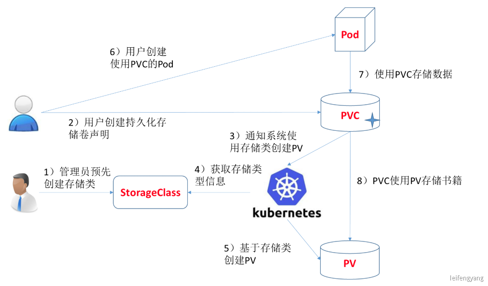

<center>
<h1>
    Kubernetes 配置与存储
    </h1>    
</center>

# 一、总览


 Kubernetes 目前支持多达 28 种数据卷类型（其中大部分特定于具体的云环境如 GCE/AWS/Azure 等），如需查阅所有的数据卷类型，请查阅 Kubernetes 官方文档 [Volumes](https://kubernetes.io/docs/concepts/storage/volumes/) 。如：

- 非持久性存储  
  - emptyDir
  - HostPath
- 网络连接性存储
  - SAN：iSCSI、ScaleIO Volumes、FC (Fibre Channel)
  - NFS：nfs，cfs
- 分布式存储
  - Glusterfs
  - RBD (Ceph Block Device)
  - CephFS
  - Portworx Volumes
  - Quobyte Volumes
- 云端存储
  - GCEPersistentDisk
  - AWSElasticBlockStore
  - AzureFile
  - AzureDisk
  - Cinder (OpenStack block storage)
  - VsphereVolume
  - StorageOS
- 自定义存储
  - FlexVolume


# 二、配置

配置最佳实战: 

- 云原生 应用12要素 中，提出了配置分离。https://www.kdocs.cn/view/l/skIUQnbIc6cJ
- 在推送到集群之前，配置文件应存储在**版本控制**中。 这允许您在必要时快速回滚配置更改。 它还有助于集群重新创建和恢复。
- **使用 YAML 而不是 JSON 编写配置文件**。虽然这些格式几乎可以在所有场景中互换使用，但 YAML 往往更加用户友好。
- 建议相关对象分组到一个文件。比如 [guestbook-all-in-one.yaml](https://github.com/kubernetes/examples/tree/master/guestbook/all-in-one/guestbook-all-in-one.yaml) 
- 除非必要，否则不指定默认值：简单的最小配置会降低错误的可能性。
- 将对象描述放在注释中，以便更好地进行内省。


## 1、Secret

- `Secret` 对象类型用来**保存敏感信息**，例如密码、OAuth 令牌和 SSH 密钥。 将这些信息放在 `secret` 中比放在 [Pod](https://kubernetes.io/docs/concepts/workloads/pods/pod-overview/) 的定义或者 [容器镜像](https://kubernetes.io/zh/docs/reference/glossary/?all=true#term-image) 中来说更加安全和灵活。
- `Secret` 是一种包含少量敏感信息例如密码、令牌或密钥的对象。用户可以创建 Secret，同时系统也创建了一些 Secret。


### 1、Secret种类


- 细分类型


### 2、Pod如何引用

要使用 Secret，Pod 需要引用 Secret。 Pod 可以用三种方式之一来使用 Secret：

- 作为挂载到一个或多个容器上的 [卷](https://kubernetes.io/zh/docs/concepts/storage/volumes/) 中的[文件](https://kubernetes.io/zh/docs/concepts/configuration/secret/#using-secrets-as-files-from-a-pod)。（volume进行挂载）
- 作为[容器的环境变量](https://kubernetes.io/zh/docs/concepts/configuration/secret/#using-secrets-as-environment-variables)（envFrom字段引用）
- 由 [kubelet 在为 Pod 拉取镜像时使用](https://kubernetes.io/zh/docs/concepts/configuration/secret/#using-imagepullsecrets)（此时Secret是docker-registry类型的）

Secret 对象的名称必须是合法的 [DNS 子域名](https://kubernetes.io/zh/docs/concepts/overview/working-with-objects/names#dns-subdomain-names)。 在为创建 Secret 编写配置文件时，你可以设置 `data` 与/或 `stringData` 字段。 `data` 和 `stringData` 字段都是可选的。`data` 字段中所有键值都必须是 base64 编码的字符串。如果不希望执行这种 base64 字符串的转换操作，你可以选择设置 `stringData` 字段，其中可以使用任何字符串作为其取值。


### 3、实验

#### 1、创建Secret

##### 1、generic 类型

```yaml
## 命令行
#### 1、使用基本字符串
kubectl create secret generic dev-db-secret \
  --from-literal=username=devuser \
  --from-literal=password='S!B\*d$zDsb='
  
## 参照以下yaml
apiVersion: v1
kind: Secret
metadata:
  name: dev-db-secret  
data:
  password: UyFCXCpkJHpEc2I9  ## base64编码了一下
  username: ZGV2dXNlcg==


#### 2、使用文件内容
echo -n 'admin' > ./username.txt
echo -n '1f2d1e2e67df' > ./password.txt

kubectl create secret generic db-user-pass \
  --from-file=./username.txt \
  --from-file=./password.txt


# 默认密钥名称是文件名。 你可以选择使用 --from-file=[key=]source 来设置密钥名称。如下
kubectl create secret generic db-user-pass-02 \
  --from-file=un=./username.txt \
  --from-file=pd=./password.txt
```


```yaml
## 使用yaml
dev-db-secret yaml内容如下
```


- 获取Secret内容

```sh
kubectl get secret dev-db-secret -o jsonpath='{.data}'
```


#### 2、使用Secret

##### 1、环境变量引用

```yaml
apiVersion: v1
kind: Pod
metadata:
  name: secret-env-pod
spec:
  containers:
  - name: mycontainer
    image: redis
    env:
      - name: SECRET_USERNAME
        valueFrom:
          secretKeyRef:
            name: mysecret
            key: username
      - name: SECRET_PASSWORD
        valueFrom:
          secretKeyRef:
            name: mysecret
            key: password
  restartPolicy: Never
```


环境变量引用的方式不会被自动更新


##### 2、卷挂载

```yaml
apiVersion: v1
kind: Pod
metadata:
  name: mypod
spec:
  containers:
  - name: mypod
    image: redis
    volumeMounts:
    - name: foo
      mountPath: "/etc/foo"
      readOnly: true
  volumes:
  - name: foo
    secret:
      secretName: mysecret
```

挂载方式的secret 在secret变化的时候会自动更新**（子路径引用除外）**


## 2、ConfigMap

- ConfigMap 来将你的配置数据和应用程序代码分开。
- ConfigMap 是一种 API 对象，用来将非机密性的数据保存到键值对中。使用时， [Pods](https://kubernetes.io/docs/concepts/workloads/pods/pod-overview/) 可以将其用作环境变量、命令行参数或者存储卷中的配置文件。

```yaml
apiVersion: v1
kind: ConfigMap
metadata:
  name: game-demo
data:
  # 类属性键；每一个键都映射到一个简单的值
  player_initial_lives: "3"
  ui_properties_file_name: "user-interface.properties"

  # 类文件键
  game.properties: |
    enemy.types=aliens,monsters
    player.maximum-lives=5    
  user-interface.properties: |
    color.good=purple
    color.bad=yellow
    allow.textmode=true
```


你可以使用四种方式来使用 ConfigMap 配置 Pod 中的容器：

1. 在容器命令和参数内
2. 容器的环境变量
3. 在只读卷里面添加一个文件，让应用来读取
4. 编写代码在 Pod 中运行，使用 Kubernetes API 来读取 ConfigMap


```yaml
apiVersion: v1
kind: Pod
metadata:
  name: configmap-demo-pod
spec:
  containers:
    - name: demo
      image: alpine
      command: ["sleep", "3600"]
      env:
        # 定义环境变量
        - name: PLAYER_INITIAL_LIVES # 请注意这里和 ConfigMap 中的键名是不一样的
          valueFrom:
            configMapKeyRef:
              name: game-demo           # 这个值来自 ConfigMap
              key: player_initial_lives # 需要取值的键
        - name: UI_PROPERTIES_FILE_NAME
          valueFrom:
            configMapKeyRef:
              name: game-demo
              key: ui_properties_file_name
      volumeMounts:
      - name: config
        mountPath: "/config"
        readOnly: true
  volumes:
    # 你可以在 Pod 级别设置卷，然后将其挂载到 Pod 内的容器中
    - name: config
      configMap:
        # 提供你想要挂载的 ConfigMap 的名字
        name: game-demo
        # 来自 ConfigMap 的一组键，将被创建为文件
        items:
        - key: "game.properties"
          path: "game.properties"
        - key: "user-interface.properties"
          path: "user-interface.properties"
```


### 1、使用挂载ConfigMap

```yaml
apiVersion: v1
kind: Pod
metadata:
  name: mypod
spec:
  containers:
  - name: mypod
    image: redis
    volumeMounts:
    - name: foo
      mountPath: "/etc/foo"
      readOnly: true
  volumes:
  - name: foo
    configMap:
      name: myconfigmap
```

**ConfigMap的修改，可以触发挂载文件的自动更新**


# 三、临时存储

## 1、几种临时存储

Kubernetes 为了不同的目的，支持几种不同类型的临时卷：

- [emptyDir](https://kubernetes.io/zh/docs/concepts/storage/volumes/#emptydir)： Pod 启动时为空，存储空间来自本地的 kubelet 根目录（通常是根磁盘）或内存
- [configMap](https://kubernetes.io/zh/docs/concepts/storage/volumes/#configmap)、 [downwardAPI](https://kubernetes.io/zh/docs/concepts/storage/volumes/#downwardapi)、 [secret](https://kubernetes.io/zh/docs/concepts/storage/volumes/#secret)： 将不同类型的 Kubernetes 数据注入到 Pod 中
- [CSI 临时卷](https://kubernetes.io/zh/docs/concepts/storage/volumes/#csi-ephemeral-volumes)： 类似于前面的卷类型，但由专门[支持此特性](https://kubernetes-csi.github.io/docs/drivers.html) 的指定 [CSI 驱动程序](https://github.com/container-storage-interface/spec/blob/master/spec.md)提供
- [通用临时卷](https://kubernetes.io/zh/docs/concepts/storage/ephemeral-volumes/#generic-ephemeral-volumes)： 它可以由所有支持持久卷的存储驱动程序提供


## 2、emptyDir

- 当 Pod 分派到某个 Node 上时，`emptyDir` 卷会被创建
- 在 Pod 在该节点上运行期间，卷一直存在。
- 卷最初是空的。 
- 尽管 Pod 中的容器挂载 `emptyDir` 卷的路径可能相同也可能不同，这些容器都可以读写 `emptyDir` 卷中相同的文件。 
- 当 Pod 因为某些原因被从节点上删除时，`emptyDir` 卷中的数据也会被永久删除。
- 存储空间来自本地的 kubelet 根目录（通常是根磁盘）或内存

```yaml
apiVersion: v1
kind: Pod
metadata:
  name: "multi-container-pod"
  namespace: default
  labels:
    app: "multi-container-pod"
spec:
  volumes:    ### 以后见到的所有名字 都应该是一个合法的域名方式
  - name: nginx-vol
    emptyDir: {}  ### docker匿名挂载，外部创建一个位置  /abc
  containers:  ## kubectl exec -it podName  -c nginx-container（容器名）-- /bin/sh
  - name: nginx-container
    image: "nginx"
    volumeMounts:  #声明卷挂载  -v
      - name: nginx-vol
        mountPath: /usr/share/nginx/html
  - name: content-container
    image: "alpine"
    command: ["/bin/sh","-c","while true;do sleep 1; date > /app/index.html;done;"]
    volumeMounts: 
      - name: nginx-vol
        mountPath: /app
```


## 3、扩展-hostPath

https://kubernetes.io/zh/docs/concepts/storage/volumes/#hostpath


```yaml
apiVersion: v1
kind: Pod
metadata:
  name: test-pd
spec:
  containers:
  - image: k8s.gcr.io/test-webserver
    name: test-container
    volumeMounts:
    - mountPath: /test-pd
      name: test-volume
  volumes:
  - name: test-volume
    hostPath:
      # 宿主上目录位置
      path: /data
      # 此字段为可选
      type: Directory
```


```yaml
apiVersion: v1
kind: Pod
metadata:
  name: test-webserver
spec:
  containers:
  - name: test-webserver
    image: k8s.gcr.io/test-webserver:latest
    volumeMounts:
    - mountPath: /var/local/aaa
      name: mydir
    - mountPath: /var/local/aaa/1.txt
      name: myfile
  volumes:
  - name: mydir
    hostPath:
      # 确保文件所在目录成功创建。
      path: /var/local/aaa
      type: DirectoryOrCreate
  - name: myfile
    hostPath:
      path: /var/local/aaa/1.txt
      type: FileOrCreate
```


> 典型应用
>
> 解决容器时间问题

```yaml
apiVersion: v1
kind: Pod
metadata:
  name: busy-box-test
  namespace: default
spec:
  restartPolicy: OnFailure
  containers:
  - name: busy-box-test
    image: busybox
    imagePullPolicy: IfNotPresent
    volumeMounts:
    - name: date-config
      mountPath: /etc/localtime
    command: ["sleep", "60000"]
  volumes:
  - name: date-config
    hostPath:
      path: /etc/localtime
```


#  四、持久化

## 1、VOLUME

### 1、基础


- Kubernetes 支持很多类型的卷。 [Pod](https://kubernetes.io/docs/concepts/workloads/pods/pod-overview/) 可以同时使用任意数目的卷类型
- 临时卷类型的生命周期与 Pod 相同，但持久卷可以比 Pod 的存活期长
- 当 Pod 不再存在时，Kubernetes 也会销毁临时卷；
- Kubernetes 不会销毁 持久卷。
- 对于给定 Pod 中**任何类型的卷**，在容器重启期间数据都不会丢失。
- 使用卷时, 在 `.spec.volumes` 字段中设置为 Pod 提供的卷，并在 `.spec.containers[*].volumeMounts` 字段中声明卷在容器中的挂载位置。


[支持的卷类型](https://kubernetes.io/zh/docs/concepts/storage/volumes/#volume-types)


### 2、使用subPath

有时，在单个 Pod 中共享卷以供多方使用是很有用的。 `volumeMounts.subPath` 属性可用于指定所引用的卷内的子路径，而不是其根路径。


### 3、使用NFS

#### 1、安装NFS

```sh
# 在任意机器
yum install -y nfs-utils
#执行命令 vi /etc/exports，创建 exports 文件，文件内容如下：
echo "/nfs/data/ *(insecure,rw,sync,no_root_squash)" > /etc/exports
#/nfs/data  172.26.248.0/20(rw,no_root_squash)

# 执行以下命令，启动 nfs 服务;创建共享目录
mkdir -p /nfs/data
systemctl enable rpcbind
systemctl enable nfs-server
systemctl start rpcbind
systemctl start nfs-server
exportfs -r
#检查配置是否生效
exportfs
# 输出结果如下所示
/nfs/data /nfs/data
```

#### 2、VOLUME进行挂载测试

```yaml
#测试Pod直接挂载NFS了
apiVersion: v1
kind: Pod
metadata:
  name: vol-nfs
  namespace: default
spec:
  containers:
  - name: myapp
    image: nginx
    volumeMounts:
    - name: html
      mountPath: /usr/share/nginx/html/
  volumes:
  - name: html
    nfs:
      path: /nfs/data   #1000G
      server: 自己的nfs服务器地址
```


#### 3、扩展-NFS文件同步

```sh
#服务器端防火墙开放111、662、875、892、2049的 tcp / udp 允许，否则远端客户无法连接。
#安装客户端工具
yum install -y nfs-utils


#执行以下命令检查 nfs 服务器端是否有设置共享目录
# showmount -e $(nfs服务器的IP)
showmount -e 172.26.165.243
# 输出结果如下所示
Export list for 172.26.165.243
/nfs/data *

#执行以下命令挂载 nfs 服务器上的共享目录到本机路径 /root/nfsmount
mkdir /root/nfsmount
# mount -t nfs $(nfs服务器的IP):/root/nfs_root /root/nfsmount
#高可用备份的方式
mount -t nfs 172.26.165.243:/nfs/data /root/nfsmount
# 写入一个测试文件
echo "hello nfs server" > /root/nfsmount/test.txt

#在 nfs 服务器上执行以下命令，验证文件写入成功
cat /root/nfsmount/test.txt
```


## 2、PV&PVC&StorageClass


### 1、基础概念

- **存储的管理**是一个与**计算实例的管理**完全不同的问题。
- PersistentVolume 子系统为用户 和管理员提供了一组 API，将存储如何供应的细节从其如何被使用中抽象出来。 
- 为了实现这点，我们引入了两个新的 API 资源：PersistentVolume 和 PersistentVolumeClaim。


**持久卷（PersistentVolume ）：**

- 持久卷（PersistentVolume，PV）是集群中的一块存储，可以由管理员事先供应，或者 使用[存储类（Storage Class）](https://kubernetes.io/zh/docs/concepts/storage/storage-classes/)来动态供应。
- 持久卷是集群资源，就像节点也是集群资源一样。PV 持久卷和普通的 Volume 一样，也是使用 卷插件来实现的，只是它们拥有独立于使用他们的Pod的生命周期。
- 此 API 对象中记述了存储的实现细节，无论其背后是 NFS、iSCSI 还是特定于云平台的存储系统。


**持久卷申请（PersistentVolumeClaim，PVC）：**

- 表达的是用户对存储的请求
- 概念上与 Pod 类似。 Pod 会耗用节点资源，而 PVC 申领会耗用 PV 资源。
- Pod 可以请求特定数量的资源（CPU 和内存）；同样 PVC 申领也可以请求特定的大小和访问模式 （例如，可以要求 PV 卷能够以 ReadWriteOnce、ReadOnlyMany 或 ReadWriteMany 模式之一来挂载，参见[访问模式](https://kubernetes.io/zh/docs/concepts/storage/persistent-volumes/#access-modes)）。


**存储类（Storage Class）**:

- 尽管 PersistentVolumeClaim 允许用户消耗抽象的存储资源，常见的情况是针对不同的 问题用户需要的是具有不同属性（如，性能）的 PersistentVolume 卷。
- 集群管理员需要能够提供不同性质的 PersistentVolume，并且这些 PV 卷之间的差别不 仅限于卷大小和访问模式，同时又不能将卷是如何实现的这些细节暴露给用户。
-  为了满足这类需求，就有了 *存储类（StorageClass）* 资源。


### 2、实战

https://kubernetes.io/zh/docs/tasks/configure-pod-container/configure-persistent-volume-storage/


### 3、细节

#### 1、访问模式

https://kubernetes.io/zh/docs/concepts/storage/persistent-volumes/#access-modes


#### 2、回收策略

https://kubernetes.io/zh/docs/concepts/storage/persistent-volumes/#reclaim-policy


#### 3、阶段

https://kubernetes.io/zh/docs/concepts/storage/persistent-volumes/#phase


## 3、动态供应




静态供应：

- 集群管理员创建若干 PV 卷。这些卷对象带有真实存储的细节信息，并且对集群 用户可用（可见）。PV 卷对象存在于 Kubernetes API 中，可供用户消费（使用）


动态供应：

- 集群自动根据PVC创建出对应PV进行使用


### 1、设置nfs动态供应

https://github.com/kubernetes-retired/external-storage/tree/master/nfs-client

按照文档部署，并换成 registry.cn-hangzhou.aliyuncs.com/lfy_k8s_images/nfs-subdir-external-provisioner:v4.0.2 镜像即可


#### 2、测试nfs动态供应


