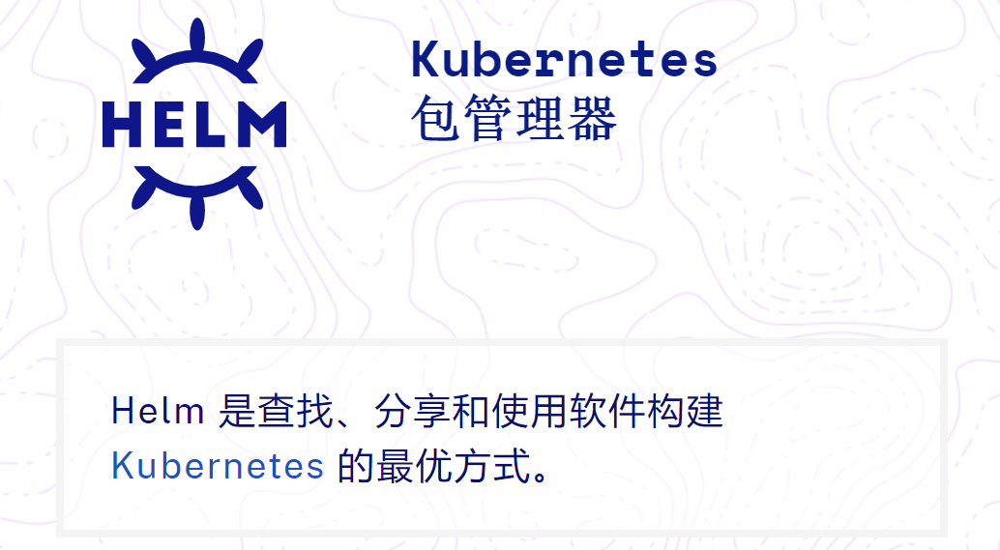
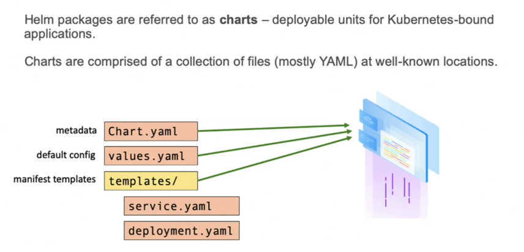
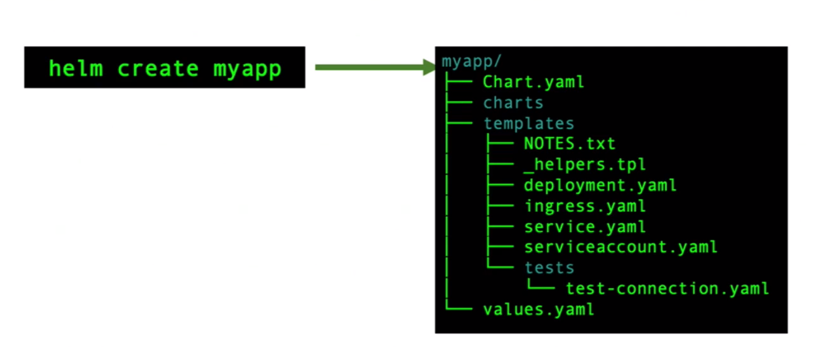
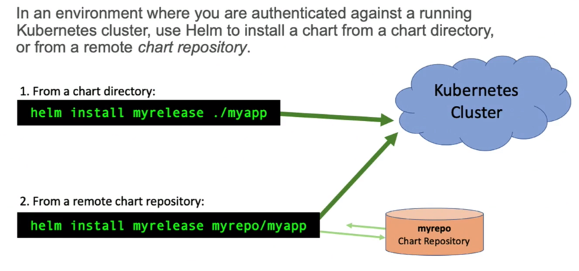
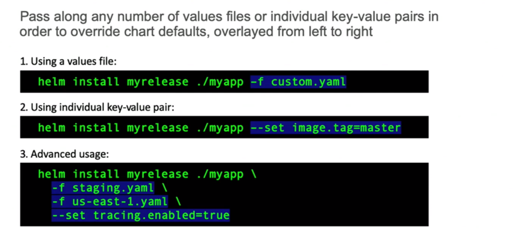

<center> 
    <h1>应用商店-Helm
    </h1></center>

# 一、简介

自己写yaml

一个应用：（博客程序，wordpress+mysql）

- Deployment.yaml
- Service.yaml
- PVC.yaml
- Ingress.yaml
- xxxx




charts：图表 发布charts；docker发布镜像


# 二、安装

## 1、用二进制版本安装

每个Helm [版本](https://github.com/helm/helm/releases)都提供了各种操作系统的二进制版本，这些版本可以手动下载和安装。

1. 下载 [需要的版本](https://github.com/helm/helm/releases)
2. 解压(`tar -zxvf helm-v3.0.0-linux-amd64.tar.gz`)
3. 在解压目中找到`helm`程序，移动到需要的目录中(`mv linux-amd64/helm /usr/local/bin/helm`)


```sh
#!/usr/bin/env bash

# Copyright The Helm Authors.
#
# Licensed under the Apache License, Version 2.0 (the "License");
# you may not use this file except in compliance with the License.
# You may obtain a copy of the License at
#
#     http://www.apache.org/licenses/LICENSE-2.0
#
# Unless required by applicable law or agreed to in writing, software
# distributed under the License is distributed on an "AS IS" BASIS,
# WITHOUT WARRANTIES OR CONDITIONS OF ANY KIND, either express or implied.
# See the License for the specific language governing permissions and
# limitations under the License.

# The install script is based off of the MIT-licensed script from glide,
# the package manager for Go: https://github.com/Masterminds/glide.sh/blob/master/get

: ${BINARY_NAME:="helm"}
: ${USE_SUDO:="true"}
: ${DEBUG:="false"}
: ${VERIFY_CHECKSUM:="true"}
: ${VERIFY_SIGNATURES:="false"}
: ${HELM_INSTALL_DIR:="/usr/local/bin"}
: ${GPG_PUBRING:="pubring.kbx"}

HAS_CURL="$(type "curl" &> /dev/null && echo true || echo false)"
HAS_WGET="$(type "wget" &> /dev/null && echo true || echo false)"
HAS_OPENSSL="$(type "openssl" &> /dev/null && echo true || echo false)"
HAS_GPG="$(type "gpg" &> /dev/null && echo true || echo false)"

# initArch discovers the architecture for this system.
initArch() {
  ARCH=$(uname -m)
  case $ARCH in
    armv5*) ARCH="armv5";;
    armv6*) ARCH="armv6";;
    armv7*) ARCH="arm";;
    aarch64) ARCH="arm64";;
    x86) ARCH="386";;
    x86_64) ARCH="amd64";;
    i686) ARCH="386";;
    i386) ARCH="386";;
  esac
}

# initOS discovers the operating system for this system.
initOS() {
  OS=$(echo `uname`|tr '[:upper:]' '[:lower:]')

  case "$OS" in
    # Minimalist GNU for Windows
    mingw*) OS='windows';;
  esac
}

# runs the given command as root (detects if we are root already)
runAsRoot() {
  if [ $EUID -ne 0 -a "$USE_SUDO" = "true" ]; then
    sudo "${@}"
  else
    "${@}"
  fi
}

# verifySupported checks that the os/arch combination is supported for
# binary builds, as well whether or not necessary tools are present.
verifySupported() {
  local supported="darwin-amd64\ndarwin-arm64\nlinux-386\nlinux-amd64\nlinux-arm\nlinux-arm64\nlinux-ppc64le\nlinux-s390x\nwindows-amd64"
  if ! echo "${supported}" | grep -q "${OS}-${ARCH}"; then
    echo "No prebuilt binary for ${OS}-${ARCH}."
    echo "To build from source, go to https://github.com/helm/helm"
    exit 1
  fi

  if [ "${HAS_CURL}" != "true" ] && [ "${HAS_WGET}" != "true" ]; then
    echo "Either curl or wget is required"
    exit 1
  fi

  if [ "${VERIFY_CHECKSUM}" == "true" ] && [ "${HAS_OPENSSL}" != "true" ]; then
    echo "In order to verify checksum, openssl must first be installed."
    echo "Please install openssl or set VERIFY_CHECKSUM=false in your environment."
    exit 1
  fi

  if [ "${VERIFY_SIGNATURES}" == "true" ]; then
    if [ "${HAS_GPG}" != "true" ]; then
      echo "In order to verify signatures, gpg must first be installed."
      echo "Please install gpg or set VERIFY_SIGNATURES=false in your environment."
      exit 1
    fi
    if [ "${OS}" != "linux" ]; then
      echo "Signature verification is currently only supported on Linux."
      echo "Please set VERIFY_SIGNATURES=false or verify the signatures manually."
      exit 1
    fi
  fi
}

# checkDesiredVersion checks if the desired version is available.
checkDesiredVersion() {
  if [ "x$DESIRED_VERSION" == "x" ]; then
    # Get tag from release URL
    local latest_release_url="https://github.com/helm/helm/releases"
    if [ "${HAS_CURL}" == "true" ]; then
      TAG=$(curl -Ls $latest_release_url | grep 'href="/helm/helm/releases/tag/v3.[0-9]*.[0-9]*\"' | grep -v no-underline | head -n 1 | cut -d '"' -f 2 | awk '{n=split($NF,a,"/");print a[n]}' | awk 'a !~ $0{print}; {a=$0}')
    elif [ "${HAS_WGET}" == "true" ]; then
      TAG=$(wget $latest_release_url -O - 2>&1 | grep 'href="/helm/helm/releases/tag/v3.[0-9]*.[0-9]*\"' | grep -v no-underline | head -n 1 | cut -d '"' -f 2 | awk '{n=split($NF,a,"/");print a[n]}' | awk 'a !~ $0{print}; {a=$0}')
    fi
  else
    TAG=$DESIRED_VERSION
  fi
}

# checkHelmInstalledVersion checks which version of helm is installed and
# if it needs to be changed.
checkHelmInstalledVersion() {
  if [[ -f "${HELM_INSTALL_DIR}/${BINARY_NAME}" ]]; then
    local version=$("${HELM_INSTALL_DIR}/${BINARY_NAME}" version --template="{{ .Version }}")
    if [[ "$version" == "$TAG" ]]; then
      echo "Helm ${version} is already ${DESIRED_VERSION:-latest}"
      return 0
    else
      echo "Helm ${TAG} is available. Changing from version ${version}."
      return 1
    fi
  else
    return 1
  fi
}

# downloadFile downloads the latest binary package and also the checksum
# for that binary.
downloadFile() {
  HELM_DIST="helm-$TAG-$OS-$ARCH.tar.gz"
  DOWNLOAD_URL="https://get.helm.sh/$HELM_DIST"
  CHECKSUM_URL="$DOWNLOAD_URL.sha256"
  HELM_TMP_ROOT="$(mktemp -dt helm-installer-XXXXXX)"
  HELM_TMP_FILE="$HELM_TMP_ROOT/$HELM_DIST"
  HELM_SUM_FILE="$HELM_TMP_ROOT/$HELM_DIST.sha256"
  echo "Downloading $DOWNLOAD_URL"
  if [ "${HAS_CURL}" == "true" ]; then
    curl -SsL "$CHECKSUM_URL" -o "$HELM_SUM_FILE"
    curl -SsL "$DOWNLOAD_URL" -o "$HELM_TMP_FILE"
  elif [ "${HAS_WGET}" == "true" ]; then
    wget -q -O "$HELM_SUM_FILE" "$CHECKSUM_URL"
    wget -q -O "$HELM_TMP_FILE" "$DOWNLOAD_URL"
  fi
}

# verifyFile verifies the SHA256 checksum of the binary package
# and the GPG signatures for both the package and checksum file
# (depending on settings in environment).
verifyFile() {
  if [ "${VERIFY_CHECKSUM}" == "true" ]; then
    verifyChecksum
  fi
  if [ "${VERIFY_SIGNATURES}" == "true" ]; then
    verifySignatures
  fi
}

# installFile installs the Helm binary.
installFile() {
  HELM_TMP="$HELM_TMP_ROOT/$BINARY_NAME"
  mkdir -p "$HELM_TMP"
  tar xf "$HELM_TMP_FILE" -C "$HELM_TMP"
  HELM_TMP_BIN="$HELM_TMP/$OS-$ARCH/helm"
  echo "Preparing to install $BINARY_NAME into ${HELM_INSTALL_DIR}"
  runAsRoot cp "$HELM_TMP_BIN" "$HELM_INSTALL_DIR/$BINARY_NAME"
  echo "$BINARY_NAME installed into $HELM_INSTALL_DIR/$BINARY_NAME"
}

# verifyChecksum verifies the SHA256 checksum of the binary package.
verifyChecksum() {
  printf "Verifying checksum... "
  local sum=$(openssl sha1 -sha256 ${HELM_TMP_FILE} | awk '{print $2}')
  local expected_sum=$(cat ${HELM_SUM_FILE})
  if [ "$sum" != "$expected_sum" ]; then
    echo "SHA sum of ${HELM_TMP_FILE} does not match. Aborting."
    exit 1
  fi
  echo "Done."
}

# verifySignatures obtains the latest KEYS file from GitHub main branch
# as well as the signature .asc files from the specific GitHub release,
# then verifies that the release artifacts were signed by a maintainer's key.
verifySignatures() {
  printf "Verifying signatures... "
  local keys_filename="KEYS"
  local github_keys_url="https://raw.githubusercontent.com/helm/helm/main/${keys_filename}"
  if [ "${HAS_CURL}" == "true" ]; then
    curl -SsL "${github_keys_url}" -o "${HELM_TMP_ROOT}/${keys_filename}"
  elif [ "${HAS_WGET}" == "true" ]; then
    wget -q -O "${HELM_TMP_ROOT}/${keys_filename}" "${github_keys_url}"
  fi
  local gpg_keyring="${HELM_TMP_ROOT}/keyring.gpg"
  local gpg_homedir="${HELM_TMP_ROOT}/gnupg"
  mkdir -p -m 0700 "${gpg_homedir}"
  local gpg_stderr_device="/dev/null"
  if [ "${DEBUG}" == "true" ]; then
    gpg_stderr_device="/dev/stderr"
  fi
  gpg --batch --quiet --homedir="${gpg_homedir}" --import "${HELM_TMP_ROOT}/${keys_filename}" 2> "${gpg_stderr_device}"
  gpg --batch --no-default-keyring --keyring "${gpg_homedir}/${GPG_PUBRING}" --export > "${gpg_keyring}"
  local github_release_url="https://github.com/helm/helm/releases/download/${TAG}"
  if [ "${HAS_CURL}" == "true" ]; then
    curl -SsL "${github_release_url}/helm-${TAG}-${OS}-${ARCH}.tar.gz.sha256.asc" -o "${HELM_TMP_ROOT}/helm-${TAG}-${OS}-${ARCH}.tar.gz.sha256.asc"
    curl -SsL "${github_release_url}/helm-${TAG}-${OS}-${ARCH}.tar.gz.asc" -o "${HELM_TMP_ROOT}/helm-${TAG}-${OS}-${ARCH}.tar.gz.asc"
  elif [ "${HAS_WGET}" == "true" ]; then
    wget -q -O "${HELM_TMP_ROOT}/helm-${TAG}-${OS}-${ARCH}.tar.gz.sha256.asc" "${github_release_url}/helm-${TAG}-${OS}-${ARCH}.tar.gz.sha256.asc"
    wget -q -O "${HELM_TMP_ROOT}/helm-${TAG}-${OS}-${ARCH}.tar.gz.asc" "${github_release_url}/helm-${TAG}-${OS}-${ARCH}.tar.gz.asc"
  fi
  local error_text="If you think this might be a potential security issue,"
  error_text="${error_text}\nplease see here: https://github.com/helm/community/blob/master/SECURITY.md"
  local num_goodlines_sha=$(gpg --verify --keyring="${gpg_keyring}" --status-fd=1 "${HELM_TMP_ROOT}/helm-${TAG}-${OS}-${ARCH}.tar.gz.sha256.asc" 2> "${gpg_stderr_device}" | grep -c -E '^\[GNUPG:\] (GOODSIG|VALIDSIG)')
  if [[ ${num_goodlines_sha} -lt 2 ]]; then
    echo "Unable to verify the signature of helm-${TAG}-${OS}-${ARCH}.tar.gz.sha256!"
    echo -e "${error_text}"
    exit 1
  fi
  local num_goodlines_tar=$(gpg --verify --keyring="${gpg_keyring}" --status-fd=1 "${HELM_TMP_ROOT}/helm-${TAG}-${OS}-${ARCH}.tar.gz.asc" 2> "${gpg_stderr_device}" | grep -c -E '^\[GNUPG:\] (GOODSIG|VALIDSIG)')
  if [[ ${num_goodlines_tar} -lt 2 ]]; then
    echo "Unable to verify the signature of helm-${TAG}-${OS}-${ARCH}.tar.gz!"
    echo -e "${error_text}"
    exit 1
  fi
  echo "Done."
}

# fail_trap is executed if an error occurs.
fail_trap() {
  result=$?
  if [ "$result" != "0" ]; then
    if [[ -n "$INPUT_ARGUMENTS" ]]; then
      echo "Failed to install $BINARY_NAME with the arguments provided: $INPUT_ARGUMENTS"
      help
    else
      echo "Failed to install $BINARY_NAME"
    fi
    echo -e "\tFor support, go to https://github.com/helm/helm."
  fi
  cleanup
  exit $result
}

# testVersion tests the installed client to make sure it is working.
testVersion() {
  set +e
  HELM="$(command -v $BINARY_NAME)"
  if [ "$?" = "1" ]; then
    echo "$BINARY_NAME not found. Is $HELM_INSTALL_DIR on your "'$PATH?'
    exit 1
  fi
  set -e
}

# help provides possible cli installation arguments
help () {
  echo "Accepted cli arguments are:"
  echo -e "\t[--help|-h ] ->> prints this help"
  echo -e "\t[--version|-v <desired_version>] . When not defined it fetches the latest release from GitHub"
  echo -e "\te.g. --version v3.0.0 or -v canary"
  echo -e "\t[--no-sudo]  ->> install without sudo"
}

# cleanup temporary files to avoid https://github.com/helm/helm/issues/2977
cleanup() {
  if [[ -d "${HELM_TMP_ROOT:-}" ]]; then
    rm -rf "$HELM_TMP_ROOT"
  fi
}

# Execution

#Stop execution on any error
trap "fail_trap" EXIT
set -e

# Set debug if desired
if [ "${DEBUG}" == "true" ]; then
  set -x
fi

# Parsing input arguments (if any)
export INPUT_ARGUMENTS="${@}"
set -u
while [[ $# -gt 0 ]]; do
  case $1 in
    '--version'|-v)
       shift
       if [[ $# -ne 0 ]]; then
           export DESIRED_VERSION="${1}"
       else
           echo -e "Please provide the desired version. e.g. --version v3.0.0 or -v canary"
           exit 0
       fi
       ;;
    '--no-sudo')
       USE_SUDO="false"
       ;;
    '--help'|-h)
       help
       exit 0
       ;;
    *) exit 1
       ;;
  esac
  shift
done
set +u

initArch
initOS
verifySupported
checkDesiredVersion
if ! checkHelmInstalledVersion; then
  downloadFile
  verifyFile
  installFile
fi
testVersion
cleanup
```


# 三、入门使用

## 1、三大概念

- *Chart* 代表着 Helm 包。它包含在 Kubernetes 集群内部运行应用程序，工具或服务所需的所有资源定义。你可以把它看作是 Homebrew formula，Apt dpkg，或 Yum RPM 在Kubernetes 中的等价物。

- *Repository（仓库）* 是用来存放和共享 charts 的地方。它就像 Perl 的 [CPAN 档案库网络](https://www.cpan.org/) 或是 Fedora 的 [软件包仓库](https://fedorahosted.org/pkgdb2/)，只不过它是供 Kubernetes 包所使用的。

- *Release* 是运行在 Kubernetes 集群中的 chart 的实例。一个 chart 通常可以在同一个集群中安装多次。每一次安装都会创建一个新的 *release*。以 MySQL chart为例，如果你想在你的集群中运行两个数据库，你可以安装该chart两次。每一个数据库都会拥有它自己的 *release* 和 *release name*。

在了解了上述这些概念以后，我们就可以这样来解释 Helm：

> Helm 安装 *charts* 到 Kubernetes 集群中，每次安装都会创建一个新的 *release*。你可以在 Helm 的 chart *repositories* 中寻找新的 chart。


```bash
helm pull bitnami/mysql
helm install -f values.yaml mysqlhaha ./
```

## 2、charts 结构







## 3、应用安装



## 4、自定义变量值



## 5、命令

```sh
helm install xx
helm list
helm status xx
helm rollback xxx
```


## 6、推送helm chart

```sh
helm registry login --insecure 192.168.86.5
helm chart save /root/mariadb 192.168.86.5/chart/mariadb:test
helm chart push 192.168.86.5/chart/mariadb:test
helm registry logout 192.168.86.5
```

