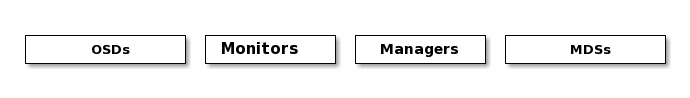

<center> 
    <h1>Kubernetes平台存储系统搭建
    </h1></center>

> 存储系统是个专业性的整个体系，我们只用常见方式搭建，具体优化需要参照公司自己的产品等各种进行调整


# 一、Ceph

https://ceph.io/

## 1、基本概念

Ceph可以有

- Ceph对象存储：键值存储，其接口就是简单的GET,PUT,DEL等。如七牛，阿里云oss等
- Ceph块设备：**AWS的EBS**，**青云的云硬盘**和**阿里云的盘古系统**，还有**Ceph的RBD**(RBD是Ceph面向块存储的接口)
- Ceph文件系统：它比块存储具有更丰富的接口，需要考虑目录、文件属性等支持，实现一个支持并行化的文件存储应该是最困难的。

一个Ceph存储集群需要

- 至少一个Ceph监视器、Ceph管理器、Ceph OSD（对象存储守护程序）
- 需要运行Ceph文件系统客户端，则需要部署 Ceph Metadata Server。



- **Monitors**:  [Ceph Monitor](https://docs.ceph.com/en/latest/glossary/#term-Ceph-Monitor) (`ceph-mon`) 监视器：维护集群状态信息
  - 维护集群状态的映射，包括监视器映射，管理器映射，OSD映射，MDS映射和CRUSH映射。 
  - 这些映射是Ceph守护程序相互协调所必需的关键群集状态。 
  - 监视器还负责管理守护程序和客户端之间的身份验证。 
  - 通常至少需要三个监视器才能实现冗余和高可用性。
- **Managers**: [Ceph Manager](https://docs.ceph.com/en/latest/glossary/#term-Ceph-Manager) 守护进程(`ceph-mgr`) : 负责跟踪运行时指标和Ceph集群的当前状态
  - Ceph Manager守护进程（ceph-mgr）负责跟踪运行时指标和Ceph集群的当前状态
  - 包括存储利用率，当前性能指标和系统负载。
  -  Ceph Manager守护程序还托管基于python的模块，以管理和公开Ceph集群信息，包括基于Web的Ceph Dashboard和REST API。 
  - 通常，至少需要两个管理器才能实现高可用性。
- **Ceph OSDs**: [Ceph OSD](https://docs.ceph.com/en/latest/glossary/#term-Ceph-OSD) (对象存储守护进程, `ceph-osd`) 【存储数据】
  - 通过检查其他Ceph OSD守护程序的心跳来存储数据，处理数据复制，恢复，重新平衡，并向Ceph监视器和管理器提供一些监视信息。 
  - 通常至少需要3个Ceph OSD才能实现冗余和高可用性。
- **MDSs**: [Ceph Metadata Server](https://docs.ceph.com/en/latest/glossary/#term-Ceph-Metadata-Server) (MDS, `ceph-mds`ceph元数据服务器)
  -  存储能代表 [Ceph File System](https://docs.ceph.com/en/latest/glossary/#term-Ceph-File-System) 的元数据(如：Ceph块设备和Ceph对象存储不使用MDS).
  -  Ceph元数据服务器允许POSIX文件系统用户执行基本命令（如ls，find等），而不会给Ceph存储集群带来巨大负担


# 二、Rook

## 1、基本概念

Rook是云原生平台的存储编排工具


Rook工作原理如下：


Rook架构如下


RGW：为Restapi Gateway

## 2、operator是什么

k8s中operator+CRD（CustomResourceDefinitions【k8s自定义资源类型】），可以快速帮我们部署一些有状态应用集群，如redis，mysql，Zookeeper等。

Rook的operator是我们k8s集群和存储集群之间进行交互的解析器


CRD：CustomResourceDefinitions (自定义资源)；如：Itdachang

operator：这个能处理自定义资源类型


# 三、部署

https://rook.io/docs/rook/v1.6/ceph-quickstart.html

## 1、查看前提条件

- Raw devices (no partitions or formatted filesystems)； 原始磁盘，无分区或者格式化
- Raw partitions (no formatted filesystem)；原始分区，无格式化文件系统

```sh
fdisk -l 
找到自己挂载的磁盘
如： /dev/vdc

# 查看满足要求的
lsblk -f

#云厂商都这么磁盘清0
dd if=/dev/zero of=/dev/vdc bs=1M status=progress
```

> ```
> NAME                  FSTYPE      LABEL UUID                                   MOUNTPOINT
> vda
> └─vda1                LVM2_member       >eSO50t-GkUV-YKTH-WsGq-hNJY-eKNf-3i07IB
>  ├─ubuntu--vg-root   ext4              c2366f76-6e21-4f10-a8f3-6776212e2fe4   /
>  └─ubuntu--vg-swap_1 swap              9492a3dc-ad75-47cd-9596-678e8cf17ff9   [SWAP]
> vdb
> ```

vdb 是可用的


## 2、部署&修改operator

```sh
cd cluster/examples/kubernetes/ceph
kubectl create -f crds.yaml -f common.yaml -f operator.yaml #注意修改operator镜像

# verify the rook-ceph-operator is in the `Running` state before proceeding
kubectl -n rook-ceph get pod
```


> 修改operator.yaml
>
> 把以前的默认镜像换成能用的，如下

```sh
  # ROOK_CSI_CEPH_IMAGE: "registry.cn-hangzhou.aliyuncs.com/lfy_k8s_images/cephcsi:v3.3.1"
  # ROOK_CSI_REGISTRAR_IMAGE: "registry.cn-hangzhou.aliyuncs.com/lfy_k8s_images/csi-node-driver-registrar:v2.0.1"
  # ROOK_CSI_RESIZER_IMAGE: "registry.cn-hangzhou.aliyuncs.com/lfy_k8s_images/csi-resizer:v1.0.1"
  # ROOK_CSI_PROVISIONER_IMAGE: "registry.cn-hangzhou.aliyuncs.com/lfy_k8s_images/csi-provisioner:v2.0.4"
  # ROOK_CSI_SNAPSHOTTER_IMAGE: "registry.cn-hangzhou.aliyuncs.com/lfy_k8s_images/csi-snapshotter:v4.0.0"
  # ROOK_CSI_ATTACHER_IMAGE: "registry.cn-hangzhou.aliyuncs.com/lfy_k8s_images/csi-attacher:v3.0.2"
```

镜像： `rook/ceph:v1.6.3`   换成  `registry.cn-hangzhou.aliyuncs.com/lfy_k8s_images/rook-ceph:v1.6.3`

```yaml
## 建议修改以下的东西。在operator.yaml里面

ROOK_CSI_CEPH_IMAGE: "registry.cn-hangzhou.aliyuncs.com/lfy_k8s_images/cephcsi:v3.3.1"
ROOK_CSI_REGISTRAR_IMAGE: "registry.cn-hangzhou.aliyuncs.com/lfy_k8s_images/csi-node-driver-registrar:v2.0.1"
ROOK_CSI_RESIZER_IMAGE: "registry.cn-hangzhou.aliyuncs.com/lfy_k8s_images/csi-resizer:v1.0.1"
ROOK_CSI_PROVISIONER_IMAGE: "registry.cn-hangzhou.aliyuncs.com/lfy_k8s_images/csi-provisioner:v2.0.4"
ROOK_CSI_SNAPSHOTTER_IMAGE: "registry.cn-hangzhou.aliyuncs.com/lfy_k8s_images/csi-snapshotter:v4.0.0"
ROOK_CSI_ATTACHER_IMAGE: "registry.cn-hangzhou.aliyuncs.com/lfy_k8s_images/csi-attacher:v3.0.2"
```


## 3、部署集群

> 修改`cluster.yaml`使用我们指定的磁盘当做存储节点即可

```yaml
  storage: # cluster level storage configuration and selection
    useAllNodes: false
    useAllDevices: false
    config:
      osdsPerDevice: "3" #每个设备osd数量
    nodes:
    - name: "k8s-node3"
      devices: 
      - name: "vdc"
    - name: "k8s-node1"
      devices: 
      - name: "vdc"
    - name: "k8s-node2"
      devices: 
      - name: "vdc"
```


镜像： `ceph/ceph:v15.2.11` 换成 `registry.cn-hangzhou.aliyuncs.com/lfy_k8s_images/ceph-ceph:v15.2.11`


## 4、部署dashboard

https://www.rook.io/docs/rook/v1.6/ceph-dashboard.html

前面的步骤，已经自动部署了。

```sh
kubectl -n rook-ceph get service
#查看service


#为了方便访问我们改为nodePort。应用nodePort文件


#获取访问密码
kubectl -n rook-ceph get secret rook-ceph-dashboard-password -o jsonpath="{['data']['password']}" | base64 --decode && echo

#默认账号 admin
4/qt]e5wad_HY:0&V.ba
```


MGR: 2；只有一个能用

Mon: 3; 全部可用

Osd: 全部可用


> 部署了高可用的mgr：提供页面。
>
> - 先部署nodePort，验证到底哪个mgr不能访问
>
> - 他是主备模式的高可用。kubectl get svc -n rook-ceph|grep dashboard
>
> - curl 访问dashboard确定哪个mgr不能访问
>
> - 自己做一个可访问到的service。如果哪天服务器故障mgr有问题。修改svc的selector即可
>
>   - ```yaml
>     apiVersion: v1
>     kind: Service
>     metadata:
>       labels:
>         app: rook-ceph-mgr
>         ceph_daemon_id: a
>         rook_cluster: rook-ceph
>       name: rook-ceph-mgr-dashboard-active
>       namespace: rook-ceph
>     spec:
>       ports:
>       - name: dashboard
>         port: 8443
>         protocol: TCP
>         targetPort: 8443
>       selector:  #service选择哪些Pod
>         app: rook-ceph-mgr
>         ceph_daemon_id: a
>         rook_cluster: rook-ceph
>       sessionAffinity: None
>       type: ClusterIP
>     ```
>
> - 再部署如下的ingress
>
>   - ```yaml
>     apiVersion: networking.k8s.io/v1
>     kind: Ingress
>     metadata:
>       name: ceph-rook-dash
>       namespace: rook-ceph
>       annotations:
>         nginx.ingress.kubernetes.io/backend-protocol: "HTTPS"
>         nginx.ingress.kubernetes.io/server-snippet: |
>           proxy_ssl_verify off;
>     spec:
>       # tls:  不用每个名称空间都配置证书信息
>       # - hosts:
>       #     - itdachang.com
>       #     -  未来的
>       #   secretName: testsecret-tls
>       rules:
>       - host: rook.itdachang.com
>         http:
>           paths:
>           - path: /
>             pathType: Prefix
>             backend:
>               service:
>                 name: rook-ceph-mgr-dashboard-active
>                 port:
>                   number: 8443
>     ```
>
>     


## 5、神坑

```yaml
#部署完成的最终结果一定要有这些组件
NAME                                                 READY   STATUS      RESTARTS   AGE
csi-cephfsplugin-provisioner-d77bb49c6-n5tgs         5/5     Running     0          140s
csi-cephfsplugin-provisioner-d77bb49c6-v9rvn         5/5     Running     0          140s
csi-cephfsplugin-rthrp                               3/3     Running     0          140s
csi-rbdplugin-hbsm7                                  3/3     Running     0          140s
csi-rbdplugin-provisioner-5b5cd64fd-nvk6c            6/6     Running     0          140s
csi-rbdplugin-provisioner-5b5cd64fd-q7bxl            6/6     Running     0          140s
rook-ceph-crashcollector-minikube-5b57b7c5d4-hfldl   1/1     Running     0          105s
rook-ceph-mgr-a-64cd7cdf54-j8b5p                     1/1     Running     0          77s
rook-ceph-mon-a-694bb7987d-fp9w7                     1/1     Running     0          105s
rook-ceph-mon-b-856fdd5cb9-5h2qk                     1/1     Running     0          94s
rook-ceph-mon-c-57545897fc-j576h                     1/1     Running     0          85s
rook-ceph-operator-85f5b946bd-s8grz                  1/1     Running     0          92m
rook-ceph-osd-0-6bb747b6c5-lnvb6                     1/1     Running     0          23s
rook-ceph-osd-1-7f67f9646d-44p7v                     1/1     Running     0          24s
rook-ceph-osd-2-6cd4b776ff-v4d68                     1/1     Running     0          25s
rook-ceph-osd-prepare-node1-vx2rz                    0/2     Completed   0          60s
rook-ceph-osd-prepare-node2-ab3fd                    0/2     Completed   0          60s
rook-ceph-osd-prepare-node3-w4xyz                    0/2     Completed   0          60s
```


```sh
#解决方案。
#找到自己的operator，删除这个pod，让重新执行

kubectl delete pod rook-ceph-operator-65965c66b5-cxrl8 -n rook-ceph


#rbd：是ceph用来做块存储的
#cephfs：是用来做共享文件系统的
```


## 6、卸载

```sh
# rook集群的清除，
##1、 delete -f 之前的yaml

##2、 再执行如下命令
kubectl -n rook-ceph get cephcluster
kubectl -n rook-ceph patch cephclusters.ceph.rook.io rook-ceph -p '{"metadata":{"finalizers": []}}' --type=merge

##3、 清除每个节点的 /var/lib/rook 目录


## 顽固的自定义资源删除；
kubectl -n rook-ceph patch cephblockpool.ceph.rook.io replicapool -p '{"metadata":{"finalizers": []}}' --type=merge
```


Rook+Ceph；

- Rook帮我们创建好 StorageClass
  - pvc只需要指定存储类，Rook自动调用 StorageClass 里面的 Provisioner供应商，接下来对ceph集群操作
- Ceph
  - Block：块存储。RWO（ReadWriteOnce）单节点读写【一个Pod操作一个自己专属的读写区】，适用于（有状态副本集）
  - Share FS：共享存储。RWX（ReadWriteMany）多节点读写【多个Pod操作同一个存储区，可读可写】，适用于无状态应用。（文件系统 ）
  - ......
  - 总结： 无状态应用随意复制多少份，一定用到RWX能力。有状态应用复制任意份，每份都只是读写自己的存储，用到RWO（优先）或者RWX。
- 直接通过Rook可以使用到任意能力的存储。


CRI、CNI、CSI

CRI：Container Runtime Interface：容器运行时接口（k8s集群整合容器运行时环境）

CNI：Container Network Interface：容器网络接口（k8s集群整合网络组件的接口）

CSI：Container Storage Interface：容器存储接口（k8s集群整合存储组件的接口）


> kubelet启动一个Pod。CRI、CNI、CSI 起作用的顺序
>
> - 启动Pod流程
>   - 每个Pod，都伴随一个Pause容器（沙箱容器）。真正的容器（nginx-pvc）和沙箱容器是公用一个网络、存储、名称空间。。。。
>   - 启动沙箱容器。给沙箱容器设置好网络，存储
>     - CRI。创建沙箱容器的运行时环境
>     - CNI。挂载沙箱容器网络等
>     - CSI。调用存储系统进行数据挂载。（提前把应用容器需要挂载的挂进来）
>   - 启动应用容器。（kubectl get pod 1/1【不算沙箱容器】  ）
>     - 应用容器直接创建运行时CRI，用以上的 CNI、CSI
> - 从应用容器角度出发：`CSI先与CRI启动`。
> - 从Pod出发。CRI。CNI。CSI
>   - 沙箱容器代码 https://github.com/kubernetes/kubernetes/blob/d541872f9a036ed4f792232e43fde6dacf0e1084/pkg/kubelet/dockershim/docker_sandbox.go#L89
>   - 应用容器 https://github.com/kubernetes/kubernetes/blob/d541872f9a036ed4f792232e43fde6dacf0e1084/pkg/kubelet/kubelet.go#L1469
>     - 判断网络（前面准备好的）
>     - 挂载
>     - 容器启动


# 四、实战

## 1、块存储(RDB)

RDB： RADOS Block Devices    

RADOS： Reliable, Autonomic Distributed Object Store

不能是RWX模式。

### 1、配置

RWO:（ReadWriteOnce）

https://www.rook.io/docs/rook/v1.6/ceph-block.html

常用 块存储 。RWO模式；STS删除，pvc不会删除，需要自己手动维护

```yaml
apiVersion: ceph.rook.io/v1
kind: CephBlockPool
metadata:
  name: replicapool
  namespace: rook-ceph
spec:
  failureDomain: host  #容灾模式，host或者osd
  replicated:
    size: 2  #数据副本数量
---
apiVersion: storage.k8s.io/v1
kind: StorageClass  #存储驱动
metadata:
   name: rook-ceph-block
# Change "rook-ceph" provisioner prefix to match the operator namespace if needed
provisioner: rook-ceph.rbd.csi.ceph.com
parameters:
    # clusterID is the namespace where the rook cluster is running
    clusterID: rook-ceph
    # Ceph pool into which the RBD image shall be created
    pool: replicapool

    # (optional) mapOptions is a comma-separated list of map options.
    # For krbd options refer
    # https://docs.ceph.com/docs/master/man/8/rbd/#kernel-rbd-krbd-options
    # For nbd options refer
    # https://docs.ceph.com/docs/master/man/8/rbd-nbd/#options
    # mapOptions: lock_on_read,queue_depth=1024

    # (optional) unmapOptions is a comma-separated list of unmap options.
    # For krbd options refer
    # https://docs.ceph.com/docs/master/man/8/rbd/#kernel-rbd-krbd-options
    # For nbd options refer
    # https://docs.ceph.com/docs/master/man/8/rbd-nbd/#options
    # unmapOptions: force

    # RBD image format. Defaults to "2".
    imageFormat: "2"

    # RBD image features. Available for imageFormat: "2". CSI RBD currently supports only `layering` feature.
    imageFeatures: layering

    # The secrets contain Ceph admin credentials.
    csi.storage.k8s.io/provisioner-secret-name: rook-csi-rbd-provisioner
    csi.storage.k8s.io/provisioner-secret-namespace: rook-ceph
    csi.storage.k8s.io/controller-expand-secret-name: rook-csi-rbd-provisioner
    csi.storage.k8s.io/controller-expand-secret-namespace: rook-ceph
    csi.storage.k8s.io/node-stage-secret-name: rook-csi-rbd-node
    csi.storage.k8s.io/node-stage-secret-namespace: rook-ceph

    # Specify the filesystem type of the volume. If not specified, csi-provisioner
    # will set default as `ext4`. Note that `xfs` is not recommended due to potential deadlock
    # in hyperconverged settings where the volume is mounted on the same node as the osds.
    csi.storage.k8s.io/fstype: ext4

# Delete the rbd volume when a PVC is deleted
reclaimPolicy: Delete
allowVolumeExpansion: true
```


### 2、STS案例实战


```yaml
apiVersion: apps/v1
kind: StatefulSet
metadata:
  name: sts-nginx
  namespace: default
spec:
  selector:
    matchLabels:
      app: sts-nginx # has to match .spec.template.metadata.labels
  serviceName: "sts-nginx"
  replicas: 3 # by default is 1
  template:
    metadata:
      labels:
        app: sts-nginx # has to match .spec.selector.matchLabels
    spec:
      terminationGracePeriodSeconds: 10
      containers:
      - name: sts-nginx
        image: nginx
        ports:
        - containerPort: 80
          name: web
        volumeMounts:
        - name: www
          mountPath: /usr/share/nginx/html
  volumeClaimTemplates:
  - metadata:
      name: www
    spec:
      accessModes: [ "ReadWriteOnce" ]
      storageClassName: "rook-ceph-block"
      resources:
        requests:
          storage: 20Mi
---
apiVersion: v1
kind: Service
metadata:
  name: sts-nginx
  namespace: default
spec:
  selector:
    app: sts-nginx
  type: ClusterIP
  ports:
  - name: sts-nginx
    port: 80
    targetPort: 80
    protocol: TCP
```

> 测试： 创建sts、修改nginx数据、删除sts、重新创建sts。他们的数据丢不丢，共享不共享


## 3、文件存储(CephFS)

### 1、配置

常用 文件存储。 RWX模式；如：10个Pod共同操作一个地方

https://rook.io/docs/rook/v1.6/ceph-filesystem.html

```yaml
apiVersion: ceph.rook.io/v1
kind: CephFilesystem
metadata:
  name: myfs
  namespace: rook-ceph # namespace:cluster
spec:
  # The metadata pool spec. Must use replication.
  metadataPool:
    replicated:
      size: 3
      requireSafeReplicaSize: true
    parameters:
      # Inline compression mode for the data pool
      # Further reference: https://docs.ceph.com/docs/nautilus/rados/configuration/bluestore-config-ref/#inline-compression
      compression_mode:
        none
        # gives a hint (%) to Ceph in terms of expected consumption of the total cluster capacity of a given pool
      # for more info: https://docs.ceph.com/docs/master/rados/operations/placement-groups/#specifying-expected-pool-size
      #target_size_ratio: ".5"
  # The list of data pool specs. Can use replication or erasure coding.
  dataPools:
    - failureDomain: host
      replicated:
        size: 3
        # Disallow setting pool with replica 1, this could lead to data loss without recovery.
        # Make sure you're *ABSOLUTELY CERTAIN* that is what you want
        requireSafeReplicaSize: true
      parameters:
        # Inline compression mode for the data pool
        # Further reference: https://docs.ceph.com/docs/nautilus/rados/configuration/bluestore-config-ref/#inline-compression
        compression_mode:
          none
          # gives a hint (%) to Ceph in terms of expected consumption of the total cluster capacity of a given pool
        # for more info: https://docs.ceph.com/docs/master/rados/operations/placement-groups/#specifying-expected-pool-size
        #target_size_ratio: ".5"
  # Whether to preserve filesystem after CephFilesystem CRD deletion
  preserveFilesystemOnDelete: true
  # The metadata service (mds) configuration
  metadataServer:
    # The number of active MDS instances
    activeCount: 1
    # Whether each active MDS instance will have an active standby with a warm metadata cache for faster failover.
    # If false, standbys will be available, but will not have a warm cache.
    activeStandby: true
    # The affinity rules to apply to the mds deployment
    placement:
      #  nodeAffinity:
      #    requiredDuringSchedulingIgnoredDuringExecution:
      #      nodeSelectorTerms:
      #      - matchExpressions:
      #        - key: role
      #          operator: In
      #          values:
      #          - mds-node
      #  topologySpreadConstraints:
      #  tolerations:
      #  - key: mds-node
      #    operator: Exists
      #  podAffinity:
      podAntiAffinity:
        requiredDuringSchedulingIgnoredDuringExecution:
          - labelSelector:
              matchExpressions:
                - key: app
                  operator: In
                  values:
                    - rook-ceph-mds
            # topologyKey: kubernetes.io/hostname will place MDS across different hosts
            topologyKey: kubernetes.io/hostname
        preferredDuringSchedulingIgnoredDuringExecution:
          - weight: 100
            podAffinityTerm:
              labelSelector:
                matchExpressions:
                  - key: app
                    operator: In
                    values:
                      - rook-ceph-mds
              # topologyKey: */zone can be used to spread MDS across different AZ
              # Use <topologyKey: failure-domain.beta.kubernetes.io/zone> in k8s cluster if your cluster is v1.16 or lower
              # Use <topologyKey: topology.kubernetes.io/zone>  in k8s cluster is v1.17 or upper
              topologyKey: topology.kubernetes.io/zone
    # A key/value list of annotations
    annotations:
    #  key: value
    # A key/value list of labels
    labels:
    #  key: value
    resources:
    # The requests and limits set here, allow the filesystem MDS Pod(s) to use half of one CPU core and 1 gigabyte of memory
    #  limits:
    #    cpu: "500m"
    #    memory: "1024Mi"
    #  requests:
    #    cpu: "500m"
    #    memory: "1024Mi"
    # priorityClassName: my-priority-class
  mirroring:
    enabled: false
```


```yaml
apiVersion: storage.k8s.io/v1
kind: StorageClass
metadata:
  name: rook-cephfs
# Change "rook-ceph" provisioner prefix to match the operator namespace if needed
provisioner: rook-ceph.cephfs.csi.ceph.com
parameters:
  # clusterID is the namespace where operator is deployed.
  clusterID: rook-ceph

  # CephFS filesystem name into which the volume shall be created
  fsName: myfs
  # Ceph pool into which the volume shall be created
  # Required for provisionVolume: "true"
  pool: myfs-data0
  # The secrets contain Ceph admin credentials. These are generated automatically by the operator
  # in the same namespace as the cluster.
  csi.storage.k8s.io/provisioner-secret-name: rook-csi-cephfs-provisioner
  csi.storage.k8s.io/provisioner-secret-namespace: rook-ceph
  csi.storage.k8s.io/controller-expand-secret-name: rook-csi-cephfs-provisioner
  csi.storage.k8s.io/controller-expand-secret-namespace: rook-ceph
  csi.storage.k8s.io/node-stage-secret-name: rook-csi-cephfs-node
  csi.storage.k8s.io/node-stage-secret-namespace: rook-ceph

reclaimPolicy: Delete
allowVolumeExpansion: true
```


### 2、测试

```yaml
apiVersion: apps/v1
kind: Deployment
metadata:
  name:  nginx-deploy
  namespace: default
  labels:
    app:  nginx-deploy
spec:
  selector:
    matchLabels:
      app: nginx-deploy
  replicas: 3
  strategy:
    rollingUpdate:
      maxSurge: 25%
      maxUnavailable: 25%
    type: RollingUpdate
  template:
    metadata:
      labels:
        app:  nginx-deploy
    spec:
      containers:
      - name:  nginx-deploy
        image:  nginx
        volumeMounts:
        - name: localtime
          mountPath: /etc/localtime
        - name: nginx-html-storage
          mountPath: /usr/share/nginx/html
      volumes:
        - name: localtime
          hostPath:
            path: /usr/share/zoneinfo/Asia/Shanghai
        - name: nginx-html-storage
          persistentVolumeClaim:
            claimName: nginx-pv-claim
---
apiVersion: v1
kind: PersistentVolumeClaim
metadata:
  name: nginx-pv-claim
  labels:
    app:  nginx-deploy
spec:
  storageClassName: rook-cephfs
  accessModes:
    - ReadWriteMany  ##如果是ReadWriteOnce将会是什么效果
  resources:
    requests:
      storage: 10Mi
```


> 测试，创建deploy、修改页面、删除deploy，新建deploy是否绑定成功，数据是否在。


## 4、pvc扩容

参照CSI（容器存储接口）文档： 

卷扩容：https://www.rook.io/docs/rook/v1.6/ceph-csi-drivers.html#dynamically-expand-volume

### 1、动态卷扩容

```yaml
# 之前创建storageclass的时候已经配置好了


# 测试：去容器挂载目录  curl -O 某个大文件  默认不能下载

#修改原来的PVC，可以扩充容器。

#注意，只能扩容，不能缩容
```


> 有状态应用（3个副本）使用块存储。自己操作自己的pvc挂载的pv；也不丢失
>
> 无状态应用（3个副本）使用共享存储。很多人操作一个pvc挂载的一个pv；也不丢失
>
> - 其他Pod可以对数据进行修改
> - MySQL 有状态做成主节点。。。MySQL - Master  ---- pv
> - MySQL 无状态只读 挂载master的 pvc。


## 5、更多参照官方文档


