<center>
    <h1>
        生态链路整合
    </h1>
</center>

# 一、Prometheus

## 1、入门

### 1、docker版本

```sh
mkdir -p /app/prometheus/config
# 自行配置 prometheus.yml
docker run -d --name prometheus --restart=always \
    -p 9090:9090 \
    -v /app/prometheus/config:/etc/prometheus \
    prom/prometheus
```


```yaml
# my global config
global:
  scrape_interval:     15s # Set the scrape interval to every 15 seconds. Default is every 1 minute.
  evaluation_interval: 15s # Evaluate rules every 15 seconds. The default is every 1 minute.
  # scrape_timeout is set to the global default (10s).
 
# Alertmanager configuration
alerting:
  alertmanagers:
  - static_configs:
    - targets:
       - alertmanager:9093
 
# Load rules once and periodically evaluate them according to the global 'evaluation_interval'.
rule_files:
  # - "first_rules.yml"
  # - "second_rules.yml"
 
# A scrape configuration containing exactly one endpoint to scrape:
# Here it's Prometheus itself.
scrape_configs:
  # The job name is added as a label `job=<job_name>` to any timeseries scraped from this config.
  - job_name: 'prometheus'
    # metrics_path defaults to '/metrics'
    # scheme defaults to 'http'.
    scrape_interval: 5s
    static_configs:
    - targets: ['127.0.0.1:9090']
 
  - job_name: 'docker'
    scrape_interval: 10s
    static_configs:
      - targets: ['10.120.82.4:8080'] ## 这个安装了下面cadvisor才有,自动访问/metrics
  - job_name: 'node'  ## 准备一个程序能暴露 /metrics   k v； node_exporter
    scrape_interval: 5s
    static_configs:
    - targets: ['10.120.82.4:9100']
```


```sh
# 运行cadvisor 导出docker节点数据，访问 8080/metrics即可
docker run -v /:/rootfs:ro \
-v /var/run:/var/run:rw \
-v /sys:/sys:ro \
-v /var/lib/docker/:/var/lib/docker:ro \
-p 8080:8080 -d  --name=cadvisor  google/cadvisor
```


```sh
#主机监控,参照如下网址
https://grafana.com/grafana/dashboards/13978?src=grafana_gettingstarted&pg=dashboards&plcmt=featured-sub1

#创建开机启动服务.为啥不行？？？？ 可以用 nohup node_exporter &
#nohup node_exporter >> node_exporter.output.log 2>&1 &
vi /etc/systemd/system/node-exporter.service
## 内容如下,如下的配置算了
[Unit]
Description=Node Exporter

[Service]
User=node-exporter
ExecStart=/usr/local/bin/node_exporter  --config.file=agent-config.yaml
##ExecStart=/usr/local/bin/node_exporter
Restart=always

[Install]
WantedBy=multi-user.target

##创建用户
useradd --no-create-home --shell /bin/false node-exporter

## 启动
sudo systemctl daemon-reload
sudo systemctl enable node-exporter.service --now
sudo systemctl start node-exporter.service
sudo systemctl status node-exporter.service


```


```sh
docker run -d --name=grafana --restart=always -p 3000:3000 grafana/grafana
```


> expression：要看metrics有哪些进行编写
>
> mysql：mysql_exporter
>
> java： 引入Acutator，也会暴露 metrics信息


## 2、安装

>  kube-prometheus-stack
>
> - prometheus
> - stack-charts
>   - [prometheus-community/kube-state-metrics](https://github.com/prometheus-community/helm-charts/tree/main/charts/kube-state-metrics)
>   - [prometheus-community/prometheus-node-exporter](https://github.com/prometheus-community/helm-charts/tree/main/charts/prometheus-node-exporter)
>   - [grafana/grafana](https://github.com/grafana/helm-charts/tree/main/charts/grafana)

### 1、charts下载

```sh
helm repo add prometheus-community https://prometheus-community.github.io/helm-charts
helm repo update
helm pull prometheus-community/kube-prometheus-stack --version 16.0.0
```


### 2、定制化配置

#### 1、配置ingress访问证书

>  全局做过的就可以跳过；
>
> 只需要给全局加上域名即可


#### 2、配置定制化文件

```yaml
vi override.yaml  #直接Ingress部署的

alertmanager:
  ingress: 
    enabled: true
    ingressClassName: nginx
    hosts:
      - alertmanager.itdachang.com
    paths:
      - /
    pathType: Prefix
    tls: 
     - secretName: itdachang.com
       hosts:
        - alertmanager.itdachang.com
grafana:
  enabled: true
  defaultDashboardsEnabled: true
  adminPassword: Admin123456
  ingress: 
    enabled: true
    hosts: 
    - grafana.itdachang.com
    path: /
    pathType: Prefix
    tls:
      - secretName: itdachang.com
        hosts:
          - grafana.itdachang.com 
  
prometheus: 
  ingress: 
    enabled: true
    hosts: [prometheus.itdachang.com]
    paths:
      - / 
    pathType: Prefix
    tls:
      - secretName: itdachang.com
        hosts:
          - prometheus.itdachang.com
    additionalPodMonitors:
      - name: registry.cn-hangzhou.aliyuncs.com/lfy_k8s_images/kube-state-metrics:v2.0.0
```

k8s.gcr.io/kube-state-metrics/kube-state-metrics:v2.0.0


### 3、安装

```sh
kubectl create ns monitor
helm install -f values.yaml -f override.yaml prometheus-stack ./ -n monitor
```


> NAME: prometheus-stack
> LAST DEPLOYED: Thu May 27 11:39:52 2021
> NAMESPACE: monitor
> STATUS: deployed
> REVISION: 1
> NOTES:
> kube-prometheus-stack has been installed. Check its status by running:
>   kubectl --namespace monitor get pods -l "release=prometheus-stack"
>
> Visit https://github.com/prometheus-operator/kube-prometheus for instructions on how to create & configure Alertmanager and Prometheus instances using the Operator.


### 4、访问


# 二、Harbor

## 1、入门

### 1、简介


### 2、核心组件

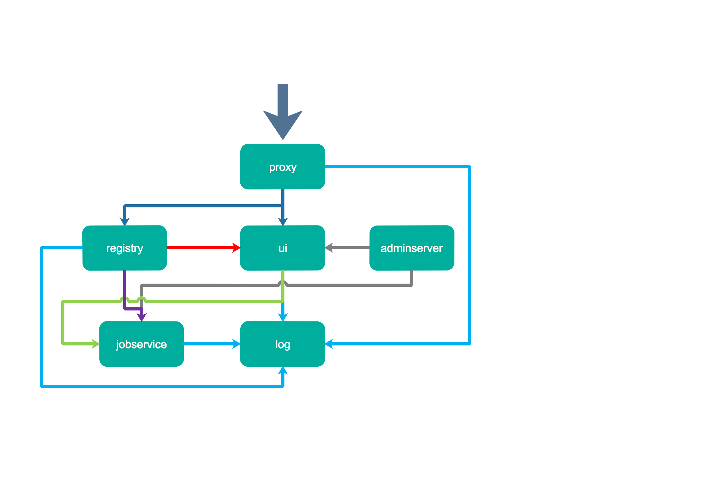

- Nginx(Proxy)：用于代理Harbor的registry,UI, token等服务
- db：负责储存用户权限、审计日志、Dockerimage分组信息等数据。
- UI：提供图形化界面，帮助用户管理registry上的镜像, 并对用户进行授权
- jobsevice：负责镜像复制工作的，他和registry通信，从一个registry pull镜像然后push到另一个registry，并记录job_log
- Adminserver：是系统的配置管理中心附带检查存储用量，ui和jobserver启动时候回需要加载adminserver的配置。
- Registry：原生的docker镜像仓库，负责存储镜像文件。
- Log：为了帮助监控Harbor运行，负责收集其他组件的log，记录到syslog中


### 3、安装

#### 1、helm下载charts

```sh
helm repo add harbor https://helm.goharbor.io
helm pull harbor/harbor
```


#### 2、定制配置

##### 1、TLS证书

```sh
$ openssl req -x509 -nodes -days 365 -newkey rsa:2048 -keyout ${KEY_FILE:tls.key} -out ${CERT_FILE:tls.cert} -subj "/CN=${HOST:itdachang.com}/O=${HOST:itdachang.com}"

kubectl create secret tls ${CERT_NAME:itdachang-tls} --key ${KEY_FILE:tls.key} --cert ${CERT_FILE:tls.cert}


## 示例命令如下
openssl req -x509 -nodes -days 365 -newkey rsa:2048 -keyout tls.key -out tls.crt -subj "/CN=*.itdachang.com/O=*.itdachang.com"

kubectl create secret tls harbor.itdachang.com --key tls.key --cert tls.crt -n devops
```

> 原来证书是 itdachang.com 域名
>
> 现在用的是harbor.itdachang.com 域名的。
>
> 单独创建一个

##### 2、values-overrides.yaml配置

- 旧版本配置；使用自己的证书。自己的证书要兼容harbor里面的组件很麻烦

```sh
expose:
  type: ingress
  tls:
    certSource: "secret"
    secret:
      secretName: "harbor.itdachang.com"
      notarySecretName: "harbor.itdachang.com"
  ingress:
    hosts:
      core: harbor.itdachang.com
      notary: notary-harbor.itdachang.com
externalURL: https://harbor.itdachang.com
internalTLS:
  enabled: true
  certSource: "secret"   #
  core:
    secretName: "harbor.itdachang.com"
  jobservice:
    secretName: "harbor.itdachang.com"
  registry:
    secretName: "harbor.itdachang.com"
  portal:
    secretName: "harbor.itdachang.com"
  chartmuseum:
    secretName: "harbor.itdachang.com"
  trivy:
    secretName: "harbor.itdachang.com"
persistence:
  enabled: true
  resourcePolicy: "keep"
  persistentVolumeClaim:
    registry:  # 存镜像的
      storageClass: "rook-ceph-block"
      accessMode: ReadWriteOnce
      size: 5Gi
    chartmuseum: #存helm的chart
      storageClass: "rook-ceph-block"
      accessMode: ReadWriteOnce
      size: 5Gi
    jobservice: #
      storageClass: "rook-ceph-block"
      accessMode: ReadWriteOnce
      size: 1Gi
    database: #数据库  pgsql
      storageClass: "rook-ceph-block"
      accessMode: ReadWriteOnce
      size: 1Gi
    redis: #
      storageClass: "rook-ceph-block"
      accessMode: ReadWriteOnce
      size: 1Gi
    trivy: # 漏洞扫描
      storageClass: "rook-ceph-block"
      accessMode: ReadWriteOnce
      size: 5Gi
metrics:
  enabled: true
```


- 新版本配置，harbor内部组件用默认证书。ingress需要用自己证书
- 自己的证书信息给每个namespace配置同一个

```yaml
expose:  #web浏览器访问用的证书
  type: ingress
  tls:
    certSource: "secret"
    secret:
      secretName: "harbor.itdachang.com"
      notarySecretName: "harbor.itdachang.com"
  ingress:
    hosts:
      core: harbor.itdachang.com
      notary: notary-harbor.itdachang.com
externalURL: https://harbor.itdachang.com
internalTLS:  #harbor内部组件用的证书
  enabled: true
  certSource: "auto"
persistence:
  enabled: true
  resourcePolicy: "keep"
  persistentVolumeClaim:
    registry:  # 存镜像的
      storageClass: "rook-ceph-block"
      accessMode: ReadWriteOnce
      size: 5Gi
    chartmuseum: #存helm的chart
      storageClass: "rook-ceph-block"
      accessMode: ReadWriteOnce
      size: 5Gi
    jobservice: #
      storageClass: "rook-ceph-block"
      accessMode: ReadWriteOnce
      size: 1Gi
    database: #数据库  pgsql
      storageClass: "rook-ceph-block"
      accessMode: ReadWriteOnce
      size: 1Gi
    redis: #
      storageClass: "rook-ceph-block"
      accessMode: ReadWriteOnce
      size: 1Gi
    trivy: # 漏洞扫描
      storageClass: "rook-ceph-block"
      accessMode: ReadWriteOnce
      size: 5Gi
metrics:
  enabled: true
```


##### 3、安装

```sh

 
 #注意，由于配置文件用到secret，所以提前在这个名称空间创建好
 openssl req -x509 -nodes -days 365 -newkey rsa:2048 -keyout tls.key -out tls.cert -subj "/CN=*.itdachang.com/O=*.itdachang.com"
kubectl create secret tls itdachang.com --key tls.key --cert tls.cert -n devops

 helm install itharbor ./ -f values.yaml -f override.yaml  -n devops
```


##### 4、配置ingress


##### 4、卸载

```sh
#卸载
helm uninstall itharbor -n devops
```


## 2、harbor使用

https://goharbor.io/docs/2.2.0/working-with-projects/

访问： https://harbor.itdachang.com:4443/

账号：admin  密码：Harbor12345   修改后：Admin123789

```sh
zSPz26aQuyunPfPPvw7aGuu9JIdkJqLk

docker login <harbor_address<>
Username: <prefix><account_name>
Password: <secret>

```


## 3、docker使用


### 1、基本配置


#### 1、使用https方式访问

由于harbor使用的是https。需要docker信任这个https；

```sh
# 把xx.cert文件 复制到  /etc/docker/certs.d/harbor.itdachang.com/tls.crt
```

> 云上`自定义域名`如下操作：
>
> 1、配置每个主机的 /etc/hosts文件。可指定域名地址为 `公网ip`或者`ingress节点所在ip`
>
> 2、在 `/etc/docker/certs.d/` 下面准备域名文件夹（包含非默认的端口号），并把域名的 `cert/crt`文件复制进去。并且修改文件名叫  `xxx.crt`，不能是cert文件
>
> 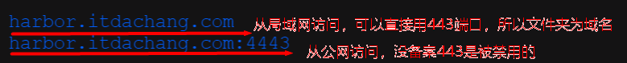
>
> 3、建议配置 ingress节点所在ip 。这样我们使用域名来到了ingress节点。ingress节点的nginx监听到了此域名，则转发给指定服务
>
> 


#### 2、不使用https访问

```sh
#修改docker配置文件
{"insecure-registries":["https://test.com","192.168.1.13","更多的...."]}
```

### 2、镜像代理

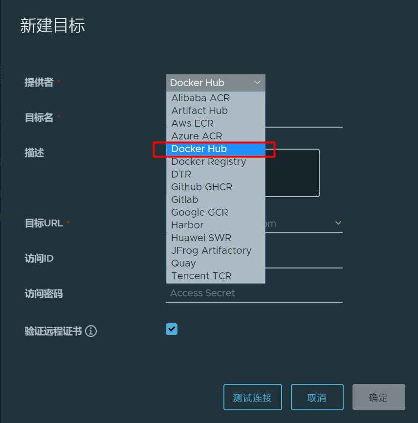

```sh
# 拉取docker官方镜像。并缓存起来。harbor.itdachang.com/自己的仓库名/ + /library + /镜像名：版本
docker pull harbor.itdachang.com/harbor-hub/library/busybox:latest
# 第三方。用第三方全名 harbor.itdachang.com/objs + 第三方
docker pull harbor.itdachang.com/objs/redislabs/redis
```


> 自建域名系统
>
> 10.120.102.31  harbor.itdachang.com


# 三、Gitlab

## 1、入门

https://registry.hub.docker.com/r/gitlab/gitlab-ce

### 1、简介


### 2、k8s安装

http://www.damagehead.com/docker-gitlab/   这个是一个快速docker-compose部署gitlab。参照一下即可

```sh
export GITLAB_HOME=/etc/gitlab


docker run -d \
  --hostname 10.120.82.4 \
  -p 6443:443 -p 88:80 -p 23:22 \
  --name gitlab \
  --restart always \
  --volume $GITLAB_HOME/config:/etc/gitlab \
  --volume $GITLAB_HOME/logs:/var/log/gitlab \
  --volume $GITLAB_HOME/data:/var/opt/gitlab \
  gitlab/gitlab-ce:latest
  

#一句命令安装
docker run -d \
  --hostname 10.120.82.4 \
  -p 6443:443 -p 88:80 -p 23:22 \
  --name gitlab  gitlab/gitlab-ce:latest
```


### 3、yum安装

```sh
vim /etc/yum.repos.d/gitlab-ce.repo


[gitlab-ce]
name=gitlab-ce
baseurl=http://mirrors.tuna.tsinghua.edu.cn/gitlab-ce/yum/el6
Repo_gpgcheck=0
Enabled=1
Gpgkey=https://packages.gitlab.com/gpg.key

sudo yum makecache
sudo yum install gitlab-ce        #自动安装最新版
sudo yum install gitlab-ce-x.x.x    #安装指定版本
```


```sh
sudo gitlab-ctl start    # 启动所有 gitlab 组件；
sudo gitlab-ctl stop        # 停止所有 gitlab 组件；
sudo gitlab-ctl restart        # 重启所有 gitlab 组件；
sudo gitlab-ctl status        # 查看服务状态；
sudo gitlab-ctl reconfigure        # 修改配置文件后，启动服务；
sudo vim /etc/gitlab/gitlab.rb        # 修改默认的配置文件；
gitlab-rake gitlab:check SANITIZE=true --trace    # 检查gitlab；
sudo gitlab-ctl tail        # 查看日志；
```


## 2、使用

> 远程gitlab：  http://139.198.186.134:88/   root   Admin123456


# 四、Jenkins

## 1、helm安装

```dockerfile
#可定制镜像
FROM jenkins/jenkins:lts
RUN jenkins-plugin-cli --plugins kubernetes workflow-aggregator git configuration-as-code
```


```sh
#helm 安装
helm repo add jenkinsci https://charts.jenkins.io/
helm pull jenkinsci/jenkins --version 3.3.18
```


```yaml
controller:
  componentName: "jenkins-controller"
  image: "jenkinsci/blueocean"
  tag: "1.24.7"
  imagePullPolicy: "Always"
  adminSecret: true


  adminUser: "admin"
  adminPassword: "admin"


  servicePort: 8080
  targetPort: 8080
  serviceType: ClusterIP

  healthProbes: true
  probes:
    startupProbe:
      httpGet:
        path: '{{ default "" .Values.controller.jenkinsUriPrefix }}/login'
        port: http
      periodSeconds: 10
      timeoutSeconds: 5
      failureThreshold: 12
    livenessProbe:
      failureThreshold: 5
      httpGet:
        path: '{{ default "" .Values.controller.jenkinsUriPrefix }}/login'
        port: http
      periodSeconds: 10
      timeoutSeconds: 5
    readinessProbe:
      failureThreshold: 3
      httpGet:
        path: '{{ default "" .Values.controller.jenkinsUriPrefix }}/login'
        port: http
      periodSeconds: 10
      timeoutSeconds: 5
  agentListenerServiceType: "ClusterIP"

  installPlugins:
    - kubernetes:1.29.4
    - workflow-aggregator:2.6
    - git:4.7.1
    - configuration-as-code:1.51

  initializeOnce: true

  ingress:
    enabled: true
    paths: 
    - backend:
        service:
            name: jenkins
            port:
              number: 8080
      path: "/"
      pathType: Prefix
    apiVersion: "networking.k8s.io/v1s"
    kubernetes.io/ingress.class: nginx

    hostName: jenkins.itdachang.com
    tls:
    - secretName: itdachang.com
      hosts:
        - jenkins.itdachang.com

  prometheus:
    enabled: true
    scrapeInterval: 60s
    scrapeEndpoint: /prometheus

agent:
  enabled: true
  workspaceVolume: 
     type: PVC
     claimName: jenkins-workspace-pvc
     readOnly: false

additionalAgents:
  maven:
    podName: maven
    customJenkinsLabels: maven
    image: jenkins/jnlp-agent-maven

persistence:
  enabled: true
  storageClass: "rook-ceph-block"
  accessMode: "ReadWriteOnce"
  size: "8Gi"
```


```sh
 openssl req -x509 -nodes -days 365 -newkey rsa:2048 -keyout tls.key -out tls.cert -subj "/CN=*.itdachang.com/O=*.itdachang.com"
 
kubectl create ns devops
kubectl create secret tls itdachang.com --key tls.key --cert tls.cert -n devops
```


```sh
helm install -f values.yaml -f override.yaml jenkins ./ -n devops
```


```yaml
1. Get your 'admin' user password by running:
  kubectl exec --namespace devops -it svc/jenkins -c jenkins -- /bin/cat /run/secrets/chart-admin-password && echo

2. Visit http://jenkins.itdachang.com

3. Login with the password from step 1 and the username: admin
4. Configure security realm and authorization strategy
5. Use Jenkins Configuration as Code by specifying configScripts in your values.yaml file, see documentation: http://jenkins.itdachang.com/configuration-as-code and examples: https://github.com/jenkinsci/configuration-as-code-plugin/tree/master/demos

For more information on running Jenkins on Kubernetes, visit:
https://cloud.google.com/solutions/jenkins-on-container-engine

For more information about Jenkins Configuration as Code, visit:
https://jenkins.io/projects/jcasc/


NOTE: Consider using a custom image with pre-installed plugins
```


访问：  http://jenkins.itdachang.com:88


## 2、手动安装

```sh
#创建证书，或者使用以前的证书
openssl req -x509 -nodes -days 365 -newkey rsa:2048 -keyout tls.key -out tls.crt -subj "/CN=*.itdachang.com/O=*.itdachang.com"
```


### 1、编写Jenkins配置文件

```yaml
apiVersion: apps/v1
kind: StatefulSet
metadata:
  name: jenkins
  namespace: devops
spec:
  selector:
    matchLabels:
      app: jenkins # has to match .spec.template.metadata.labels
  serviceName: "jenkins"
  replicas: 1
  template:
    metadata:
      labels:
        app: jenkins # has to match .spec.selector.matchLabels
    spec:
      serviceAccountName: "jenkins"
      terminationGracePeriodSeconds: 10
      containers:
      - name: jenkins
        image: jenkinsci/blueocean:1.24.7
        securityContext:                     
          runAsUser: 0                      #设置以ROOT用户运行容器
          privileged: true                  #拥有特权
        ports:
        - containerPort: 8080
          name: web
        - name: jnlp                        #jenkins slave与集群的通信口
          containerPort: 50000
        resources:
          limits:
            memory: 2Gi
            cpu: "2000m"
          requests:
            memory: 700Mi
            cpu: "500m"
        env:
        - name: LIMITS_MEMORY
          valueFrom:
            resourceFieldRef:
              resource: limits.memory
              divisor: 1Mi
        - name: "JAVA_OPTS" #设置变量，指定时区和 jenkins slave 执行者设置
          value: " 
                   -Xmx$(LIMITS_MEMORY)m 
                   -XshowSettings:vm 
                   -Dhudson.slaves.NodeProvisioner.initialDelay=0
                   -Dhudson.slaves.NodeProvisioner.MARGIN=50
                   -Dhudson.slaves.NodeProvisioner.MARGIN0=0.75
                   -Duser.timezone=Asia/Shanghai
                 "  
        volumeMounts:
        - name: home
          mountPath: /var/jenkins_home
  volumeClaimTemplates:
  - metadata:
      name: home
    spec:
      accessModes: [ "ReadWriteOnce" ]
      storageClassName: "rook-ceph-block"
      resources:
        requests:
          storage: 5Gi

---
apiVersion: v1
kind: Service
metadata:
  name: jenkins
  namespace: devops
spec:
  selector:
    app: jenkins
  type: ClusterIP
  ports:
  - name: web
    port: 8080
    targetPort: 8080
    protocol: TCP
  - name: jnlp
    port: 50000
    targetPort: 50000
    protocol: TCP
---
apiVersion: networking.k8s.io/v1
kind: Ingress
metadata:
  name: jenkins
  namespace: devops
spec:
  tls:
  - hosts:
      - jenkins.itdachang.com
    secretName: itdachang.com
  rules:
  - host: jenkins.itdachang.com
    http:
      paths:
      - path: /
        pathType: Prefix
        backend:
          service:
            name: jenkins
            port:
              number: 8080
---
apiVersion: v1
kind: ServiceAccount
metadata:
  name: jenkins
  namespace: devops

---
apiVersion: rbac.authorization.k8s.io/v1
kind: ClusterRole
metadata:
  name: jenkins
rules:
  - apiGroups: ["extensions", "apps"]
    resources: ["deployments"]
    verbs: ["create", "delete", "get", "list", "watch", "patch", "update"]
  - apiGroups: [""]
    resources: ["services"]
    verbs: ["create", "delete", "get", "list", "watch", "patch", "update"]
  - apiGroups: [""]
    resources: ["pods"]
    verbs: ["create","delete","get","list","patch","update","watch"]
  - apiGroups: [""]
    resources: ["pods/exec"]
    verbs: ["create","delete","get","list","patch","update","watch"]
  - apiGroups: [""]
    resources: ["pods/log"]
    verbs: ["get","list","watch"]
  - apiGroups: [""]
    resources: ["secrets"]
    verbs: ["get"]

---
apiVersion: rbac.authorization.k8s.io/v1
kind: ClusterRoleBinding
metadata:
  name: jenkins
roleRef:
  kind: ClusterRole
  name: jenkins
  apiGroup: rbac.authorization.k8s.io
subjects:
- kind: ServiceAccount
  name: jenkins
  namespace: devops
```

> 非常好的优化文章
>
> https://www.cnblogs.com/guguli/p/7827435.html

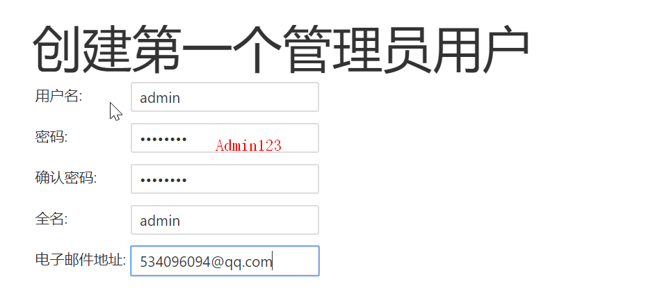

### 2、安装核心插件

```sh
- kubernetes
- docker
#以上插件可能无法下载，可以手动去jenkins-plugins下载并上传.
kubectl cp /root/other/kubernetes-client-api.hpi devops/jenkins-0:/var/jenkins_home/plugins/

#配置镜像源
https://updates.jenkins.io/update-center.json   默认的
http://updates.jenkins-ci.org/update-center.json
#或者国内源
https://mirrors.tuna.tsinghua.edu.cn/jenkins/updates/update-center.json
```


### 3、配置集群整合

#### 1、动态slave架构

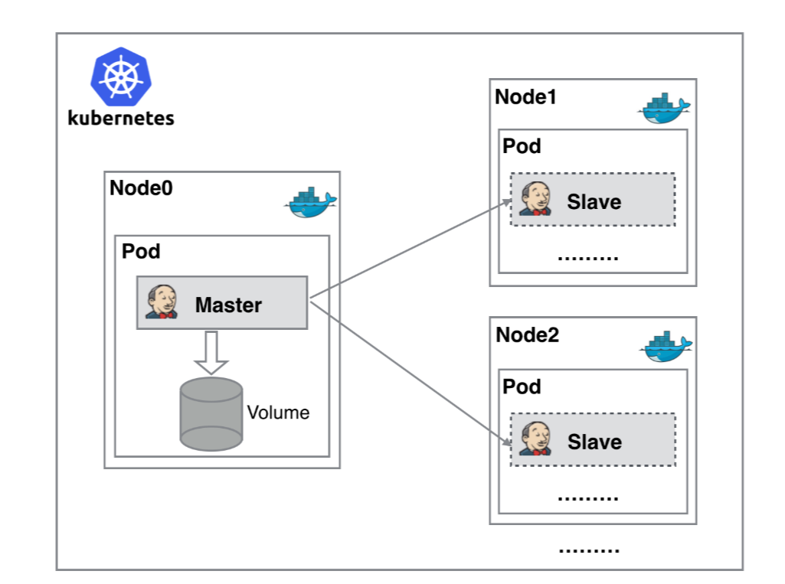


#### 2、配置整合

点击《系统管理》—>《Configure System》—>《配置一个云》—>《kubernetes》，如下：

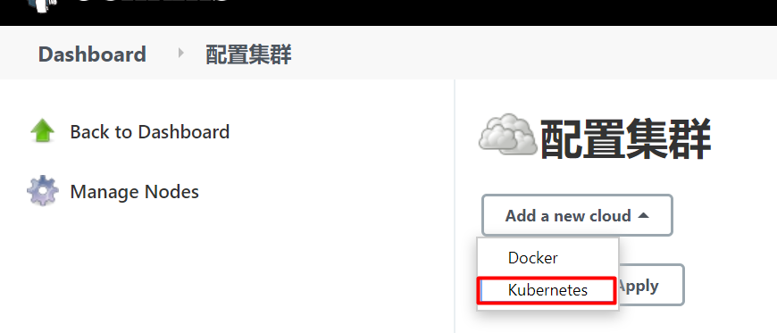


#### 3、配置kubernetes集群信息

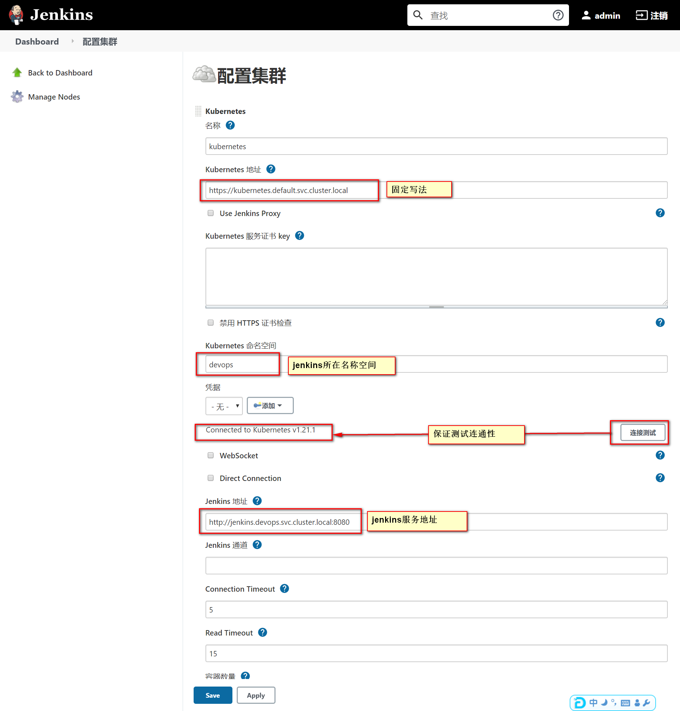


#### 4、配置slave的pod模板

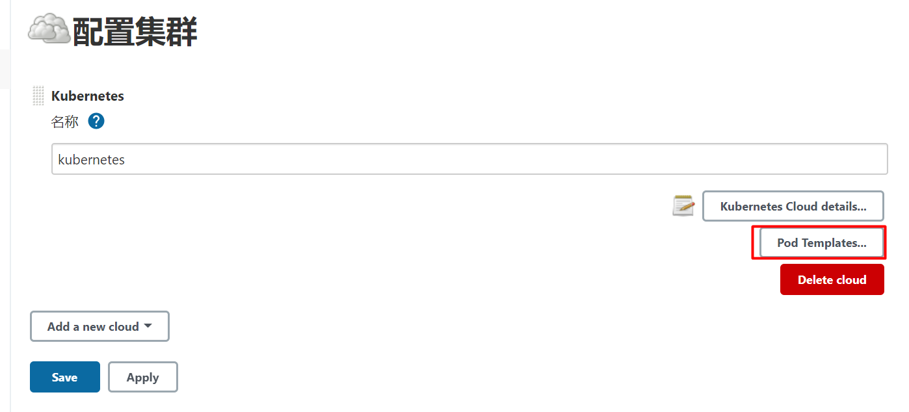


> Slave就是动态运行起来的容器环境.
>
> jenkins的所有构建命令会在这个容器里面运行
>
> - 注意配置以下内容
>   - 名称: `自定义`
>   - 命名空间 :  `devops`
>   - 标签列表:  `自定义`
>   - 容器名称、镜像： `jenkins/inbound-agent:4.7-1-alpine`
>   - serviceAccount挂载项: `jenkins`
>   - `运行命令`: 改为 `jenkins-slave`
>
> 注意：
>
> - jenkins-url如果是一个域名，测试环境下可能不能访问，此时需要给各个主机配置域名转发到vpc网络的ip
> - 修改各个主机的 /etc/hosts文件即可
> - 也可以直接设置jenkins-url为公网ip地址

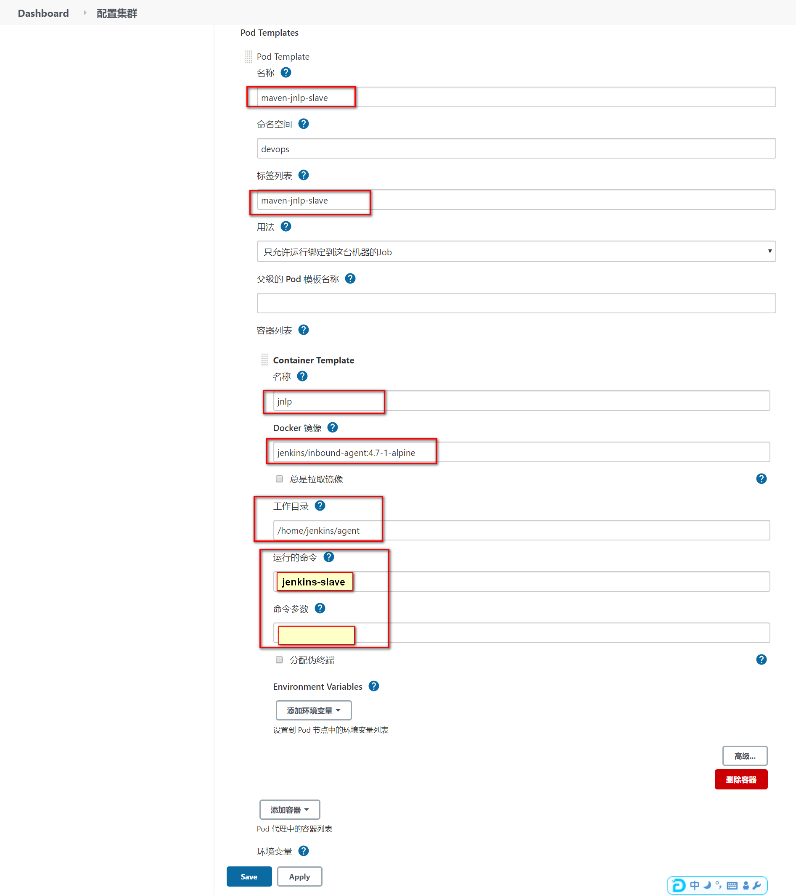


### 4、测试动态slave

##### 1、自由风格

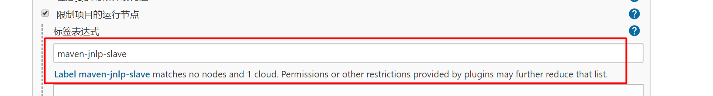

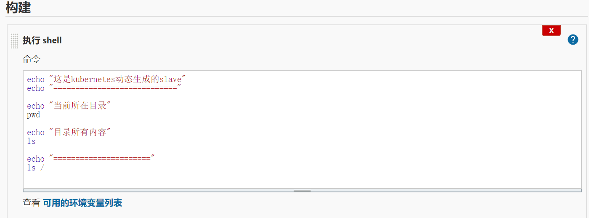


##### 2、流水线写法

```groovy
pipeline {
    agent {
      label 'maven-jnlp-slave'
    }

    stages {
        stage('Hello') {
            steps {
                echo 'Hello World'
            }
        }
    }
}
```


### 5、配置更多的slave

| slave-label | 镜像                                                         | 集成工具                                                |
| ----------- | ------------------------------------------------------------ | ------------------------------------------------------- |
| maven       | registry.cn-hangzhou.aliyuncs.com/lfy_k8s_images/jnlp-maven:3.6.3 | jq、curl、maven                                         |
| nodejs      | registry.cn-hangzhou.aliyuncs.com/lfy_k8s_images/jnlp-nodejs:14.16.1 | jq、curl、nodejs、npm（已经设置全局目录在 /root/npm下） |
| kubectl     | registry.cn-hangzhou.aliyuncs.com/lfy_k8s_images/jnlp-kubectl:1.21.1 | kubectl、helm、helm-push、jq、curl、                    |
| allin       | registry.cn-hangzhou.aliyuncs.com/lfy_k8s_images/jnlp-all:v1.0 | kubectl、helm、maven、nodejs、jq、curl                  |
| docker      | registry.cn-hangzhou.aliyuncs.com/lfy_k8s_images/jnlp-docker:20.10.2 | jq、curl、docker                                        |

> 根据自己环境可以有很多定制的slave

## 3、slave参考配置

> 下面的截图忘了选中 user,group 都应该为 0,0  也就是root用户
>
> 每个打包机都应该hostPath模式挂载/etc/hosts文件。方便统一域名管理。或者全系统内部都不用域名，都使用ip进行交互也可以【但是推荐域名，域名可以统一修改，ip变化所有引用的地方都来修改很麻烦】

### 1、maven配置

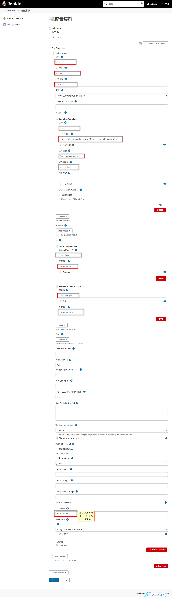

> 使用要求
>
> - 1、提前创建好maven的settings.xml，并且以configMap的形式保存到k8s集群的devops名称空间。configmap名叫`maven-conf`，里面有一个键名`settings.xml`，值为 `maven配置文件的值`
>
> - 2、准备名为`maven-jar-pvc` 的pvc 在 devops名称空间下。为RWX模式
>
> - 例如：
>
> - `kubectl create configmap maven-conf --from-file=settings.xml=/root/settings.xml -n devops`
>
> - ```yaml
> apiVersion: v1
> kind: PersistentVolumeClaim
> metadata:
>   name: maven-jar-pvc
>   namespace: devops
>   labels:
>     app: maven-jar-pvc
> spec:
> storageClassName: rook-cephfs
> accessModes:
>   - ReadWriteMany
> resources:
> requests:
>   storage: 5Gi
>   ```
> ```
> 
> ```
>
> - 
> ```
> 
> ```

```xml
<?xml version="1.0" encoding="UTF-8"?>

<settings xmlns="http://maven.apache.org/SETTINGS/1.0.0"
          xmlns:xsi="http://www.w3.org/2001/XMLSchema-instance"
          xsi:schemaLocation="http://maven.apache.org/SETTINGS/1.0.0 http://maven.apache.org/xsd/settings-1.0.0.xsd">
  <!-- 这个目录是被maven打包机使用pvc挂载出去的
  -->
  <localRepository>/root/maven/.m2</localRepository>

  <pluginGroups>

  </pluginGroups>

  <proxies>

  </proxies>


  <servers>

  </servers>

  <mirrors>
	 <mirror>
        <id>nexus-aliyun</id>
        <mirrorOf>central</mirrorOf>
        <name>Nexus aliyun</name>
        <url>http://maven.aliyun.com/nexus/content/groups/public</url>
	 </mirror>
  </mirrors>
  <profiles>
		<profile>
			 <id>jdk-1.8</id>
			 <activation>
			   <activeByDefault>true</activeByDefault>
			   <jdk>1.8</jdk>
			 </activation>
			 <properties>
			   <maven.compiler.source>1.8</maven.compiler.source>
			   <maven.compiler.target>1.8</maven.compiler.target>
			   <maven.compiler.compilerVersion>1.8</maven.compiler.compilerVersion>
			 </properties>
		</profile>
  </profiles>
</settings>

```


```yaml
apiVersion: v1
kind: PersistentVolumeClaim
metadata:
  name: maven-jar-pvc
  namespace: devops
  labels:
    app: maven-jar-pvc
spec:
  storageClassName: rook-cephfs
  accessModes:
  - ReadWriteMany
  resources:
    requests:
      storage: 5Gi
```


### 2、kubectl配置

在容器内 /root/.kube/config，config文件的内容是我们集群之前的admin.conf的内容

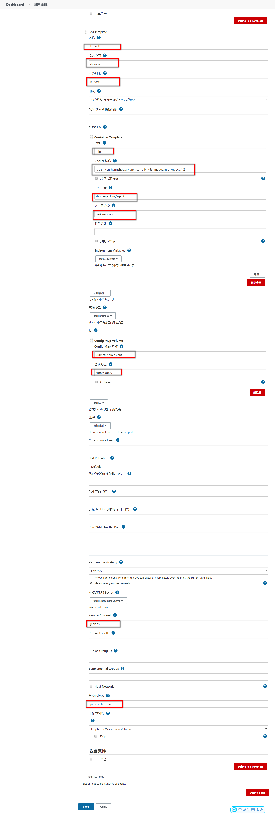


> 使用要求
>
> - 必须提前给集群创建一个ConfigMap，名叫 `kubectl-admin.conf`，里面有一个键名叫`config`，键值可以是master节点 /root/.kube/config的内容
> - 例如
> - `kubectl create configmap kubectl-admin.conf --from-file=config=/root/.kube/config -n devops`


### 3、nodejs配置

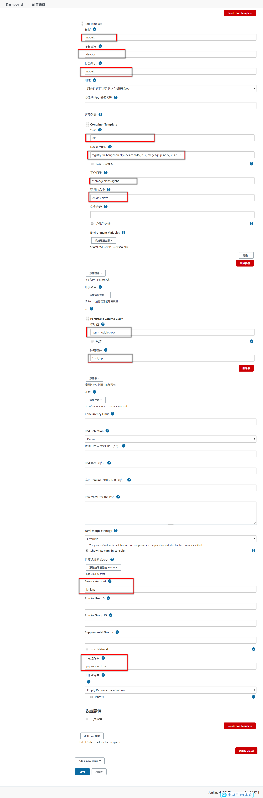

> 使用说明
>
> - 准备名为`npm-modules-pvc` 的pvc 在 devops名称空间下。为RWX模式
>
> ```yaml
> apiVersion: v1
> kind: PersistentVolumeClaim
> metadata:
>     name: npm-modules-pvc
>     namespace: devops
>     labels:
>        app: npm-modules-pvc
> spec:
>     storageClassName: rook-cephfs
>     accessModes:
>     - ReadWriteMany
>     resources:
>        requests:
>          storage: 5Gi
> ```
>
> 


### 4、docker配置

> 使用注意：
>
> - docker访问harbor之类的私有仓库且是https，要注意配置证书受信任。提前各个机器配置好

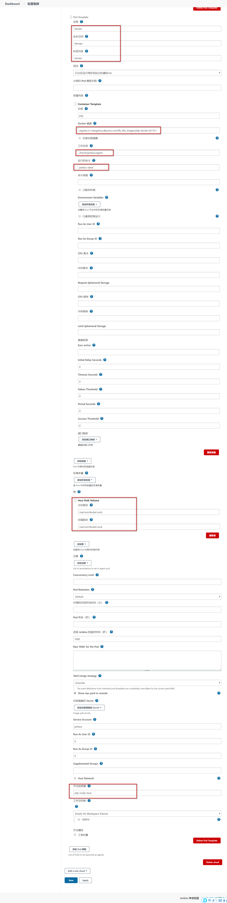


## 4、示例流水线

### 1、打包机检查

```groovy
pipeline {
    //无代理，各阶段声明自己的代理
    agent none
    stages {
        stage('检查nodejs打包机') {
            //使用nodejs代理
            agent {
                label 'nodejs'
            }
            steps {
                echo "nodejs版本："
                sh 'node -v'
                echo "npm modules目录位置"
                sh 'npm config ls -l | grep prefix'
                echo "检查完成..."
            }
        }

        stage('检查maven打包机') {
            //使用nodejs代理
            agent {
                label 'maven'
            }
            steps {
                echo "maven版本："
                sh 'mvn -v'
                echo "maven配置文件"
                sh 'cat /app/maven/settings.xml'

                echo "maven目录位置信息"
                sh 'ls -al /app/maven/'
            }
        }
        stage('检查docker打包机') {
            //使用nodejs代理
            agent {
                label 'docker'
            }
            steps {
                echo "docker版本："
                sh 'docker version'
                sh 'docker images'
            }
        }

        stage('检查kubectl打包机') {
            //使用nodejs代理
            agent {
                label 'kubectl'
            }
            steps {
                echo "kubectl版本："
                sh ' kubectl version'
                echo "kubectl操作集群: 所有Pod"
                sh 'kubectl get pods'

                echo "kubectl操作集群: 所有nodes"
                sh 'kubectl get nodes'
            }
        }
    }
}
```


### 2、复杂流水线

#### 1、java-Dockerfile模板

```dockerfile
#这个也得有
FROM openjdk:8-jre-alpine
LABEL maintainer="534096094@qq.com"
#复制打好的jar包
COPY target/*.jar /app.jar
RUN  apk add -U tzdata; \
ln -sf /usr/share/zoneinfo/Asia/Shanghai /etc/localtime; \
echo 'Asia/Shanghai' >/etc/timezone; \
touch /app.jar;

ENV JAVA_OPTS=""
ENV PARAMS=""

EXPOSE 8080

ENTRYPOINT [ "sh", "-c", "java -Djava.security.egd=file:/dev/./urandom $JAVA_OPTS -jar /app.jar $PARAMS" ]
```


#### 2、准备示例项目

https://gitee.com/macrozheng/mall

##### 1、准备数据库镜像

```dockerfile
FROM mysql:5.7

# 所有在 /docker-entrypoint-initdb.d 下的sql，数据库会自己初始化
COPY mall.sql /docker-entrypoint-initdb.d
```


##### 2、继续


# 五、kustomize

## 1、是什么

https://kustomize.io/  Kubernetes本地的配置管理工具。轻量版的helm；

> 以后我们公司自己部署的一些中间件等，可以封装为 kustomize 管理的文件结构。
>
> 只需要`kubectl apply -k` 即可快速部署不同环境应用


## 2、用法

### 1、demo

#### 1、文件结构

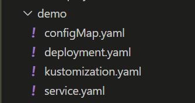


#### 2、文件内容

```yaml
#service.yaml
kind: Service
apiVersion: v1
metadata:
  name: the-service
spec:
  selector:
    deployment: hello
  type: ClusterIP
  ports:
  - protocol: TCP
    port: 8666
    targetPort: 8080
```


```yaml
#kustomization.yaml
apiVersion: kustomize.config.k8s.io/v1beta1
kind: Kustomization
metadata:
  name: arbitrary
# Example configuration for the webserver
# at https://github.com/monopole/hello
commonLabels:
  app: hello  # 构建出来的每个资源上都有app=hello标签
resources:
- deployment.yaml
- service.yaml
- configMap.yaml
```


```yaml
#configMap.yaml
apiVersion: v1
kind: ConfigMap
metadata:
  name: the-map
data:
  altGreeting: "Good Morning!"
  enableRisky: "false"
```

```yaml
#deployment.yaml
apiVersion: apps/v1
kind: Deployment
metadata:
  name: the-deployment
spec:
  replicas: 3
  selector:
    matchLabels:
      deployment: hello
  template:
    metadata:
      labels:
        deployment: hello
    spec:
      containers:
      - name: the-container
        image: monopole/hello:1
        command: ["/hello",
                  "--port=8080",
                  "--enableRiskyFeature=$(ENABLE_RISKY)"]
        ports:
        - containerPort: 8080
        env:
        - name: ALT_GREETING
          valueFrom:
            configMapKeyRef:
              name: the-map
              key: altGreeting
        - name: ENABLE_RISKY
          valueFrom:
            configMapKeyRef:
              name: the-map
              key: enableRisky
```


#### 3、使用

```sh
kubectl apply -k demo/
```


#### 4、注意事项

- kustomization.yaml 文件名是固定的；
- kubectl apply -k  path 会自动找path下的kustomization.yaml 


#### 5、高级-环境分离

- 创建  [overlay](https://kubectl.docs.kubernetes.io/references/kustomize/glossary/#overlay),分离各个环境。原来的可以抽取为`base`环境。其他环境层可只定义变量覆盖
- 每个环境层定义自己的 kustomization.yaml

- 新的层级结构
- 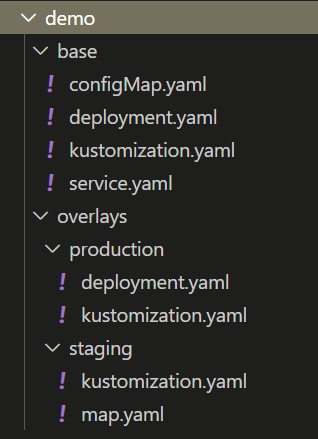


- 多的内容

  - ```yaml
    #production/kustomization.yaml
    apiVersion: kustomize.config.k8s.io/v1beta1
    kind: Kustomization
    namePrefix: production-
    commonLabels:
      variant: production
      org: acmeCorporation
    commonAnnotations:
      note: Hello, I am production!
    bases:
    - ../../base
    patchesStrategicMerge:
    - deployment.yaml
    
    #production/deployment.yaml
    apiVersion: apps/v1
    kind: Deployment
    metadata:
      name: the-deployment
    spec:
      replicas: 10
    ## 只需要定义可变部分
    ```

  - ```yaml
    #staging/kustomization.yaml
    apiVersion: kustomize.config.k8s.io/v1beta1
    kind: Kustomization
    namePrefix: staging-   #所有资源的前缀
    commonLabels:   #所有资源的标签
      variant: staging   
      org: acmeCorporation
    commonAnnotations:  #所有资源的注解
      note: Hello, I am staging!
    bases:
    - ../../base  #基础配置的位置
    patchesStrategicMerge:
    - map.yaml  #需要额外引入部署的内容，如果引入的内容基础内容有配置，则使用这个最新的
    
    #staging/map.yaml
    apiVersion: v1
    kind: ConfigMap
    metadata:
      name: the-map
    data:
      altGreeting: "Have a pineapple!"
      enableRisky: "true"  
    ```

- 执行命令

- ```sh
  kubectl apply -k overlays/staging -n hello   #可以在部署的时候统一制定名称空间
  ```

[kustomzition文件能写的内容](https://kubectl.docs.kubernetes.io/guides/config_management/)

### 2、部署mysql

参照kustomize文件


# 六、整合EFK

> 部署前预习
>
> - ElasticSearch 的 [配置文件位置](https://www.elastic.co/guide/en/elasticsearch/reference/7.13/settings.html#config-files-location)
> - 简单的ElasticSearch [配置管理章节](https://www.elastic.co/guide/cn/elasticsearch/guide/current/_configuration_management.html)
> - ElasticStack [安装](https://www.elastic.co/guide/en/elastic-stack/current/installing-elastic-stack.html#install-order-elastic-stack)
> - [kompose](https://github.com/kubernetes/kompose/tree/v1.21.0) 转换 compose为k8s文件
> - kubectl get pvc -n devops| grep es | awk '{print $1}' | xargs kubectl delete pvc -n devops

使用Es官方Operator方式

## 1、安装operator

https://www.elastic.co/guide/en/cloud-on-k8s/current/k8s-quickstart.html

```sh
kubectl apply -f https://download.elastic.co/downloads/eck/1.6.0/all-in-one.yaml


#查看状态
kubectl -n elastic-system logs -f statefulset.apps/elastic-operator
```

[ECK安装的每个组件如何配置](https://www.elastic.co/guide/en/cloud-on-k8s/current/k8s-orchestrating-elastic-stack-applications.html)


## 2、部署ES集群

```yaml
apiVersion: elasticsearch.k8s.elastic.co/v1
kind: Elasticsearch
metadata:
  name: es-cluster
  # 可以指定名称空间
spec:
  version: 7.13.1
  nodeSets:
  - name: masters
    count: 3
    config:
      node.roles: ["master"]
      xpack.ml.enabled: true
    volumeClaimTemplates:
    - metadata:
        name: es-master
      spec:
        accessModes:
        - ReadWriteOnce
        resources:
          requests:
            storage: 5Gi
        storageClassName: "rook-ceph-block"
  - name: data
    count: 4
    config:
      node.roles: ["data", "ingest", "ml", "transform"]
    volumeClaimTemplates:
    - metadata:
        name: es-node
      spec:
        accessModes:
        - ReadWriteOnce
        resources:
          requests:
            storage: 5Gi
        storageClassName: "rook-ceph-block"
```


> 测试访问
>
> https://www.elastic.co/guide/en/cloud-on-k8s/current/k8s-deploy-elasticsearch.html#k8s_request_elasticsearch_access


### 1、本地访问密码测试

```sh
## elastic的访问
kubectl get secret es-cluster-es-elastic-user -o=jsonpath='{.data.elastic}' | base64 --decode; echo

## 1、集群内组件访问
###账号 elastic
###密码 t5upEg4l5J376298kOIPy8Ww
curl -u "elastic:2WC5On8Xio6EK4x4ph1T7Q54" -k "https://es-cluster-es-http:9200"
curl -u "elastic:2WC5On8Xio6EK4x4ph1T7Q54" -k "https://10.96.9.9:9200"

## 2、集群本地访问
kubectl port-forward service/es-cluster-es-http 9200
curl -u "elastic:$PASSWORD" -k "https://localhost:9200"

## 3、做成下面的Ingress访问
```


### 2、部署ingress访问

```yaml
apiVersion: networking.k8s.io/v1
kind: Ingress
metadata:
  name: elastic-ingress
  annotations:
    kubernetes.io/ingress.class: "nginx"
    nginx.ingress.kubernetes.io/backend-protocol: "HTTPS"
    nginx.ingress.kubernetes.io/server-snippet: |
      proxy_ssl_verify off;
spec:
  tls:
  - hosts:
      - elastic.itdachang.com
    secretName: itdachang.com
  rules:
  - host: elastic.itdachang.com
    http:
      paths:
      - path: /
        pathType: Prefix
        backend:
          service:
            name: es-cluster-es-http
            port:
              number: 9200
```


## 3、部署kibana

```yaml
apiVersion: kibana.k8s.elastic.co/v1
kind: Kibana
metadata:
  name: kibana
spec:
  version: 7.13.1
  count: 1
  elasticsearchRef:
    name: es-cluster
```


### 1、访问密码

```sh
kubectl get secret es-cluster-es-elastic-user -o=jsonpath='{.data.elastic}' | base64 --decode; echo
### 账号  elastic 
### 密码  618FAZBH5a269Wqb0Hpan19Y
###登录即可
```


### 2、配置Ingress

```yaml
apiVersion: networking.k8s.io/v1
kind: Ingress
metadata:
  name: kibana-ingress
  annotations:
    kubernetes.io/ingress.class: "nginx"
    nginx.ingress.kubernetes.io/backend-protocol: "HTTPS"
    nginx.ingress.kubernetes.io/server-snippet: |
      proxy_ssl_verify off;
spec:
  tls:
  - hosts:
      - kibana.itdachang.com
    secretName: itdachang.com
  rules:
  - host: kibana.itdachang.com
    http:
      paths:
      - path: /
        pathType: Prefix
        backend:
          service:
            name: kibana-kb-http
            port:
              number: 5601
```

```yaml

```


## 4、部署FileBeats


```yaml
apiVersion: beat.k8s.elastic.co/v1beta1
kind: Beat
metadata:
  name: beats
spec:
  type: filebeat
  version: 7.13.1
  elasticsearchRef:
    name: es-cluster
  config:
    filebeat.inputs:
    - type: container
      paths:
      - /var/log/containers/*.log
  daemonSet:
    podTemplate:
      spec:
        dnsPolicy: ClusterFirstWithHostNet
        hostNetwork: true
        securityContext:
          runAsUser: 0
        containers:
        - name: filebeat
          volumeMounts:
          - name: varlogcontainers
            mountPath: /var/log/containers
          - name: varlogpods
            mountPath: /var/log/pods
          - name: varlibdockercontainers
            mountPath: /var/lib/docker/containers
        volumes:
        - name: varlogcontainers
          hostPath:
            path: /var/log/containers
        - name: varlogpods
          hostPath:
            path: /var/log/pods
        - name: varlibdockercontainers
          hostPath:
            path: /var/lib/docker/containers
```


